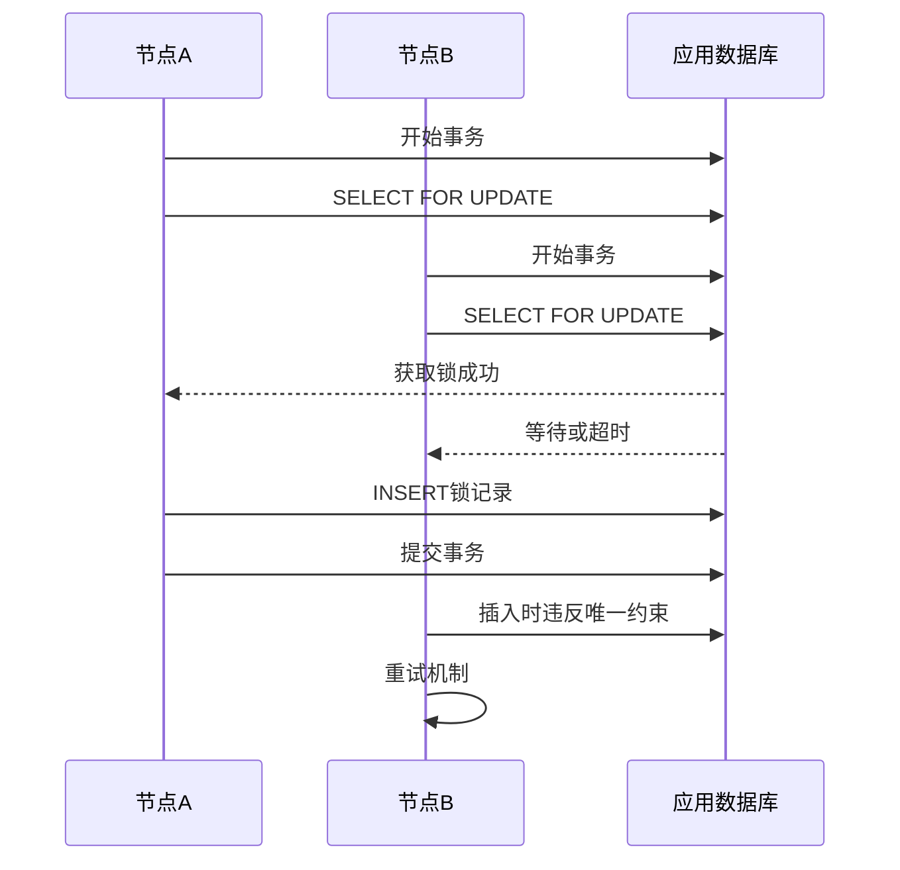
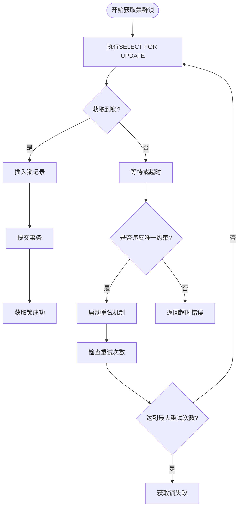
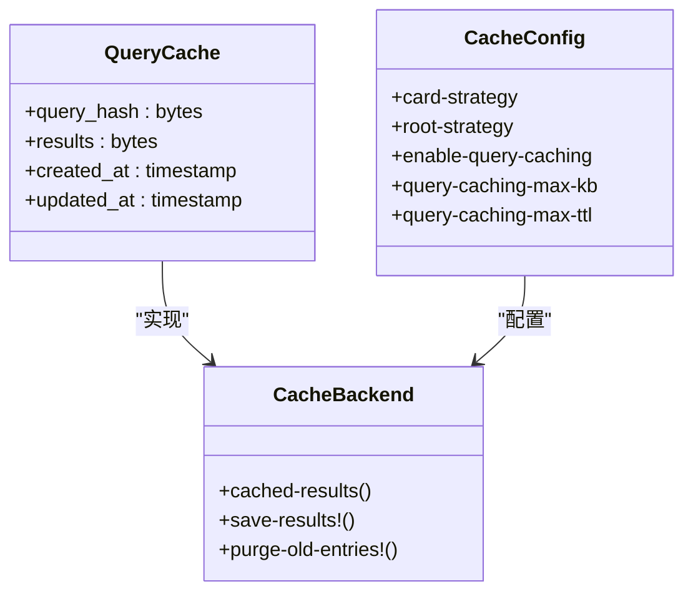
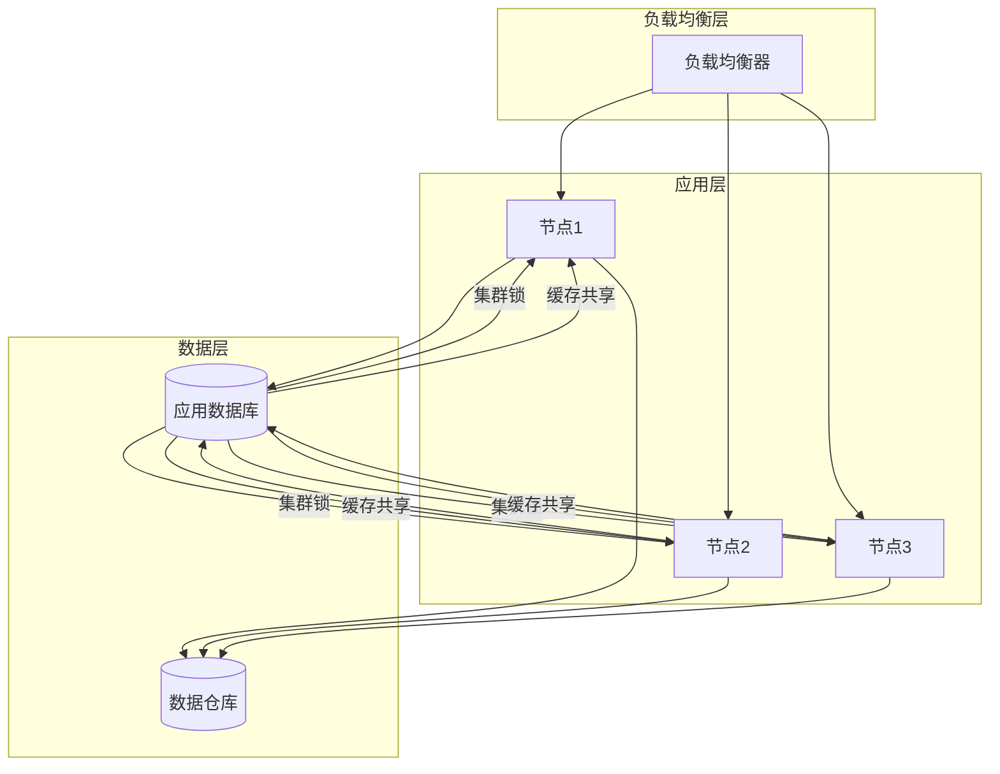

# 集群配置

<cite>
**本文档中引用的文件**  
- [cluster_lock.clj](file://src/metabase/app_db/cluster_lock.clj)
- [connection.clj](file://src/metabase/app_db/connection.clj)
- [env.clj](file://src/metabase/app_db/env.clj)
- [core.clj](file://src/metabase/cache/core.clj)
- [query_cache.clj](file://src/metabase/cache/models/query_cache.clj)
- [settings.clj](file://src/metabase/cache/settings.clj)
- [config-file-intro.md](file://src/metabase/cmd/resources/config-file-intro.md)
- [env-var-intro.md](file://src/metabase/cmd/resources/env-var-intro.md)
</cite>

## 目录
1. [引言](#引言)
2. [多节点环境配置要点](#多节点环境配置要点)
3. [集群锁机制实现原理与配置](#集群锁机制实现原理与配置)
4. [分布式缓存配置策略](#分布式缓存配置策略)
5. [高可用性部署配置](#高可用性部署配置)
6. [监控与运维建议](#监控与运维建议)

## 引言
本文档旨在为Metabase系统在多节点集群环境下的部署提供详细的配置指南。重点介绍集群锁机制、分布式缓存、高可用性部署等关键配置要素，确保在多实例共享应用数据库的环境中实现节点间的协调一致性和数据一致性。

## 多节点环境配置要点
在多节点环境下部署Metabase时，必须确保所有实例共享同一个应用数据库（Application Database），并正确配置环境变量以支持集群模式。关键配置包括：

- **应用数据库类型**：支持PostgreSQL、MySQL和H2，生产环境推荐使用PostgreSQL或MySQL
- **数据库连接配置**：通过环境变量或配置文件指定数据库连接信息
- **实例标识**：每个节点应有唯一的标识，通过应用数据库连接信息生成
- **连接池配置**：为应用数据库配置适当的连接池参数

主要配置方式包括：
1. 使用独立的连接参数（如MB_DB_TYPE、MB_DB_HOST等）
2. 使用JDBC连接字符串（MB_DB_CONNECTION_URI）
3. 混合模式：JDBC字符串配合独立的用户名/密码

**Section sources**
- [env.clj](file://src/metabase/app_db/env.clj#L0-L203)
- [connection.clj](file://src/metabase/app_db/connection.clj#L0-L210)

## 集群锁机制实现原理与配置
### 实现原理
集群锁机制通过应用数据库中的`metabase_cluster_lock`表实现，利用数据库的唯一约束和事务机制确保同一时间只有一个节点能获取特定锁。核心实现位于`cluster_lock.clj`文件中。

**Diagram sources**
- [cluster_lock.clj](file://src/metabase/app_db/cluster_lock.clj#L0-L105)

### 配置方法
集群锁的配置主要通过以下方式实现：

1. **锁获取流程**：
   - 使用`SELECT ... FOR UPDATE`语句尝试获取行级锁
   - 如果获取成功，则插入锁记录
   - 如果插入时违反唯一约束，则说明其他节点已持有锁

2. **重试机制**：
   - 默认最大重试次数：5次
   - 初始重试间隔：1000毫秒
   - 重试间隔随机化因子：0.1
   - 支持指数退避重试策略

3. **超时设置**：
   - 默认锁超时时间：1秒
   - 可通过`timeout-seconds`参数自定义

4. **特殊处理**：
   - H2数据库不支持查询超时，使用进程内锁替代
   - PostgreSQL使用PSQLException消息内容判断唯一约束冲突

### 避免脑裂问题
通过以下机制确保数据一致性并避免脑裂：

1. **单一真相源**：以应用数据库为唯一协调点
2. **事务一致性**：所有锁操作在数据库事务中完成
3. **唯一约束**：利用数据库主键唯一性确保锁的排他性
4. **重试策略**：处理并发冲突，确保最终一致性

**Diagram sources**
- [cluster_lock.clj](file://src/metabase/app_db/cluster_lock.clj#L28-L83)

**Section sources**
- [cluster_lock.clj](file://src/metabase/app_db/cluster_lock.clj#L0-L105)

## 分布式缓存配置策略
### 缓存同步机制
分布式缓存通过应用数据库中的`query_cache`表实现，所有节点共享同一缓存存储。核心组件包括：

- **缓存模型**：`query_cache`表存储查询结果，以查询哈希值为键
- **缓存策略**：支持基于卡片和根级别的缓存策略
- **缓存后端**：可扩展的缓存后端接口

**Diagram sources**
- [query_cache.clj](file://src/metabase/cache/models/query_cache.clj#L0-L12)
- [core.clj](file://src/metabase/cache/core.clj#L0-L21)
- [settings.clj](file://src/metabase/cache/settings.clj#L0-L46)

### 失效策略
缓存失效通过以下机制实现：

1. **时间基础失效**：
   - 最大缓存生存时间（TTL）：35天（默认）
   - 可通过`query-caching-max-ttl`参数配置

2. **大小限制**：
   - 单个查询结果最大缓存大小：2000KB（默认）
   - 全局最大缓存大小限制：200MB
   - 可通过`query-caching-max-kb`参数配置

3. **手动失效**：
   - 提供`invalidate!`函数用于手动清除缓存
   - 支持按策略清除特定缓存

4. **自动清理**：
   - 定期清理过期缓存条目
   - 清理任务由查询处理器定期调用

**Section sources**
- [settings.clj](file://src/metabase/cache/settings.clj#L0-L46)
- [core.clj](file://src/metabase/cache/core.clj#L0-L21)

## 高可用性部署配置
### 故障转移配置
高可用性部署中的故障转移机制依赖于：

1. **应用数据库的高可用**：
   - 使用支持主从复制的数据库（PostgreSQL/MySQL）
   - 配置数据库连接的故障转移URL
   - 实现连接重试和超时机制

2. **无状态节点设计**：
   - 所有节点状态存储在应用数据库中
   - 节点故障可被其他节点无缝接管
   - 通过集群锁协调后台任务执行

3. **健康检查**：
   - 实现节点健康状态监控
   - 集成到负载均衡器的健康检查机制

### 负载均衡配置
负载均衡配置要点：

1. **会话亲和性**：
   - 建议启用会话亲和性（sticky sessions）
   - 或确保所有节点共享相同的加密密钥

2. **请求分发**：
   - 将读写请求均匀分发到各个节点
   - 监控各节点的负载情况

3. **后台任务协调**：
   - 使用集群锁确保定时任务只在一个节点执行
   - 通过`with-cluster-lock`宏保护关键操作

**Diagram sources**
- [cluster_lock.clj](file://src/metabase/app_db/cluster_lock.clj#L0-L105)
- [connection.clj](file://src/metabase/app_db/connection.clj#L0-L210)

**Section sources**
- [env.clj](file://src/metabase/app_db/env.clj#L0-L203)
- [cluster_lock.clj](file://src/metabase/app_db/cluster_lock.clj#L0-L105)

## 监控与运维建议
### 监控指标
建议监控以下关键指标：

1. **集群锁相关**：
   - 锁获取成功率
   - 锁等待时间
   - 重试次数统计

2. **缓存性能**：
   - 缓存命中率
   - 缓存大小使用情况
   - 缓存清理频率

3. **数据库性能**：
   - 应用数据库连接数
   - 查询响应时间
   - 锁等待情况

### 运维最佳实践
1. **配置管理**：
   - 使用配置文件或环境变量统一管理配置
   - 避免在管理界面修改会被环境变量覆盖的设置

2. **升级策略**：
   - 逐个节点滚动升级
   - 确保应用数据库迁移在升级过程中正确执行

3. **备份策略**：
   - 定期备份应用数据库
   - 备份包含所有配置和元数据

4. **故障排查**：
   - 检查集群锁表`metabase_cluster_lock`的状态
   - 监控`query_cache`表的大小和性能
   - 查看节点日志中的锁获取和缓存操作记录

**Section sources**
- [env.clj](file://src/metabase/app_db/env.clj#L0-L203)
- [cluster_lock.clj](file://src/metabase/app_db/cluster_lock.clj#L0-L105)
- [settings.clj](file://src/metabase/cache/settings.clj#L0-L46)