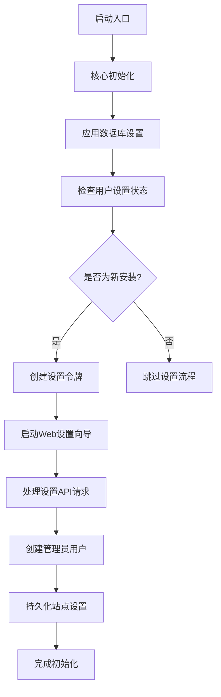
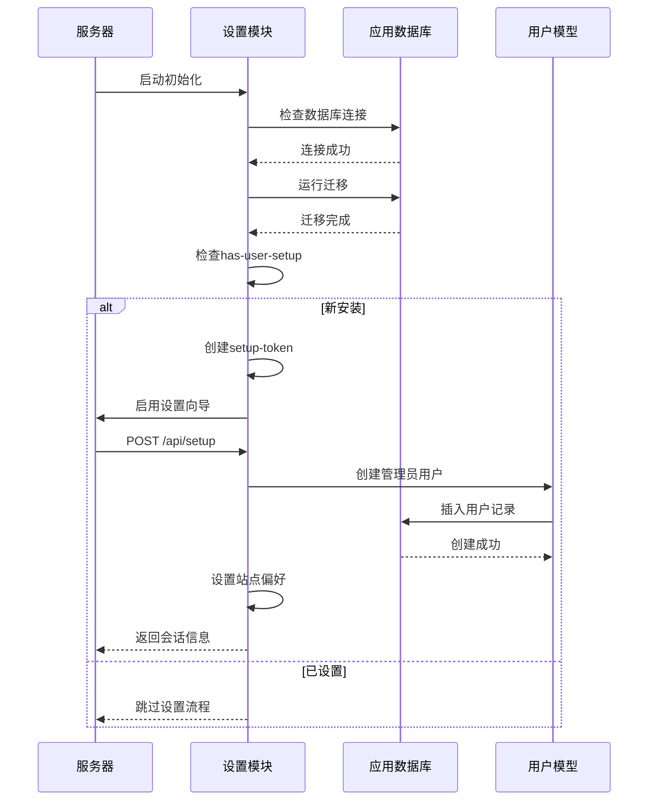
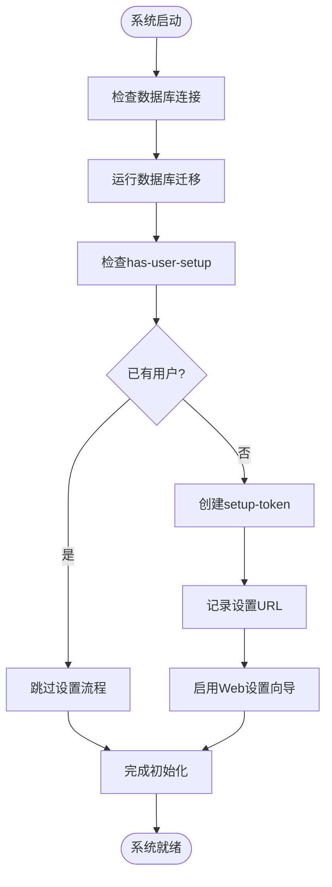
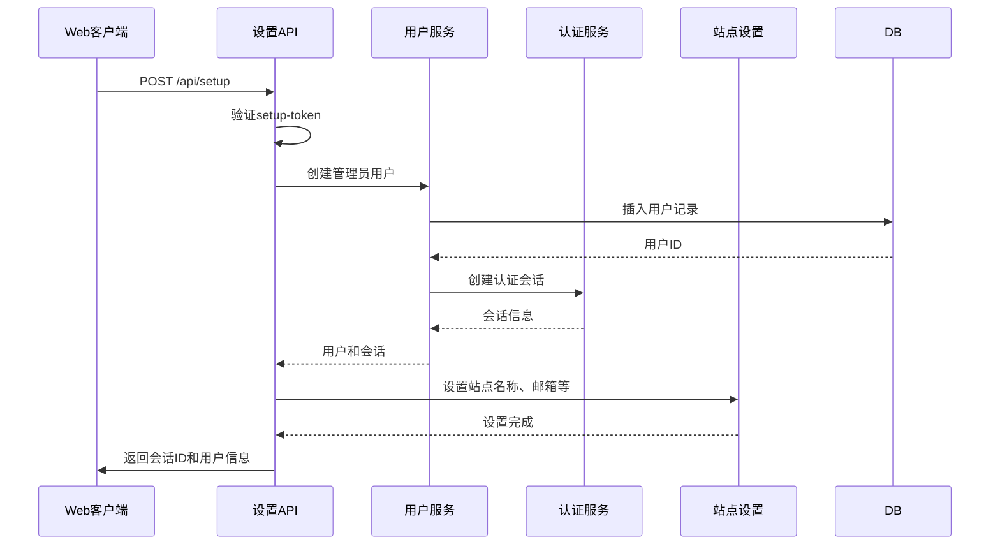
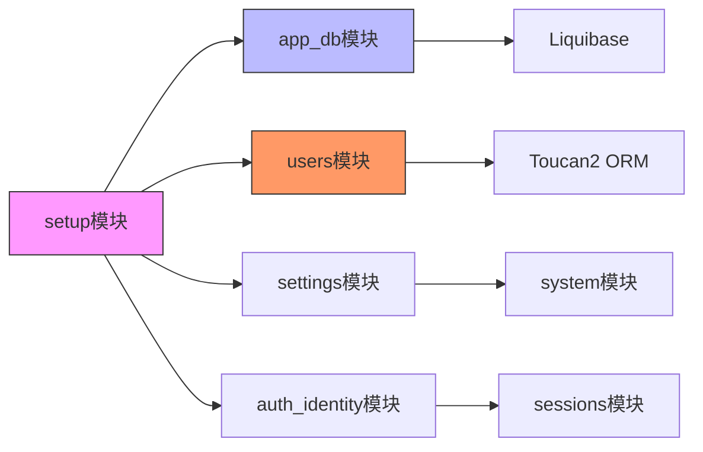

# 初始设置与引导

<cite>
**本文档中引用的文件**  
- [core.clj](file://src/metabase/core/core.clj)
- [bootstrap.clj](file://src/metabase/core/bootstrap.clj)
- [init.clj](file://src/metabase/core/init.clj)
- [setup/core.clj](file://src/metabase/setup/core.clj)
- [setup/settings.clj](file://src/metabase/setup/settings.clj)
- [setup_rest/api.clj](file://src/metabase/setup_rest/api.clj)
- [app_db/setup.clj](file://src/metabase/app_db/setup.clj)
- [app_db/core.clj](file://src/metabase/app_db/core.clj)
- [config/core.clj](file://src/metabase/config/core.clj)
- [users/models/user.clj](file://src/metabase/users/models/user.clj)
</cite>

## 目录
1. [简介](#简介)
2. [项目结构](#项目结构)
3. [核心组件](#核心组件)
4. [架构概述](#架构概述)
5. [详细组件分析](#详细组件分析)
6. [依赖分析](#依赖分析)
7. [性能考虑](#性能考虑)
8. [故障排除指南](#故障排除指南)
9. [结论](#结论)

## 简介
本文档详细描述了Metabase系统的初始设置流程，重点关注`setup`模块如何处理首次启动时的引导过程。文档涵盖了Web安装向导的后端逻辑、数据库初始化、管理员账户创建以及站点设置的持久化机制。通过分析`core.clj`中的bootstrap逻辑，解释了系统状态检测（是否已设置）和跳转机制。同时提供了在无头模式或自动化部署中绕过Web引导的配置方法，并包含错误处理场景的解决方案。

## 项目结构
Metabase的初始设置功能主要分布在`src/metabase/setup/`目录下，该模块负责处理系统首次启动时的引导流程。设置流程与核心系统模块紧密集成，特别是与数据库连接、用户管理和API路由等组件。



**Diagram sources**
- [core.clj](file://src/metabase/core/core.clj#L175-L204)
- [setup/core.clj](file://src/metabase/setup/core.clj#L0-L26)
- [setup_rest/api.clj](file://src/metabase/setup_rest/api.clj#L0-L36)

**Section sources**
- [core.clj](file://src/metabase/core/core.clj#L170-L280)
- [setup/core.clj](file://src/metabase/setup/core.clj#L0-L27)

## 核心组件
Metabase的初始设置流程由多个核心组件协同工作。`setup`模块负责管理设置状态和令牌，`setup_rest/api.clj`处理Web安装向导的API请求，而`app_db/setup.clj`则负责数据库的初始化和迁移。系统通过`has-user-setup`设置项来检测是否已完成初始设置，从而决定是否显示Web引导界面。

**Section sources**
- [setup/core.clj](file://src/metabase/setup/core.clj#L0-L27)
- [setup/settings.clj](file://src/metabase/setup/settings.clj#L0-L47)
- [setup_rest/api.clj](file://src/metabase/setup_rest/api.clj#L0-L106)

## 架构概述
Metabase的初始设置架构采用分层设计，从系统启动到完成初始化的流程清晰。系统首先进行数据库连接和迁移，然后检查用户设置状态，根据结果决定是否进入设置流程。设置流程通过REST API暴露，允许前端Web向导与后端交互完成初始配置。



**Diagram sources**
- [core.clj](file://src/metabase/core/core.clj#L175-L204)
- [setup_rest/api.clj](file://src/metabase/setup_rest/api.clj#L33-L105)
- [app_db/setup.clj](file://src/metabase/app_db/setup.clj#L0-L290)

## 详细组件分析

### 设置状态检测与引导机制
Metabase使用`has-user-setup`设置项来检测系统是否已完成初始设置。该设置项的值基于数据库中是否存在用户记录来确定。当系统首次启动时，如果没有用户存在，系统会创建一个设置令牌并启用Web引导流程。



**Diagram sources**
- [setup/settings.clj](file://src/metabase/setup/settings.clj#L0-L47)
- [core.clj](file://src/metabase/core/core.clj#L175-L204)
- [bootstrap.clj](file://src/metabase/core/bootstrap.clj#L0-L36)

**Section sources**
- [setup/settings.clj](file://src/metabase/setup/settings.clj#L0-L47)
- [core.clj](file://src/metabase/core/core.clj#L170-L280)

### Web安装向导后端逻辑
Web安装向导的后端逻辑由`setup_rest/api.clj`中的POST `/api/setup`端点处理。该端点验证设置令牌，创建第一个管理员用户，并设置站点偏好。整个过程在数据库事务中执行，确保操作的原子性。



**Diagram sources**
- [setup_rest/api.clj](file://src/metabase/setup_rest/api.clj#L33-L105)
- [users/models/user.clj](file://src/metabase/users/models/user.clj#L0-L527)

**Section sources**
- [setup_rest/api.clj](file://src/metabase/setup_rest/api.clj#L0-L106)
- [users/models/user.clj](file://src/metabase/users/models/user.clj#L0-L527)

### 数据库初始化与迁移
数据库初始化由`app_db/setup.clj`模块负责，包括连接验证、模式迁移和加密检查。系统使用Liquibase进行数据库迁移管理，确保数据库模式与应用程序版本兼容。

```mermaid
flowchart TD
A[开始数据库设置] --> B["验证数据库连接\n(verify-db-connection)"]
B --> C["检查是否需要降级\n(error-if-downgrade-required!)"]
C --> D{"自动迁移?}
D --> |是| E["运行模式迁移\n(run-schema-migrations!)"]
D --> |否| F["打印迁移SQL\n(print-migrations-and-quit-if-needed!)"]
E --> G["检查加密配置\n(check-encryption)"]
F --> G
G --> H[完成数据库设置]
```

**Diagram sources**
- [app_db/setup.clj](file://src/metabase/app_db/setup.clj#L0-L290)
- [app_db/core.clj](file://src/metabase/app_db/core.clj#L0-L164)

**Section sources**
- [app_db/setup.clj](file://src/metabase/app_db/setup.clj#L0-L290)
- [app_db/core.clj](file://src/metabase/app_db/core.clj#L0-L164)

## 依赖分析
Metabase的初始设置流程依赖于多个核心模块的协同工作。`setup`模块依赖于`app_db`模块进行数据库操作，依赖于`users`模块创建管理员账户，依赖于`settings`模块持久化站点配置。这些依赖关系通过Clojure的命名空间引用机制实现。



**Diagram sources**
- [setup/core.clj](file://src/metabase/setup/core.clj#L0-L27)
- [setup_rest/api.clj](file://src/metabase/setup_rest/api.clj#L0-L36)
- [users/models/user.clj](file://src/metabase/users/models/user.clj#L0-L527)

**Section sources**
- [setup/core.clj](file://src/metabase/setup/core.clj#L0-L27)
- [setup_rest/api.clj](file://src/metabase/setup_rest/api.clj#L0-L106)

## 性能考虑
初始设置流程的性能主要受数据库连接速度和迁移操作的影响。对于大型生产环境，建议预先完成数据库迁移，避免在启动时执行耗时的模式变更操作。系统提供了`MB_DB_AUTOMIGRATE=false`配置选项，允许管理员手动执行迁移脚本，从而控制迁移过程的时间和资源消耗。

## 故障排除指南
初始设置过程中可能遇到的常见问题包括数据库连接失败、迁移冲突和配置错误。系统提供了详细的日志输出，帮助诊断这些问题。对于数据库连接问题，应检查环境变量配置；对于迁移问题，可以使用`migrate release-locks`命令释放迁移锁。

**Section sources**
- [app_db/setup.clj](file://src/metabase/app_db/setup.clj#L145-L165)
- [cmd/migrate.clj](file://src/metabase/cmd/migrate.clj#L0-L7)
- [cmd/remove_encryption.clj](file://src/metabase/cmd/remove_encryption.clj#L0-L13)

## 结论
Metabase的初始设置流程设计合理，通过清晰的状态检测机制和模块化架构，确保了系统首次启动的可靠性和安全性。Web安装向导的后端逻辑完整，能够安全地创建管理员账户并持久化站点设置。对于自动化部署场景，系统提供了多种配置选项，支持无头模式安装和预配置部署。