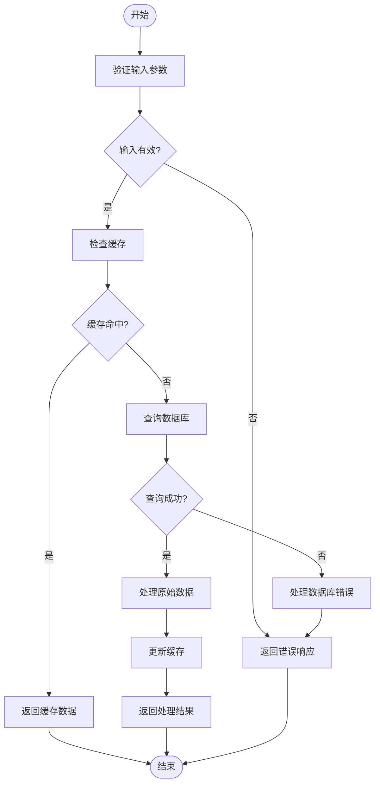
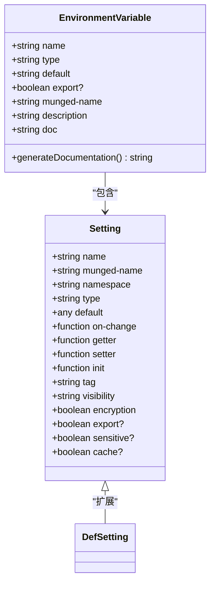

# 命令行工具与运维任务

<cite>
**本文档中引用的文件**  
- [migrate.clj](file://src/metabase/cmd/migrate.clj)
- [dump_to_h2.clj](file://src/metabase/cmd/dump_to_h2.clj)
- [load_from_h2.clj](file://src/metabase/cmd/load_from_h2.clj)
- [rotate_encryption_key.clj](file://src/metabase/cmd/rotate_encryption_key.clj)
- [env_var_dox.clj](file://src/metabase/cmd/env_var_dox.clj)
- [core.clj](file://src/metabase/cmd/core.clj)
- [copy.clj](file://src/metabase/cmd/copy.clj)
- [h2.clj](file://src/metabase/cmd/copy/h2.clj)
- [env-var-intro.md](file://src/metabase/cmd/resources/env-var-intro.md)
- [other-env-vars.md](file://src/metabase/cmd/resources/other-env-vars.md)
- [config-template.yaml](file://src/metabase/cmd/resources/config-template.yaml)
</cite>

## 目录
1. [简介](#简介)
2. [数据库迁移命令](#数据库迁移命令)
3. [数据导出与导入](#数据导出与导入)
4. [加密密钥管理](#加密密钥管理)
5. [环境变量文档生成](#环境变量文档生成)
6. [自动化脚本示例](#自动化脚本示例)
7. [运维最佳实践](#运维最佳实践)

## 简介
Metabase 提供了一套强大的命令行工具，用于数据库管理、数据迁移、安全配置和系统运维。这些工具通过 Clojure CLI 或 JAR 文件执行，支持多种运维场景，包括数据库迁移、备份恢复、加密密钥轮换和环境变量管理。本文档详细介绍了这些命令的使用方法和在运维中的应用场景。

## 数据库迁移命令

`migrate` 命令用于管理 Metabase 应用数据库的迁移。该命令通过 Liquibase 框架执行数据库模式变更，确保数据库结构与应用程序版本保持同步。迁移方向包括 `up`（升级）、`force`（强制升级）、`down`（降级）、`down-force`（强制降级）、`print`（打印迁移脚本）和 `release-locks`（释放锁）。

**Section sources**
- [migrate.clj](file://src/metabase/cmd/migrate.clj#L1-L9)
- [core.clj](file://src/metabase/cmd/core.clj#L100-L105)

## 数据导出与导入

### 数据导出 (`dump-to-h2`)
`dump-to-h2` 命令将现有数据库中的数据导出到 H2 文件中。该命令支持可选参数 `--keep-existing`（保留现有 H2 文件）和 `--dump-plaintext`（以明文导出数据）。导出的目标 H2 文件默认为 `metabase_dump.h2`，如果未指定文件名。

### 数据导入 (`load-from-h2`)
`load-from-h2` 命令将 H2 文件中的数据导入到新创建的 MySQL 或 Postgres 数据库中。该命令默认使用 `metabase.app-db.env/db-file` 作为源 H2 数据库，如果未指定文件名。导入过程包括数据复制和搜索索引重置。



**Diagram sources**
- [dump_to_h2.clj](file://src/metabase/cmd/dump_to_h2.clj#L1-L47)
- [load_from_h2.clj](file://src/metabase/cmd/load_from_h2.clj#L1-L37)
- [copy.clj](file://src/metabase/cmd/copy.clj#L1-L451)

**Section sources**
- [dump_to_h2.clj](file://src/metabase/cmd/dump_to_h2.clj#L1-L47)
- [load_from_h2.clj](file://src/metabase/cmd/load_from_h2.clj#L1-L37)

## 加密密钥管理

`rotate-encryption-key` 命令用于轮换 Metabase 数据库的加密密钥。该命令要求设置 `MB_ENCRYPTION_SECRET_KEY` 环境变量为当前密钥，并提供新密钥作为参数。新密钥必须至少 16 个字符长。如果新密钥为空，则数据库将被解密。

**Section sources**
- [rotate_encryption_key.clj](file://src/metabase/cmd/rotate_encryption_key.clj#L1-L16)
- [core.clj](file://src/metabase/cmd/core.clj#L220-L251)

## 环境变量文档生成

`env_var_dox.clj` 脚本用于生成环境变量文档。该脚本通过分析 `defsetting` 宏注册的设置，生成包含所有支持环境变量及其作用的 Markdown 文档。文档包括变量类型、默认值、是否导出、配置文件名称、描述和附加文档。



**Diagram sources**
- [env_var_dox.clj](file://src/metabase/cmd/env_var_dox.clj#L1-L228)
- [setting.clj](file://src/metabase/settings/models/setting.clj#L1024-L1437)

**Section sources**
- [env_var_dox.clj](file://src/metabase/cmd/env_var_dox.clj#L1-L228)

## 自动化脚本示例

以下示例展示了如何将 Metabase 命令行工具集成到 CI/CD 和运维流程中：

### 数据库迁移脚本
```bash
#!/bin/bash
# 执行数据库迁移
java --add-opens java.base/java.nio=ALL-UNNAMED -jar metabase.jar migrate up
```

### 数据备份脚本
```bash
#!/bin/bash
# 导出数据到 H2 文件
java --add-opens java.base/java.nio=ALL-UNNAMED -jar metabase.jar dump-to-h2 /backup/metabase_backup.h2 --keep-existing
```

### 数据恢复脚本
```bash
#!/bin/bash
# 从 H2 文件导入数据
MB_DB_TYPE=postgres MB_DB_HOST=localhost MB_DB_PORT=5432 MB_DB_USER=metabase MB_DB_DBNAME=metabase java --add-opens java.base/java.nio=ALL-UNNAMED -jar metabase.jar load-from-h2 /backup/metabase_backup.h2
```

### 加密密钥轮换脚本
```bash
#!/bin/bash
# 轮换加密密钥
export MB_ENCRYPTION_SECRET_KEY="current-secret-key"
java --add-opens java.base/java.nio=ALL-UNNAMED -jar metabase.jar rotate-encryption-key "new-secret-key-1234567890"
```

**Section sources**
- [core.clj](file://src/metabase/cmd/core.clj#L1-L317)
- [common.clj](file://src/metabase/cmd/common.clj#L1-L37)

## 运维最佳实践

### 环境变量管理
- 使用 `MB_` 前缀设置环境变量，如 `MB_SITE_NAME`。
- 环境变量优先级高于管理面板设置。
- 敏感信息如数据库密码应通过环境变量设置。

### 数据库连接
- 使用 `MB_DB_TYPE` 指定数据库类型（h2, postgres, mysql）。
- 使用 `MB_DB_HOST`、`MB_DB_PORT`、`MB_DB_USER`、`MB_DB_PASS` 和 `MB_DB_DBNAME` 配置数据库连接。

### 安全配置
- 启用 `MB_ENCRYPTION_SECRET_KEY` 以加密数据库凭据。
- 定期轮换加密密钥以增强安全性。
- 使用 `MB_JETTY_SSL` 启用 HTTPS。

### 性能优化
- 调整 `MB_ASYNC_QUERY_THREAD_POOL_SIZE` 和 `MB_JETTY_MAXTHREADS` 以优化查询性能。
- 设置 `MB_ATTACHMENT_TABLE_ROW_LIMIT` 控制邮件附件中的行数。

**Section sources**
- [env-var-intro.md](file://src/metabase/cmd/resources/env-var-intro.md#L1-L52)
- [other-env-vars.md](file://src/metabase/cmd/resources/other-env-vars.md#L1-L488)
- [config-template.yaml](file://src/metabase/cmd/resources/config-template.yaml#L1-L100)