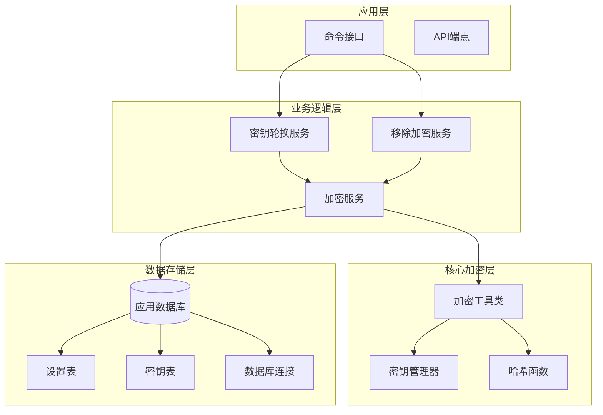
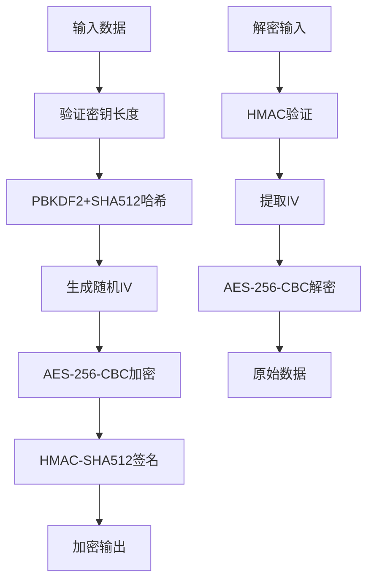
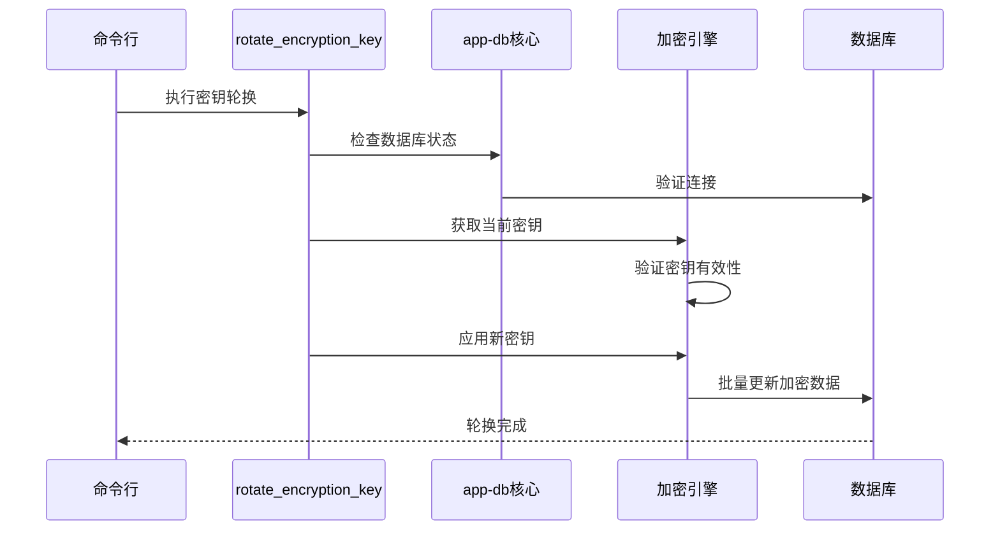
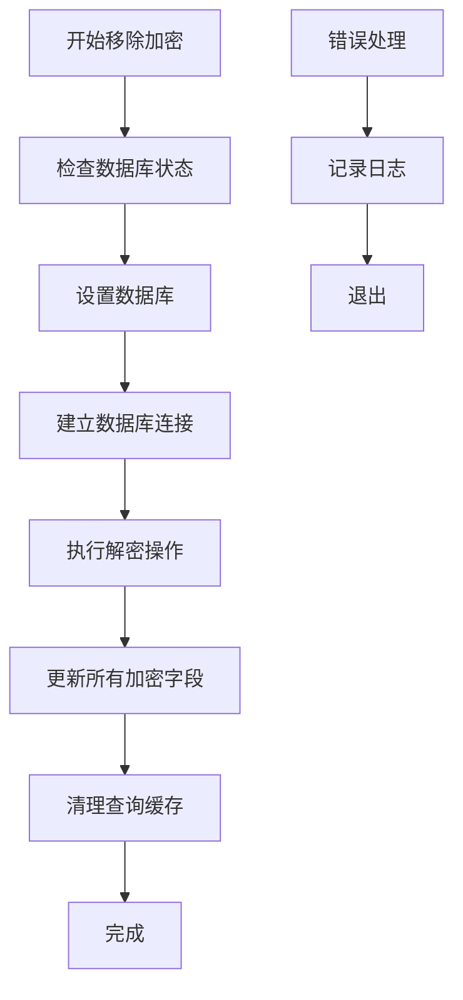
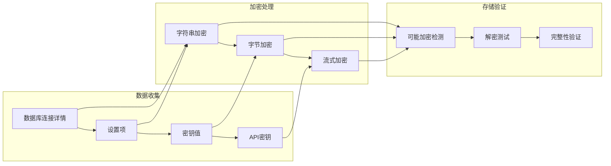
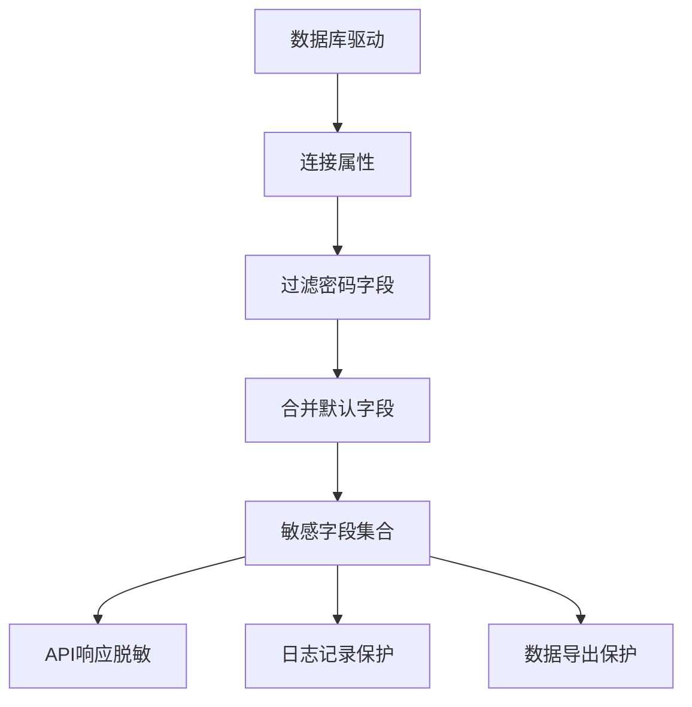
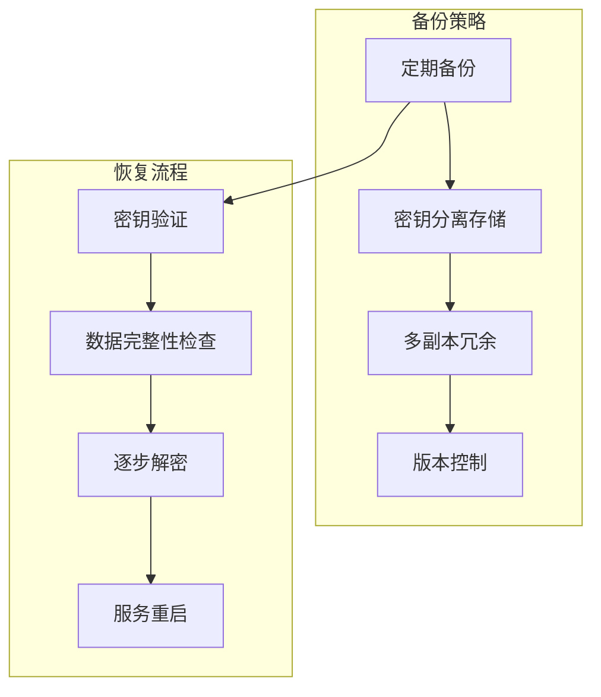
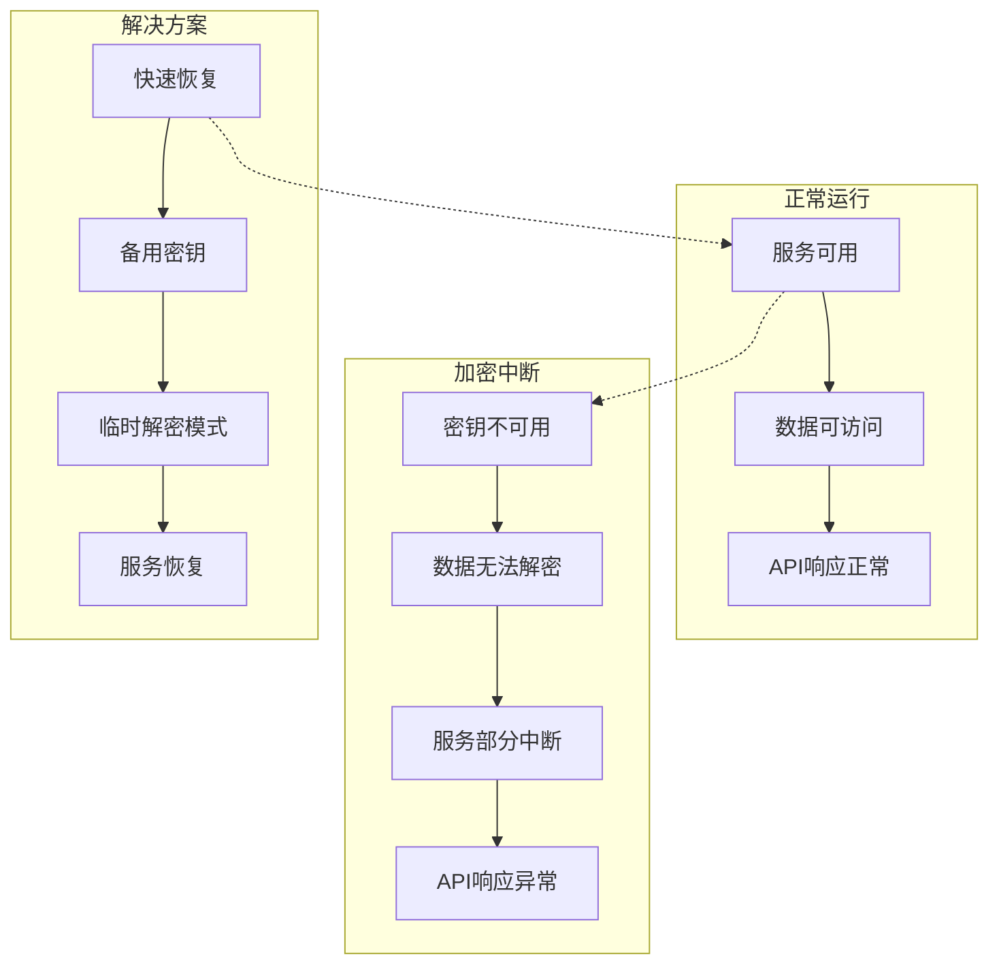
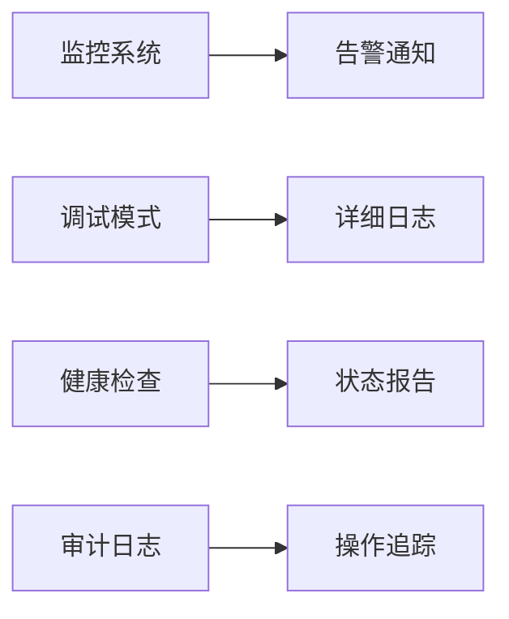

# 安全密钥管理

<cite>
**本文档中引用的文件**
- [encryption.clj](file://src/metabase/util/encryption.clj)
- [app_db/encryption.clj](file://src/metabase/app_db/encryption.clj)
- [cmd/rotate_encryption_key.clj](file://src/metabase/cmd/rotate_encryption_key.clj)
- [cmd/remove_encryption.clj](file://src/metabase/cmd/remove_encryption.clj)
- [app_db/core.clj](file://src/metabase/app_db/core.clj)
- [driver/util.clj](file://src/metabase/driver/util.clj)
- [secrets/models/secret.clj](file://src/metabase/secrets/models/secret.clj)
- [settings/models/setting.clj](file://src/metabase/settings/models/setting.clj)
- [app_db/env.clj](file://src/metabase/app_db/env.clj)
</cite>

## 目录
1. [简介](#简介)
2. [系统架构概览](#系统架构概览)
3. [核心加密组件](#核心加密组件)
4. [密钥轮换机制](#密钥轮换机制)
5. [数据加密体系](#数据加密体系)
6. [敏感字段保护](#敏感字段保护)
7. [密钥管理最佳实践](#密钥管理最佳实践)
8. [风险控制与中断影响](#风险控制与中断影响)
9. [故障排除指南](#故障排除指南)
10. [总结](#总结)

## 简介

Metabase的安全密钥管理系统是一个全面的数据保护框架，旨在确保敏感信息在存储和传输过程中的安全性。该系统通过多层次的加密机制保护数据库连接详情、API密钥、密码等敏感数据，同时提供了灵活的密钥轮换和管理功能。

本系统的核心目标是：
- 保护存储在应用数据库中的敏感连接信息
- 提供安全的密钥轮换机制
- 确保数据加密的一致性和完整性
- 支持企业级的安全合规要求

## 系统架构概览

Metabase的加密系统采用分层架构设计，包含以下主要组件：



**图表来源**
- [cmd/rotate_encryption_key.clj](file://src/metabase/cmd/rotate_encryption_key.clj#L1-L17)
- [cmd/remove_encryption.clj](file://src/metabase/cmd/remove_encryption.clj#L1-L15)
- [app_db/encryption.clj](file://src/metabase/app_db/encryption.clj#L1-L61)

## 核心加密组件

### 加密算法与协议

Metabase采用AES-256-CBC + HMAC-SHA512加密标准，提供强大的数据保护能力：



**图表来源**
- [util/encryption.clj](file://src/metabase/util/encryption.clj#L35-L98)

### 密钥处理机制

系统使用PBKDF2算法对用户提供的密钥进行强化处理：

| 参数 | 值 | 说明 |
|------|-----|------|
| 算法 | PBKDF2+SHA512 | 密钥派生函数 |
| 迭代次数 | 100,000次 | 提高暴力破解难度 |
| 输出长度 | 64字节 | 生成AES-256兼容密钥 |
| 最小长度 | 16字符 | 确保密钥强度 |

**段落来源**
- [util/encryption.clj](file://src/metabase/util/encryption.clj#L35-L45)

## 密钥轮换机制

### rotate_encryption_key命令

`rotate_encryption_key`命令提供了安全的密钥轮换功能：



**图表来源**
- [cmd/rotate_encryption_key.clj](file://src/metabase/cmd/rotate_encryption_key.clj#L8-L16)

### 移除加密功能

`remove_encryption`命令允许完全移除数据加密：



**图表来源**
- [cmd/remove_encryption.clj](file://src/metabase/cmd/remove_encryption.clj#L8-L14)

**段落来源**
- [cmd/rotate_encryption_key.clj](file://src/metabase/cmd/rotate_encryption_key.clj#L1-L17)
- [cmd/remove_encryption.clj](file://src/metabase/cmd/remove_encryption.clj#L1-L15)

## 数据加密体系

### 加密范围

Metabase对以下类型的数据进行加密存储：

| 数据类型 | 存储位置 | 加密方式 | 说明 |
|----------|----------|----------|------|
| 数据库连接详情 | metabase_database.details | AES-256-CBC | 包含用户名、密码等连接信息 |
| 设置值 | setting.value | AES-256-CBC | 敏感配置参数 |
| 密钥值 | secret.value | AES-256-CBC | 加密后的密钥内容 |
| API密钥 | api_key.key | BCrypt哈希 | 用户API访问凭证 |

### 加密流程



**图表来源**
- [app_db/encryption.clj](file://src/metabase/app_db/encryption.clj#L15-L59)

**段落来源**
- [app_db/encryption.clj](file://src/metabase/app_db/encryption.clj#L15-L59)

## 敏感字段保护

### 默认敏感字段

系统预定义了一组默认敏感字段，这些字段在API响应中会被自动脱敏：

| 字段名称 | 类型 | 描述 |
|----------|------|------|
| password | 密码字段 | 数据库连接密码 |
| pass | 密码字段 | 通用密码标识 |
| tunnel-pass | 密码字段 | 隧道连接密码 |
| tunnel-private-key | 私钥字段 | SSH隧道私钥 |
| tunnel-private-key-passphrase | 密码字段 | 私钥密码短语 |
| access-token | 访问令牌 | OAuth访问令牌 |
| refresh-token | 刷新令牌 | OAuth刷新令牌 |
| service-account-json | 服务账户 | Google服务账户JSON |

### 动态敏感字段检测

系统根据数据库驱动程序动态识别额外的敏感字段：



**图表来源**
- [driver/util.clj](file://src/metabase/driver/util.clj#L645-L668)

**段落来源**
- [driver/util.clj](file://src/metabase/driver/util.clj#L641-L668)

## 密钥管理最佳实践

### 密钥生成建议

推荐使用以下方法生成强密钥：

```clojure
(let [ba (byte-array 32)
      _  (.nextBytes (java.security.SecureRandom.) ba)
      k  (codecs/bytes->b64-str ba)]
  (alter-var-root #'env/env assoc :mb-encryption-secret-key k)
  k)
```

### 密钥轮换策略

| 轮换周期 | 推荐场景 | 实施频率 |
|----------|----------|----------|
| 90天 | 高安全要求环境 | 自动化执行 |
| 180天 | 标准企业环境 | 定期手动检查 |
| 365天 | 低风险环境 | 年度审计 |

### 备份与恢复



### 权限控制

| 权限级别 | 可执行操作 | 访问限制 |
|----------|------------|----------|
| 超级用户 | 密钥轮换、移除加密 | 仅管理员 |
| 数据库管理员 | 查看加密状态 | 受限访问 |
| 普通用户 | 无直接访问权限 | API隔离 |

**段落来源**
- [util/encryption.clj](file://src/metabase/util/encryption.clj#L6-L18)

## 风险控制与中断影响

### 主要风险点

| 风险类型 | 影响程度 | 控制措施 |
|----------|----------|----------|
| 密钥丢失 | 高 | 多重备份、密钥恢复流程 |
| 密钥泄露 | 高 | 网络监控、访问审计 |
| 加密中断 | 中 | 快速回滚、降级方案 |
| 数据损坏 | 中 | 完整性校验、事务保证 |

### 中断影响评估



### 灾难恢复计划

1. **预防措施**
   - 定期密钥轮换
   - 多层次备份策略
   - 监控告警机制

2. **应急响应**
   - 快速密钥恢复
   - 服务降级方案
   - 数据完整性验证

3. **事后处理**
   - 事件调查分析
   - 流程改进优化
   - 安全加固措施

## 故障排除指南

### 常见问题诊断

| 问题症状 | 可能原因 | 解决方案 |
|----------|----------|----------|
| 密钥验证失败 | 环境变量未设置 | 检查MB_ENCRYPTION_SECRET_KEY |
| 数据解密错误 | 密钥不匹配 | 使用正确的密钥重新加密 |
| 性能下降 | 加密开销过大 | 优化加密算法或硬件升级 |
| 数据损坏 | 加密中断导致 | 执行数据完整性检查 |

### 调试工具

系统提供了多种调试和监控功能：



### 性能优化

1. **加密性能调优**
   - 选择合适的硬件加速
   - 优化密钥派生参数
   - 实现缓存机制

2. **存储效率提升**
   - 数据压缩预处理
   - 分块加密策略
   - 索引优化

**段落来源**
- [util/encryption.clj](file://src/metabase/util/encryption.clj#L240-L262)

## 总结

Metabase的安全密钥管理系统提供了一个完整、可靠的数据保护解决方案。通过多层次的加密机制、灵活的密钥管理功能和严格的风险控制措施，该系统能够满足企业级应用的安全需求。

### 关键优势

1. **全面的数据保护**：覆盖所有敏感数据类型
2. **灵活的密钥管理**：支持轮换、备份和恢复
3. **高性能加密**：优化的算法实现和缓存机制
4. **严格的权限控制**：细粒度的访问管理
5. **完善的监控审计**：实时的状态监控和操作追踪

### 最佳实践建议

- 定期执行密钥轮换
- 建立完善的备份策略
- 实施严格的访问控制
- 监控系统性能指标
- 制定详细的应急预案

通过遵循这些指导原则和最佳实践，组织可以确保其数据资产得到充分保护，同时维持系统的高效运行。