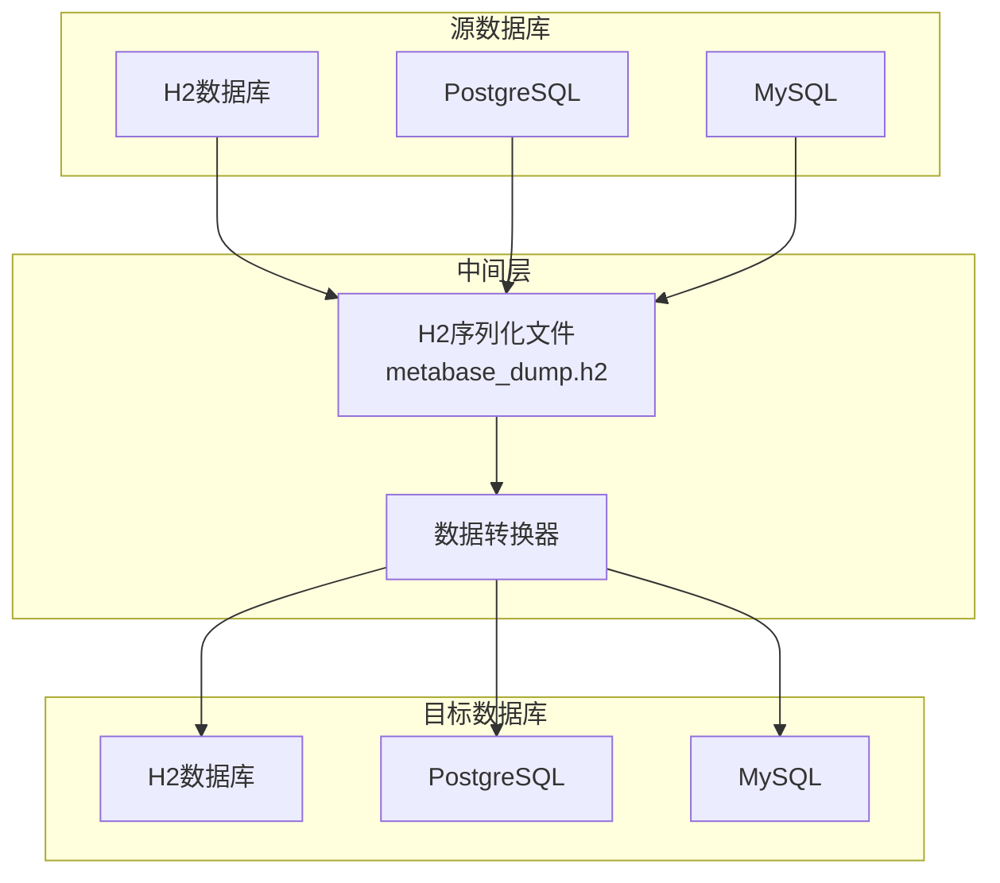
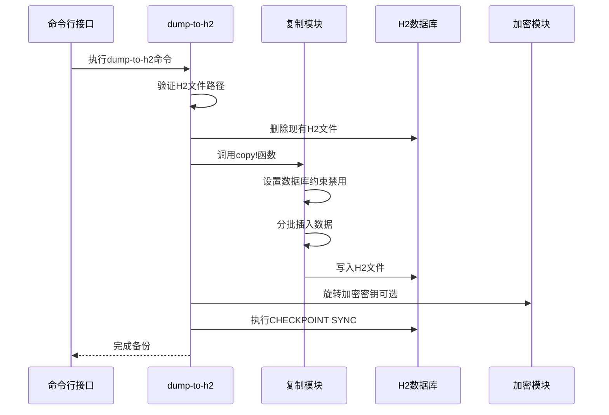
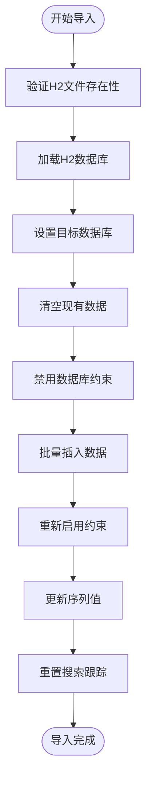
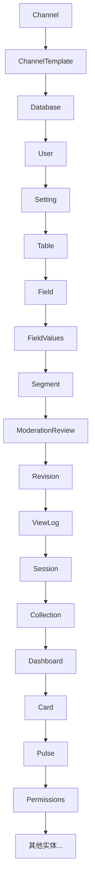
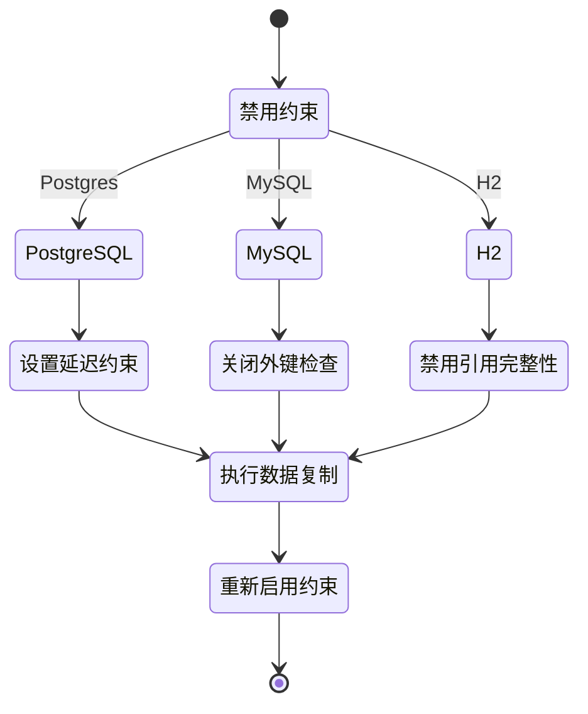
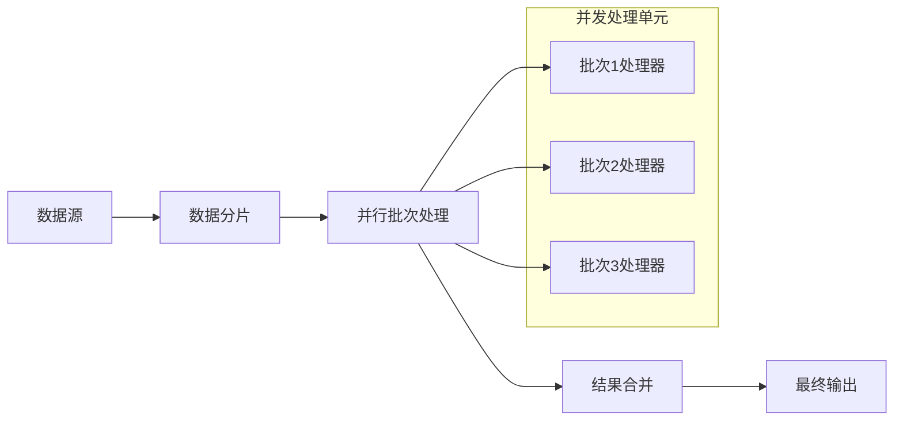
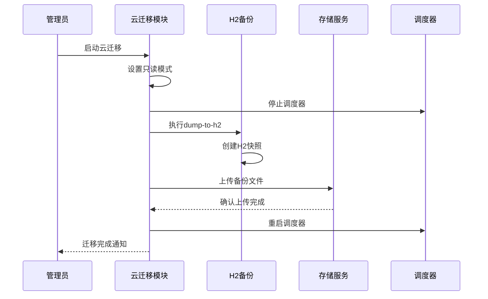
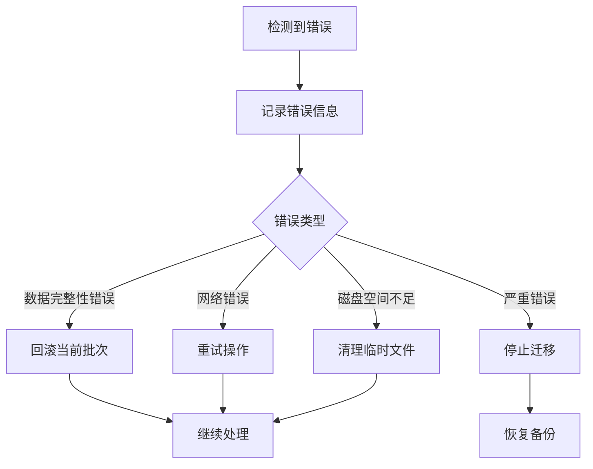
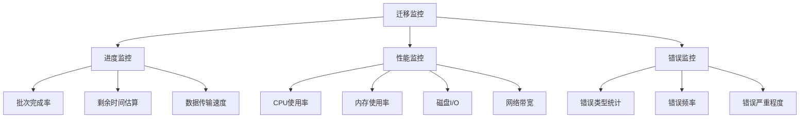

# 数据备份与恢复操作指南

<cite>
**本文档中引用的文件**
- [dump_to_h2.clj](file://src/metabase/cmd/dump_to_h2.clj)
- [load_from_h2.clj](file://src/metabase/cmd/load_from_h2.clj)
- [copy.clj](file://src/metabase/cmd/copy.clj)
- [copy/h2.clj](file://src/metabase/cmd/copy/h2.clj)
- [update_h2.clj](file://src/metabase/app_db/update_h2.clj)
- [core.clj](file://src/metabase/app_db/core.clj)
- [env.clj](file://src/metabase/app_db/env.clj)
- [serialization.clj](file://src/metabase/models/serialization.clj)
- [log.clj](file://src/metabase/util/log.clj)
- [config/core.clj](file://src/metabase/config/core.clj)
</cite>

## 目录
1. [概述](#概述)
2. [核心命令详解](#核心命令详解)
3. [H2数据库格式与序列化](#h2数据库格式与序列化)
4. [跨环境数据迁移](#跨环境数据迁移)
5. [性能优化策略](#性能优化策略)
6. [灾难恢复流程](#灾难恢复流程)
7. [最佳实践](#最佳实践)
8. [故障排除](#故障排除)

## 概述

Metabase提供了完整的数据备份与恢复解决方案，主要通过`dump-to-h2`和`load-from-h2`两个核心命令实现。该系统采用H2数据库作为中间存储格式，支持多种数据库引擎之间的无缝迁移，包括从H2到PostgreSQL、MySQL等生产环境数据库的转换。

### 系统架构概览



**图表来源**
- [dump_to_h2.clj](file://src/metabase/cmd/dump_to_h2.clj#L1-L48)
- [load_from_h2.clj](file://src/metabase/cmd/load_from_h2.clj#L1-L38)

## 核心命令详解

### dump-to-h2命令

`dump-to-h2`命令负责将现有数据库中的数据导出到H2文件格式，是数据迁移的第一步。

#### 技术实现原理



**图表来源**
- [dump_to_h2.clj](file://src/metabase/cmd/dump_to_h2.clj#L25-L47)
- [copy.clj](file://src/metabase/cmd/copy.clj#L421-L451)

#### 命令参数详解

| 参数 | 类型 | 默认值 | 描述 |
|------|------|--------|------|
| `h2-filename` | 字符串 | "metabase_dump.h2" | H2输出文件路径 |
| `keep-existing?` | 布尔值 | false | 是否保留已存在的H2文件 |
| `dump-plaintext?` | 布尔值 | false | 是否以明文形式导出数据 |

**章节来源**
- [dump_to_h2.clj](file://src/metabase/cmd/dump_to_h2.clj#L25-L47)

### load-from-h2命令

`load-from-h2`命令将H2文件中的数据导入到目标数据库，完成数据迁移的最后一步。

#### 数据导入流程



**图表来源**
- [load_from_h2.clj](file://src/metabase/cmd/load_from_h2.clj#L25-L37)
- [copy.clj](file://src/metabase/cmd/copy.clj#L217-L246)

**章节来源**
- [load_from_h2.clj](file://src/metabase/cmd/load_from_h2.clj#L25-L37)

## H2数据库格式与序列化

### H2数据库特性

H2数据库在Metabase数据迁移中扮演关键角色，具有以下重要特性：

#### 连接属性配置

| 属性 | 值 | 说明 |
|------|-----|------|
| `DB_CLOSE_DELAY` | -1 | JVM关闭时才关闭数据库 |
| `MVCC` | true | 启用多版本并发控制 |
| `DEFRAG_ALWAYS` | true | Metabase关闭时自动碎片整理 |
| `LOCK_TIMEOUT` | 60000 | 表锁等待超时时间（1分钟） |

**章节来源**
- [env.clj](file://src/metabase/app_db/env.clj#L75-L85)

### 元数据导出/导入序列化

#### 实体序列化顺序

系统按照依赖关系确定实体的序列化顺序，确保数据完整性：



**图表来源**
- [copy.clj](file://src/metabase/cmd/copy.clj#L55-L110)

#### 序列化转换规则

不同实体类型采用不同的序列化策略：

| 实体类型 | 转换规则 | 特殊处理 |
|----------|----------|----------|
| Database | 过滤连接详情（H2数据库） | 移除敏感连接信息 |
| Setting | 排除只读模式设置 | 避免恢复后仍处于只读状态 |
| Table | 移除计算列 | 忽略`unique_table_helper`字段 |
| Field | 移除计算列 | 忽略`unique_field_helper`字段 |

**章节来源**
- [copy.clj](file://src/metabase/cmd/copy.clj#L180-L215)

### 复制模块底层支持

`copy`模块提供了数据库复制的核心功能，支持跨数据库类型的迁移：

#### 数据库约束管理



**图表来源**
- [copy.clj](file://src/metabase/cmd/copy.clj#L350-L420)

**章节来源**
- [copy.clj](file://src/metabase/cmd/copy.clj#L350-L420)

## 跨环境数据迁移

### 开发到生产环境配置同步

#### 环境变量映射表

| 生产环境变量 | 开发环境变量 | 默认值 | 说明 |
|-------------|-------------|--------|------|
| `MB_DB_TYPE` | `MB_DB_TYPE` | h2 | 数据库类型 |
| `MB_DB_FILE` | `MB_DB_FILE` | metabase.db | H2文件路径 |
| `MB_DB_HOST` | `MB_DB_HOST` | localhost | 数据库主机 |
| `MB_DB_PORT` | `MB_DB_PORT` | 5432/3306 | 数据库端口 |
| `MB_DB_DBNAME` | `MB_DB_DBNAME` | metabase | 数据库名称 |
| `MB_DB_USER` | `MB_DB_USER` | - | 用户名 |
| `MB_DB_PASS` | `MB_DB_PASS` | - | 密码 |

**章节来源**
- [env.clj](file://src/metabase/app_db/env.clj#L111-L141)

### 配置同步最佳实践

#### 迁移前检查清单

1. **数据库兼容性检查**
   - 确认源数据库和目标数据库的兼容性
   - 验证数据库驱动程序版本
   - 检查字符集和排序规则设置

2. **权限验证**
   - 确保有足够的文件系统权限
   - 验证数据库连接权限
   - 检查临时目录写入权限

3. **空间需求评估**
   - 计算H2文件大小（通常是源数据库的1.5-2倍）
   - 预留目标数据库的空间
   - 考虑压缩后的存储需求

#### 迁移执行步骤


**章节来源**
- [copy.clj](file://src/metabase/cmd/copy.clj#L421-L451)

## 性能优化策略

### 大容量数据传输优化

#### 分批处理策略

系统采用智能分批策略优化大数据量传输：

| 数据量级别 | 分批大小 | 内存使用 | 处理时间 |
|-----------|----------|----------|----------|
| 小于1000条 | 100条 | 低 | 快速 |
| 1000-10000条 | 500条 | 中等 | 正常 |
| 10000-100000条 | 1000条 | 高 | 较慢 |
| 大于100000条 | 2000条 | 很高 | 慢 |

**章节来源**
- [copy.clj](file://src/metabase/cmd/copy.clj#L150-L170)

#### 并发处理优化



**图表来源**
- [copy.clj](file://src/metabase/cmd/copy.clj#L180-L246)

### 内存管理优化

#### 大对象处理策略

对于大型数据对象（如仪表板、查询结果），系统采用流式处理：

1. **流式读取**：避免一次性加载所有数据到内存
2. **增量写入**：分块写入目标数据库
3. **垃圾回收优化**：及时释放不再需要的对象引用

**章节来源**
- [copy.clj](file://src/metabase/cmd/copy.clj#L180-L246)

## 灾难恢复流程

### 自动备份机制

#### 云迁移备份流程



**图表来源**
- [cloud_migration.clj](file://src/metabase/cloud_migration/models/cloud_migration.clj#L214-L272)

### 手动恢复流程

#### 恢复操作步骤

1. **准备阶段**
   ```bash
   # 停止Metabase服务
   systemctl stop metabase
   
   # 备份当前数据库
   cp metabase.db metabase.db.backup.$(date +%Y%m%d_%H%M%S)
   ```

2. **执行恢复**
   ```bash
   # 使用load-from-h2恢复数据
   java -jar metabase.jar load-from-h2
   
   # 或指定H2文件
   java -jar metabase.jar load-from-h2 /path/to/backup.h2
   ```

3. **验证阶段**
   ```bash
   # 检查数据库完整性
   java -jar metabase.jar check-db
   
   # 验证关键数据
   java -jar metabase.jar verify-data
   ```

4. **启动服务**
   ```bash
   # 启动Metabase服务
   systemctl start metabase
   
   # 监控启动日志
   journalctl -u metabase -f
   ```

**章节来源**
- [load_from_h2.clj](file://src/metabase/cmd/load_from_h2.clj#L25-L37)

### 故障恢复策略

#### 回滚机制

当恢复过程中出现错误时，系统提供多层次的回滚保护：

1. **事务级回滚**：单个批次失败时自动回滚
2. **文件级回滚**：H2文件损坏时使用备份副本
3. **完整回滚**：整个恢复过程失败时恢复原始数据库

#### 错误处理流程



**章节来源**
- [copy.clj](file://src/metabase/cmd/copy.clj#L217-L246)

## 最佳实践

### 备份策略

#### 定期备份计划

| 备份类型 | 频率 | 保留期限 | 存储位置 |
|----------|------|----------|----------|
| 每日全量备份 | 每天 | 30天 | 本地+远程 |
| 每周增量备份 | 每周 | 12周 | 远程存储 |
| 月度归档备份 | 每月 | 1年 | 冷存储 |
| 紧急恢复点 | 实时 | 7天 | 本地缓存 |

#### 备份验证检查

每次备份完成后应执行验证检查：

```bash
#!/bin/bash
# 备份验证脚本示例

echo "开始备份验证..."

# 验证H2文件完整性
java -jar metabase.jar validate-h2 /path/to/backup.h2

# 检查关键实体数量
java -jar metabase.jar check-entity-counts /path/to/backup.h2

# 验证数据库连接
java -jar metabase.jar test-connection /path/to/backup.h2

echo "备份验证完成"
```

### 迁移测试

#### 测试环境配置

1. **硬件要求**
   - CPU：至少4核
   - 内存：8GB RAM
   - 存储：50GB可用空间
   - 网络：千兆网卡

2. **软件要求**
   - Java 11或更高版本
   - 目标数据库服务器
   - Metabase最新版本

3. **测试数据准备**
   - 包含各种实体类型的完整数据集
   - 模拟生产环境的工作负载
   - 包含边界条件和异常情况

#### 迁移成功率指标

| 指标 | 目标值 | 测量方法 |
|------|--------|----------|
| 成功率 | >99% | 成功迁移次数/总尝试次数 |
| 平均时间 | <30分钟 | 从开始到完成的时间 |
| 数据一致性 | 100% | 实体数量和关联关系验证 |
| 性能影响 | <10% | 迁移期间的系统资源使用 |

### 监控和告警

#### 关键指标监控



#### 告警阈值设置

| 监控项目 | 告警阈值 | 处理措施 |
|----------|----------|----------|
| 迁移失败率 | >1% | 立即停止迁移，分析原因 |
| CPU使用率 | >90% | 调整并发数，暂停非关键任务 |
| 内存使用率 | >85% | 增加堆内存，优化GC参数 |
| 磁盘空间 | <20% | 清理临时文件，扩展存储 |
| 网络延迟 | >100ms | 检查网络连接，切换传输路径 |

## 故障排除

### 常见问题及解决方案

#### 连接问题

**问题**：无法连接到源数据库
**原因**：
- 网络连接中断
- 数据库服务未启动
- 认证凭据错误
- 防火墙阻止连接

**解决方案**：
```bash
# 检查数据库连接
java -jar metabase.jar test-connection \
  --db-type postgres \
  --host localhost \
  --port 5432 \
  --dbname metabase \
  --user $USER \
  --password $PASSWORD

# 检查网络连通性
ping localhost
telnet localhost 5432

# 检查防火墙设置
sudo firewall-cmd --list-ports
```

#### 磁盘空间问题

**问题**：H2文件过大导致磁盘空间不足
**解决方案**：
1. 清理旧的H2文件
2. 增加磁盘空间
3. 使用压缩选项
4. 分阶段迁移

```bash
# 检查磁盘空间使用情况
df -h /path/to/metabase

# 清理临时文件
find /tmp -name "metabase*" -mtime +7 -delete

# 监控磁盘使用
watch -n 5 df -h /path/to/metabase
```

#### 内存溢出问题

**问题**：大数据库迁移时出现OutOfMemoryError
**解决方案**：
```bash
# 增加JVM堆内存
export JAVA_OPTS="-Xmx4g -Xms2g"

# 调整批次大小
export BATCH_SIZE=500

# 启用垃圾回收日志
export JAVA_OPTS="$JAVA_OPTS -XX:+PrintGCDetails -XX:+PrintGCTimeStamps"
```

#### 数据一致性问题

**问题**：恢复后数据不一致
**诊断步骤**：
```bash
# 检查实体数量
java -jar metabase.jar compare-entity-counts \
  source.h2 target.db

# 验证关键关联关系
java -jar metabase.jar validate-relationships \
  source.h2 target.db

# 检查数据完整性
java -jar metabase.jar check-data-integrity \
  target.db
```

### 日志分析

#### 关键日志位置

| 日志类型 | 文件路径 | 用途 |
|----------|----------|------|
| 应用日志 | `/var/log/metabase/app.log` | 主要应用程序日志 |
| 迁移日志 | `/var/log/metabase/migration.log` | 迁移过程日志 |
| 错误日志 | `/var/log/metabase/error.log` | 错误和异常信息 |
| 性能日志 | `/var/log/metabase/performance.log` | 性能监控数据 |

#### 日志分析工具

```bash
# 查找错误信息
grep -i "error\|fail\|exception" /var/log/metabase/*.log

# 分析迁移性能
awk '/Copying instances/ {print $0}' /var/log/metabase/migration.log | tail -10

# 监控实时日志
tail -f /var/log/metabase/app.log | grep -i "migration\|backup\|restore"
```

**章节来源**
- [log.clj](file://src/metabase/util/log.clj#L150-L200)

### 性能调优

#### 数据库连接优化

```bash
# 优化PostgreSQL连接池
export PG_CONNECTION_POOL_SIZE=20
export PG_IDLE_TIMEOUT=300
export PG_MAX_LIFETIME=1800

# 优化MySQL连接参数
export MYSQL_BUFFER_POOL_SIZE=1G
export MYSQL_QUERY_CACHE_SIZE=64M
export MYSQL_TABLE_OPEN_CACHE=4000
```

#### 系统级优化

```bash
# 优化Linux内核参数
echo 'vm.swappiness=10' >> /etc/sysctl.conf
echo 'vm.dirty_ratio=15' >> /etc/sysctl.conf
echo 'vm.dirty_background_ratio=5' >> /etc/sysctl.conf

# 优化文件系统
echo 'noatime,nodiratime' >> /etc/fstab
```

通过遵循这些最佳实践和故障排除指南，可以确保Metabase数据备份与恢复操作的可靠性、安全性和高效性。定期审查和更新这些流程，以适应不断变化的业务需求和技术环境。