# 数据库迁移管理

<cite>
**本文档中引用的文件**
- [migrate.clj](file://src/metabase/cmd/migrate.clj)
- [custom_migrations.clj](file://src/metabase/app_db/custom_migrations.clj)
- [liquibase.clj](file://src/metabase/app_db/liquibase.clj)
- [metrics_v2.clj](file://src/metabase/app_db/custom_migrations/metrics_v2.clj)
- [pulse_to_notification.clj](file://src/metabase/app_db/custom_migrations/pulse_to_notification.clj)
- [util.clj](file://src/metabase/app_db/custom_migrations/util.clj)
- [setup.clj](file://src/metabase/app_db/setup.clj)
- [core.clj](file://src/metabase/cmd/core.clj)
- [env.clj](file://src/metabase/app_db/env.clj)
</cite>

## 目录
1. [简介](#简介)
2. [项目结构](#项目结构)
3. [核心组件](#核心组件)
4. [架构概览](#架构概览)
5. [详细组件分析](#详细组件分析)
6. [依赖关系分析](#依赖关系分析)
7. [性能考虑](#性能考虑)
8. [故障排除指南](#故障排除指南)
9. [结论](#结论)

## 简介

Metabase的数据库迁移管理系统是一个复杂而强大的框架，负责管理应用程序数据库模式的演进。该系统基于Liquibase构建，提供了SQL迁移和自定义Clojure迁移的双重支持，确保数据库结构能够随着应用版本的升级而平滑演进。

该系统的核心特性包括：
- 与Liquibase的深度集成，提供可靠的数据库变更管理
- 支持可逆的自定义迁移脚本，用于复杂的业务逻辑迁移
- 多数据库支持（PostgreSQL、MySQL、H2）
- 智能的迁移锁管理和并发控制
- 完整的错误处理和回滚机制

## 项目结构

数据库迁移相关的文件主要分布在以下目录结构中：

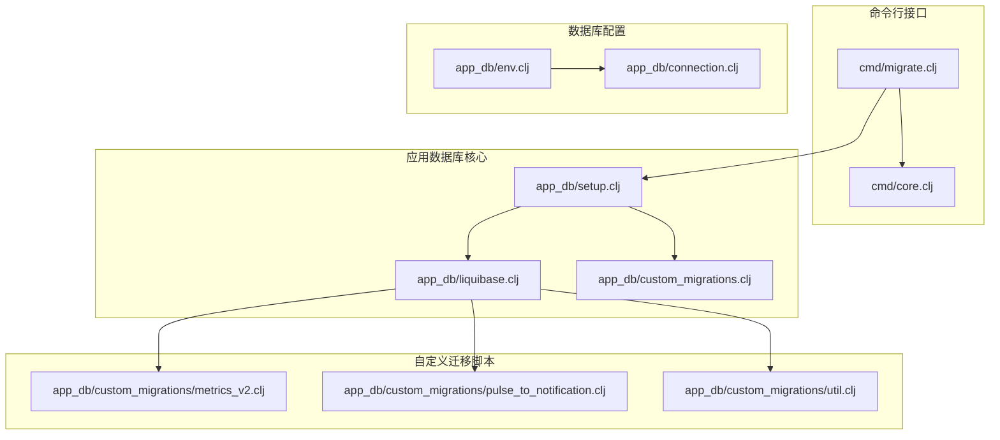

**图表来源**
- [migrate.clj](file://src/metabase/cmd/migrate.clj#L1-L9)
- [setup.clj](file://src/metabase/app_db/setup.clj#L1-L50)
- [liquibase.clj](file://src/metabase/app_db/liquibase.clj#L1-L30)

## 核心组件

### 命令行入口点

`migrate`命令是数据库迁移的主要入口点，它通过简单的接口封装了复杂的迁移逻辑。

**章节来源**
- [migrate.clj](file://src/metabase/cmd/migrate.clj#L1-L9)
- [core.clj](file://src/metabase/cmd/core.clj#L60-L70)

### Liquibase集成层

Liquibase集成层提供了高级的数据库迁移抽象，支持多种数据库类型和复杂的迁移场景。

**章节来源**
- [liquibase.clj](file://src/metabase/app_db/liquibase.clj#L1-L100)
- [setup.clj](file://src/metabase/app_db/setup.clj#L55-L100)

### 自定义迁移框架

自定义迁移框架允许开发者编写复杂的业务逻辑迁移，这些迁移可以包含数据转换、业务规则更新等操作。

**章节来源**
- [custom_migrations.clj](file://src/metabase/app_db/custom_migrations.clj#L1-L100)
- [metrics_v2.clj](file://src/metabase/app_db/custom_migrations/metrics_v2.clj#L1-L50)

## 架构概览

数据库迁移系统采用分层架构设计，确保了良好的可扩展性和维护性：

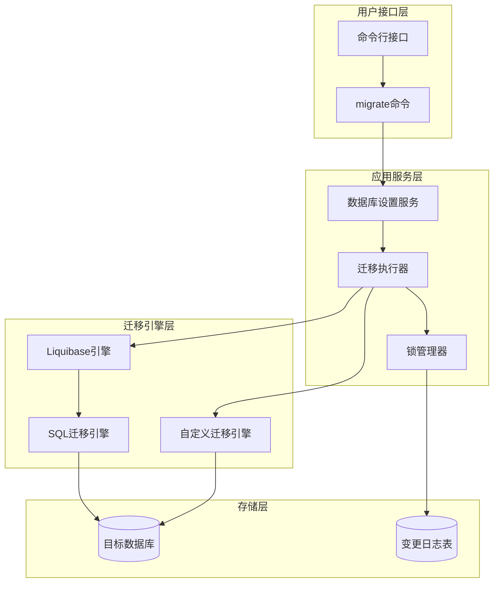

**图表来源**
- [core.clj](file://src/metabase/cmd/core.clj#L60-L70)
- [setup.clj](file://src/metabase/app_db/setup.clj#L55-L100)
- [liquibase.clj](file://src/metabase/app_db/liquibase.clj#L124-L150)

## 详细组件分析

### `migrate`命令实现

`migrate`命令是整个迁移系统的核心入口，它提供了简洁的接口来执行各种迁移操作。

#### 命令参数和选项

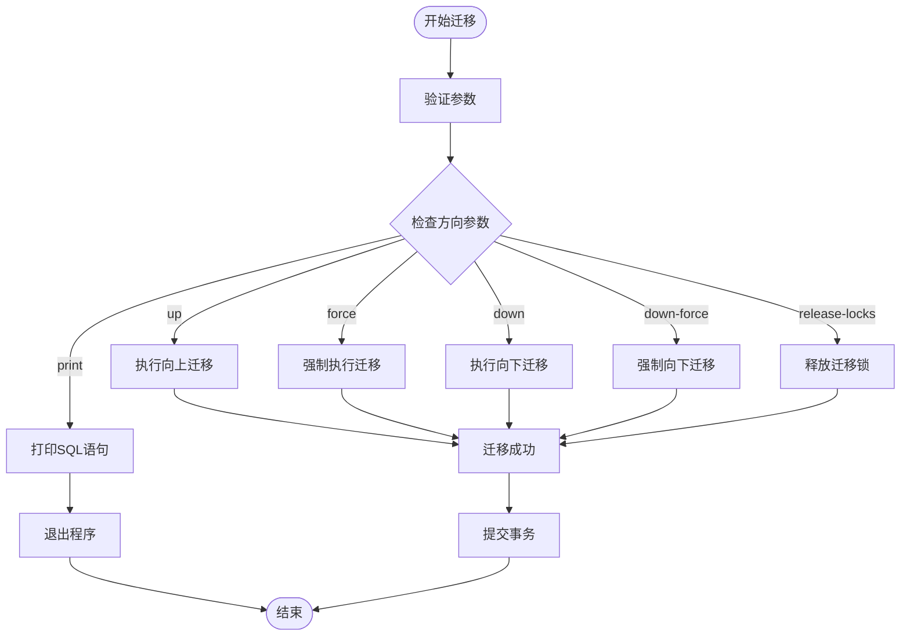

**图表来源**
- [migrate.clj](file://src/metabase/cmd/migrate.clj#L1-L9)
- [core.clj](file://src/metabase/cmd/core.clj#L60-L70)

#### 迁移方向详解

系统支持以下迁移方向：

| 方向 | 描述 | 使用场景 |
|------|------|----------|
| `:up` | 执行未运行的迁移 | 正常升级到新版本 |
| `:force` | 强制执行迁移，忽略锁和失败 | 解决迁移卡住问题 |
| `:down` | 回滚到上一个主版本 | 版本降级需求 |
| `:down-force` | 强制回滚，忽略验证 | 紧急回滚场景 |
| `:print` | 打印待执行的SQL语句 | 预览迁移内容 |
| `:release-locks` | 释放遗留的迁移锁 | 清理锁定状态 |

**章节来源**
- [setup.clj](file://src/metabase/app_db/setup.clj#L55-L80)

### Liquibase集成机制

Liquibase集成提供了强大的数据库变更管理能力，支持多种数据库类型和复杂的迁移场景。

#### Liquibase生命周期管理

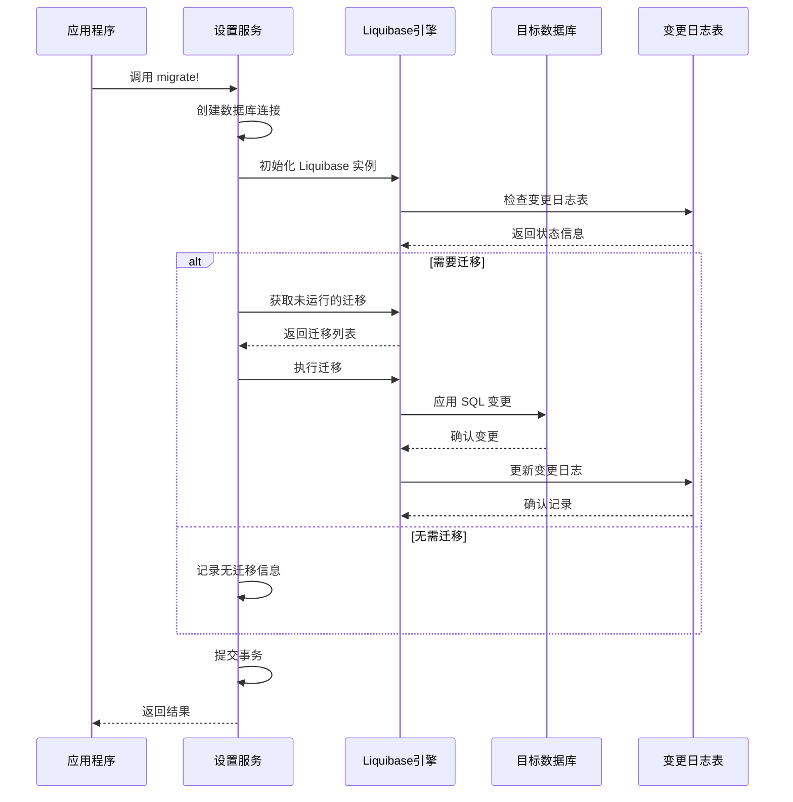

**图表来源**
- [liquibase.clj](file://src/metabase/app_db/liquibase.clj#L124-L150)
- [setup.clj](file://src/metabase/app_db/setup.clj#L70-L100)

#### 数据库类型检测和适配

系统能够自动检测目标数据库类型并选择合适的迁移策略：

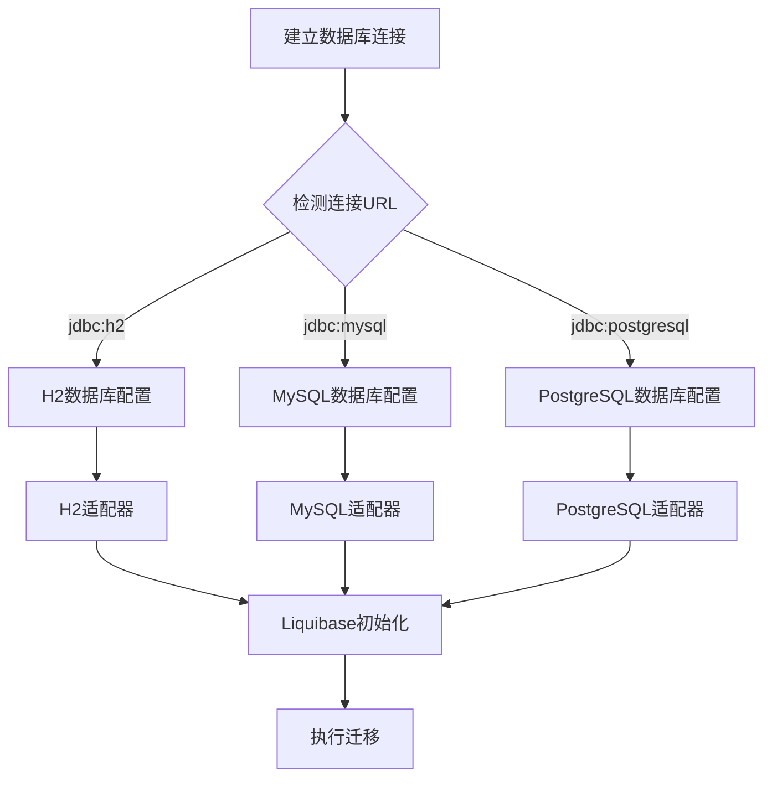

**图表来源**
- [liquibase.clj](file://src/metabase/app_db/liquibase.clj#L100-L130)
- [env.clj](file://src/metabase/app_db/env.clj#L40-L80)

**章节来源**
- [liquibase.clj](file://src/metabase/app_db/liquibase.clj#L100-L150)

### 自定义迁移脚本系统

自定义迁移系统允许开发者编写复杂的业务逻辑迁移，这些迁移可以访问完整的应用功能和数据。

#### 迁移脚本注册和发现机制

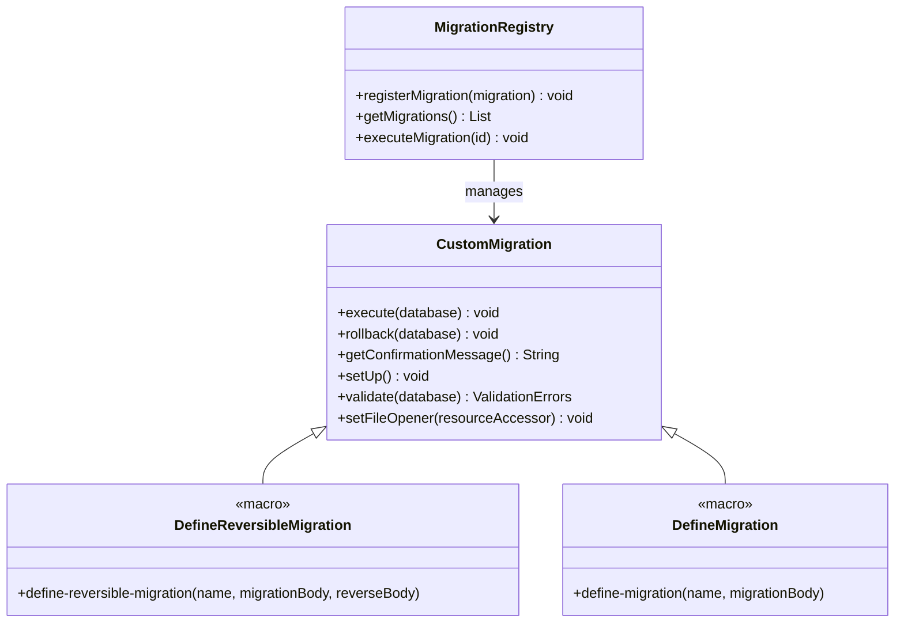

**图表来源**
- [custom_migrations.clj](file://src/metabase/app_db/custom_migrations.clj#L60-L90)

#### 自定义迁移脚本示例

系统提供了多个实际的自定义迁移脚本作为参考：

##### 指标V2迁移

指标V2迁移是一个典型的复杂业务迁移案例，展示了如何从旧版指标系统迁移到新版：

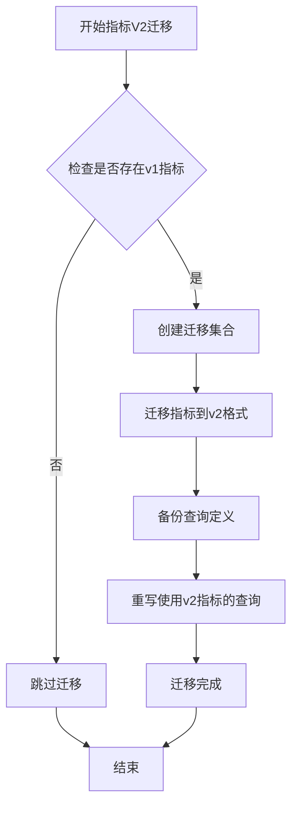

**图表来源**
- [metrics_v2.clj](file://src/metabase/app_db/custom_migrations/metrics_v2.clj#L100-L150)

##### 脉冲到通知迁移

脉冲到通知系统的迁移展示了如何将旧的通知系统迁移到新的通知系统：

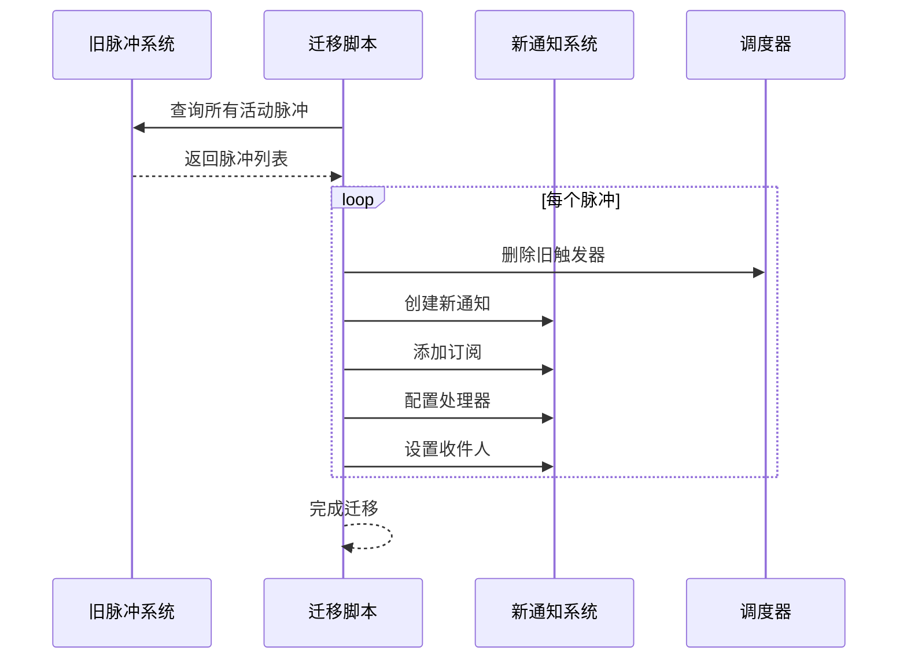

**图表来源**
- [pulse_to_notification.clj](file://src/metabase/app_db/custom_migrations/pulse_to_notification.clj#L100-L166)

**章节来源**
- [custom_migrations.clj](file://src/metabase/app_db/custom_migrations.clj#L60-L150)
- [metrics_v2.clj](file://src/metabase/app_db/custom_migrations/metrics_v2.clj#L1-L152)
- [pulse_to_notification.clj](file://src/metabase/app_db/custom_migrations/pulse_to_notification.clj#L1-L167)

### 迁移锁管理和并发控制

迁移系统实现了完善的锁管理和并发控制机制，确保在多实例部署环境下的安全性。

#### 锁管理流程

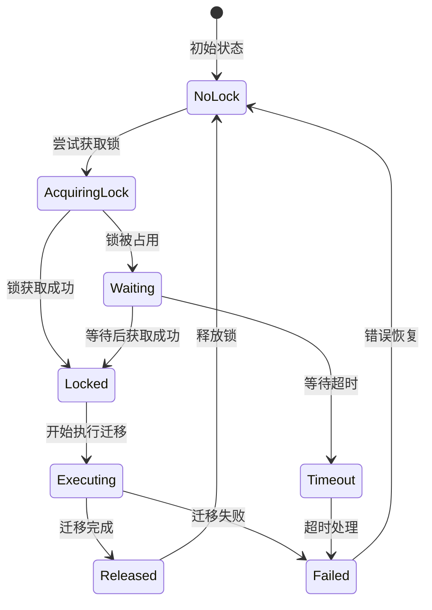

**图表来源**
- [liquibase.clj](file://src/metabase/app_db/liquibase.clj#L230-L280)

#### 并发冲突解决

系统提供了多种机制来处理并发冲突：

| 冲突类型 | 处理策略 | 实现方式 |
|----------|----------|----------|
| 锁竞争 | 等待重试 | 自动重试机制 |
| 死锁检测 | 强制释放 | 锁超时机制 |
| 不一致状态 | 回滚恢复 | 事务回滚 |
| 网络分区 | 乐观锁 | 版本检查 |

**章节来源**
- [liquibase.clj](file://src/metabase/app_db/liquibase.clj#L230-L300)

## 依赖关系分析

数据库迁移系统的依赖关系体现了清晰的分层架构：

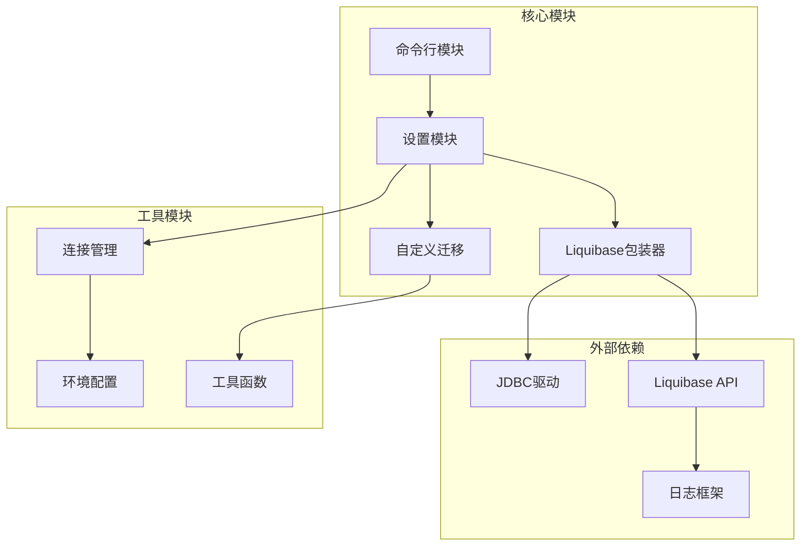

**图表来源**
- [setup.clj](file://src/metabase/app_db/setup.clj#L1-L30)
- [liquibase.clj](file://src/metabase/app_db/liquibase.clj#L1-L30)

**章节来源**
- [setup.clj](file://src/metabase/app_db/setup.clj#L1-L50)
- [liquibase.clj](file://src/metabase/app_db/liquibase.clj#L1-L50)

## 性能考虑

### 迁移性能优化

系统采用了多种策略来优化迁移性能：

1. **批量操作**：将多个小的迁移合并为批量操作
2. **索引优化**：在迁移过程中智能管理数据库索引
3. **连接池管理**：合理使用数据库连接池
4. **内存管理**：避免大数据量迁移时的内存溢出

### 大规模数据迁移策略

对于包含大量数据的迁移，系统提供了以下优化策略：

- 分批处理：将大数据集分割为小批次处理
- 并行处理：在支持的场景下并行执行独立的迁移
- 增量迁移：只迁移发生变化的数据部分
- 后台处理：将长时间运行的迁移放到后台执行

## 故障排除指南

### 常见迁移问题及解决方案

#### 迁移卡住问题

当迁移过程卡住时，可以使用以下步骤进行排查：

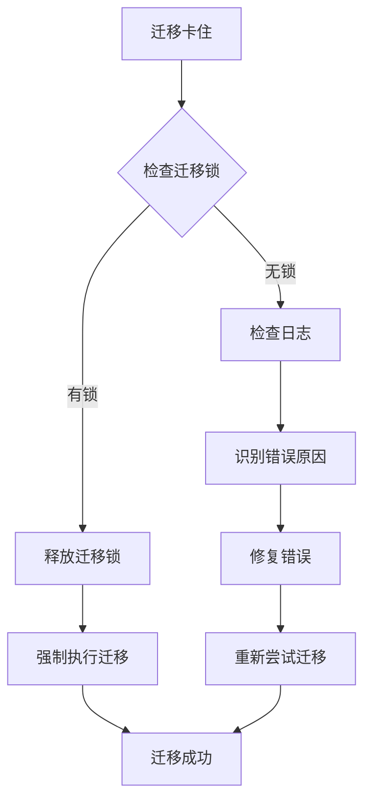

**图表来源**
- [liquibase.clj](file://src/metabase/app_db/liquibase.clj#L200-L250)

#### 数据库连接问题

常见的数据库连接问题及解决方案：

| 问题类型 | 症状 | 解决方案 |
|----------|------|----------|
| 连接超时 | 迁移开始后无响应 | 检查网络连接和数据库负载 |
| 权限不足 | 执行DDL语句失败 | 验证数据库用户权限 |
| 版本不匹配 | Liquibase版本冲突 | 升级或降级Liquibase版本 |
| 字符编码问题 | 中文字符显示异常 | 检查数据库字符集设置 |

**章节来源**
- [liquibase.clj](file://src/metabase/app_db/liquibase.clj#L200-L300)

### 错误恢复机制

系统提供了多层次的错误恢复机制：

1. **自动重试**：对于临时性错误自动重试
2. **事务回滚**：在发生错误时自动回滚已执行的操作
3. **状态检查**：定期检查迁移状态以识别问题
4. **人工干预**：提供手动干预的接口和工具

## 结论

Metabase的数据库迁移管理系统是一个设计精良、功能完备的解决方案，它成功地解决了现代应用在数据库演进过程中面临的各种挑战。

### 主要优势

1. **可靠性**：基于Liquibase的成熟技术栈，提供可靠的迁移保证
2. **灵活性**：支持SQL和自定义迁移，适应各种复杂的业务需求
3. **安全性**：完善的锁管理和并发控制机制
4. **可观测性**：详细的日志记录和状态监控
5. **可扩展性**：模块化设计便于添加新的迁移类型和数据库支持

### 最佳实践建议

1. **生产环境迁移**：始终先在测试环境中验证迁移
2. **备份策略**：在执行重大迁移前做好完整备份
3. **监控告警**：建立迁移过程的监控和告警机制
4. **文档记录**：详细记录每次迁移的原因和影响
5. **回滚准备**：为重要迁移准备快速回滚方案

该系统为Metabase的持续演进提供了坚实的基础，确保了应用能够在不断发展的过程中保持稳定和可靠。