# 用户管理与系统维护

<cite>
**本文档中引用的文件**
- [reset_password.clj](file://src/metabase/cmd/reset_password.clj)
- [common.clj](file://src/metabase/cmd/common.clj)
- [user.clj](file://src/metabase/users/models/user.clj)
- [auth_identity.clj](file://src/metabase/auth_identity/models/auth_identity.clj)
- [session.clj](file://src/metabase/session/models/session.clj)
- [audit_log.clj](file://src/metabase/audit_app/events/audit_log.clj)
- [permissions_group_membership.clj](file://src/metabase/permissions/models/permissions_group_membership.clj)
- [truncate_audit_tables.clj](file://src/metabase/audit_app/task/truncate_audit_tables.clj)
- [session_cleanup.clj](file://src/metabase/session/task/session_cleanup.clj)
- [core.clj](file://src/metabase/cmd/core.clj)
- [migrate.clj](file://src/metabase/cmd/migrate.clj)
- [permissions.clj](file://src/metabase/permissions/core.clj)
</cite>

## 目录
1. [简介](#简介)
2. [项目结构概览](#项目结构概览)
3. [核心组件分析](#核心组件分析)
4. [密码重置系统](#密码重置系统)
5. [用户状态管理](#用户状态管理)
6. [会话管理系统](#会话管理系统)
7. [权限管理与修复](#权限管理与修复)
8. [审计日志系统](#审计日志系统)
9. [系统维护任务](#系统维护任务)
10. [自动化维护脚本](#自动化维护脚本)
11. [安全考量](#安全考量)
12. [故障排除指南](#故障排除指南)
13. [总结](#总结)

## 简介

Metabase是一个开源的数据可视化平台，其用户管理系统和系统维护功能是确保平台安全运行的关键组件。本文档详细介绍了Metabase中的用户管理、密码重置、系统维护等核心功能，以及相关的安全机制和最佳实践。

该系统采用模块化设计，通过命令行工具、Web API和后台任务等多种方式提供用户管理功能。核心功能包括：
- 密码重置和身份验证
- 用户状态管理（激活/停用）
- 权限组管理
- 会话清理和失效
- 审计日志记录
- 自动化维护任务

## 项目结构概览

Metabase的用户管理和系统维护功能分布在多个命名空间中，形成了清晰的层次结构：

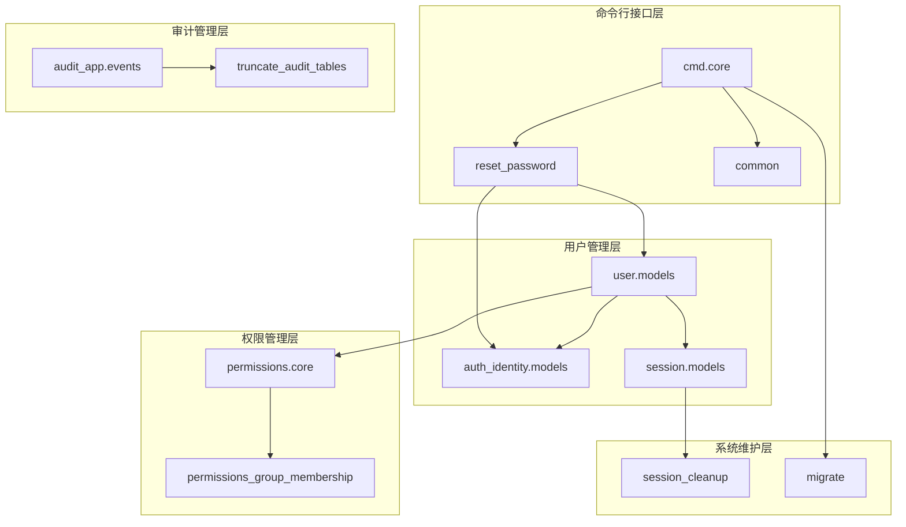

**图表来源**
- [core.clj](file://src/metabase/cmd/core.clj#L1-L50)
- [reset_password.clj](file://src/metabase/cmd/reset_password.clj#L1-L31)
- [user.clj](file://src/metabase/users/models/user.clj#L1-L100)

## 核心组件分析

### 命令行工具基础设施

`common.clj`提供了命令行工具的基础设施，包含资源加载和文档生成功能：

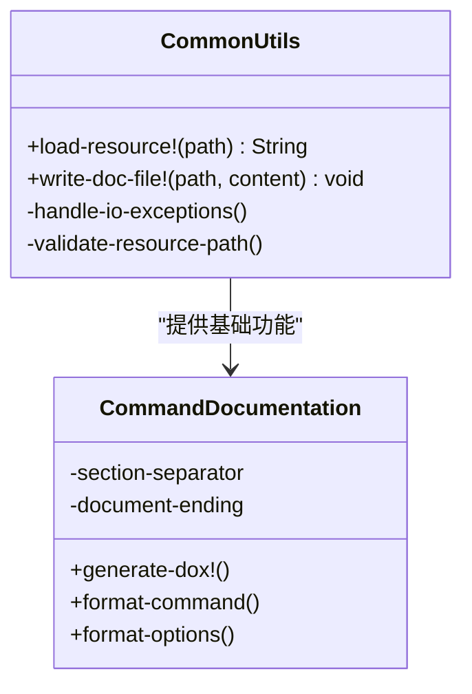

**图表来源**
- [common.clj](file://src/metabase/cmd/common.clj#L10-L37)

**章节来源**
- [common.clj](file://src/metabase/cmd/common.clj#L1-L38)

### 用户模型与身份验证

用户管理系统的核心是用户模型和身份验证机制：

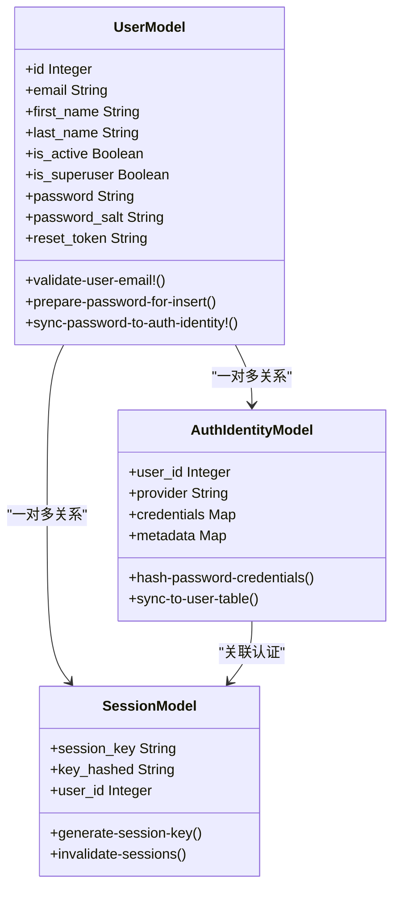

**图表来源**
- [user.clj](file://src/metabase/users/models/user.clj#L40-L100)
- [auth_identity.clj](file://src/metabase/auth_identity/models/auth_identity.clj#L20-L60)
- [session.clj](file://src/metabase/session/models/session.clj#L30-L75)

**章节来源**
- [user.clj](file://src/metabase/users/models/user.clj#L1-L528)
- [auth_identity.clj](file://src/metabase/auth_identity/models/auth_identity.clj#L1-L136)
- [session.clj](file://src/metabase/session/models/session.clj#L1-L76)

## 密码重置系统

### 技术实现原理

密码重置功能通过专门的命令行工具实现，具有严格的安全控制和审计跟踪：

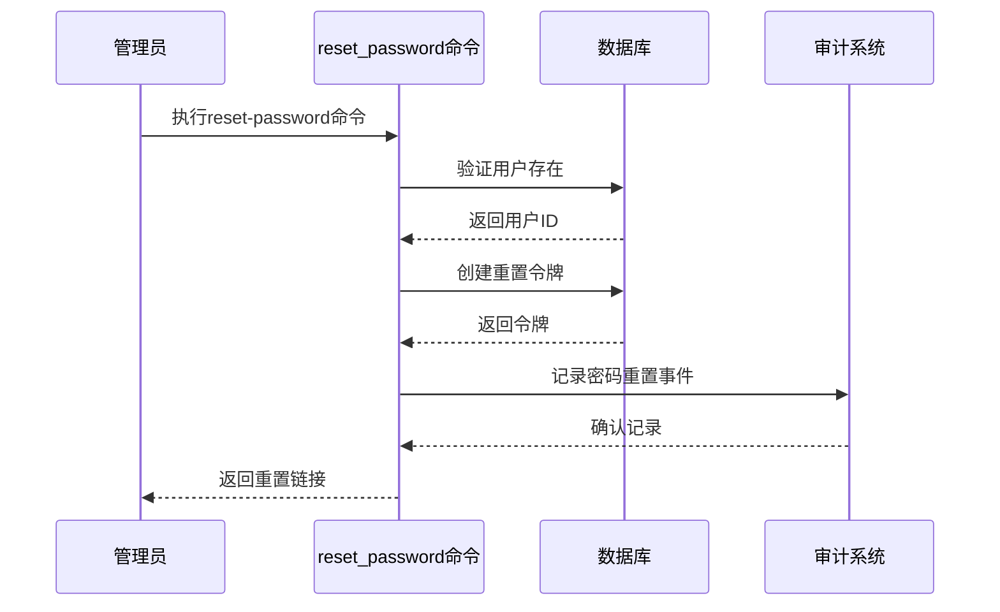

**图表来源**
- [reset_password.clj](file://src/metabase/cmd/reset_password.clj#L15-L30)

### 身份验证机制

密码重置过程包含多层安全验证：

1. **用户验证**：检查邮箱地址是否存在且有效
2. **令牌生成**：使用BCrypt算法生成安全的重置令牌
3. **时间限制**：令牌有效期为48小时
4. **单次使用**：令牌消费后自动失效

### 审计日志记录

每次密码重置操作都会被详细记录：

| 字段 | 描述 | 示例值 |
|------|------|--------|
| 事件类型 | 用户事件分类 | `password-reset-initiated` |
| 用户ID | 受影响用户标识 | `123` |
| 操作者ID | 执行操作的用户 | `456` |
| 时间戳 | 事件发生时间 | `2024-01-15T10:30:00Z` |
| IP地址 | 操作来源IP | `192.168.1.100` |
| 浏览器信息 | 客户端信息 | `Chrome 119.0.0.0` |

**章节来源**
- [reset_password.clj](file://src/metabase/cmd/reset_password.clj#L1-L31)
- [audit_log.clj](file://src/metabase/audit_app/events/audit_log.clj#L280-L290)

## 用户状态管理

### 用户生命周期管理

用户状态管理涵盖了从创建到归档的完整生命周期：

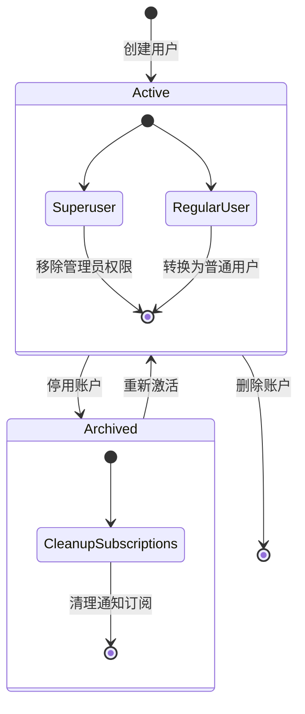

**图表来源**
- [user.clj](file://src/metabase/users/models/user.clj#L160-L190)

### 权限同步机制

用户状态变更时会自动同步权限设置：

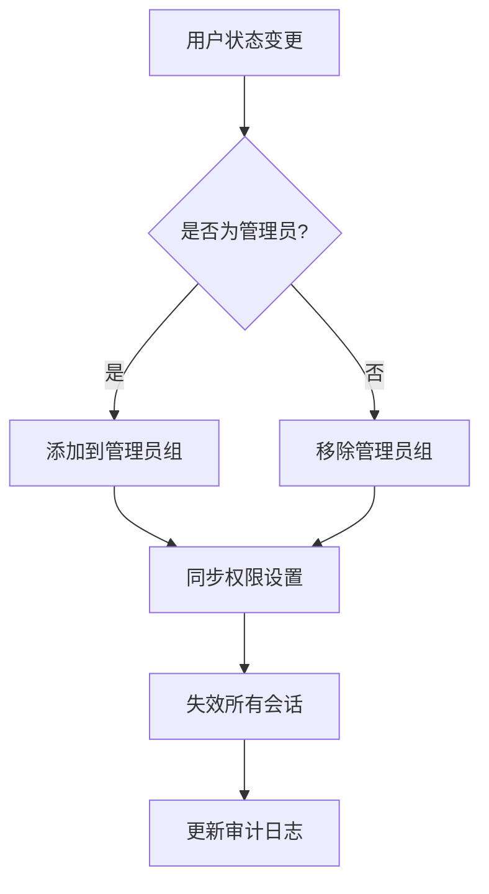

**图表来源**
- [user.clj](file://src/metabase/users/models/user.clj#L151-L185)

### 最后管理员保护

系统防止意外删除唯一管理员：

| 场景 | 行为 | 异常处理 |
|------|------|----------|
| 删除最后一个管理员 | 禁止操作 | 抛出异常："无法删除最后一位管理员" |
| 停用管理员账户 | 允许但警告 | 提示需要先添加新管理员 |
| 转换管理员角色 | 自动同步 | 更新权限组和超级用户标志 |

**章节来源**
- [user.clj](file://src/metabase/users/models/user.clj#L151-L190)
- [permissions_group_membership.clj](file://src/metabase/permissions/models/permissions_group_membership.clj#L40-L70)

## 会话管理系统

### 会话生命周期

会话管理负责维护用户登录状态和安全控制：

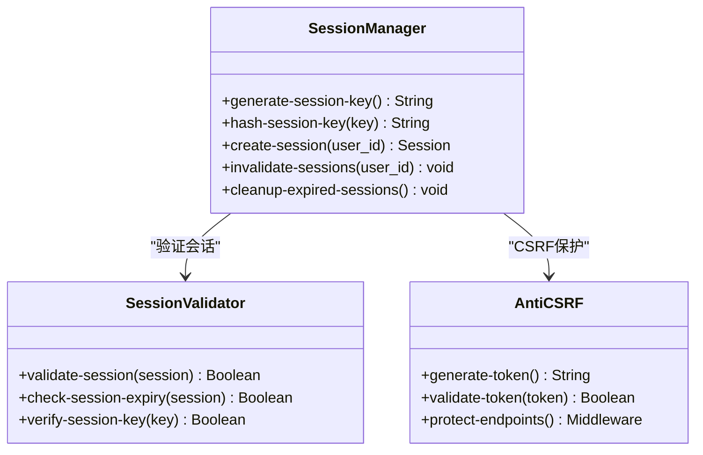

**图表来源**
- [session.clj](file://src/metabase/session/models/session.clj#L20-L50)

### 会话清理策略

系统定期清理过期会话以维护性能：

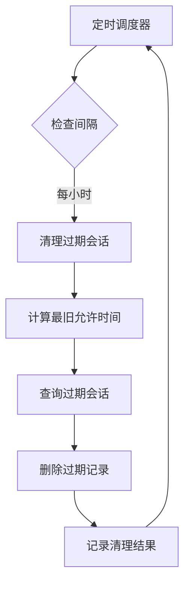

**图表来源**
- [session_cleanup.clj](file://src/metabase/session/task/session_cleanup.clj#L15-L35)

### 安全特性

| 特性 | 实现方式 | 安全级别 |
|------|----------|----------|
| 会话加密 | SHA-512哈希 | 高 |
| CSRF保护 | 32位随机令牌 | 中 |
| 过期控制 | 可配置超时时间 | 中 |
| 单点登录 | 会话隔离 | 高 |

**章节来源**
- [session.clj](file://src/metabase/session/models/session.clj#L1-L76)
- [session_cleanup.clj](file://src/metabase/session/task/session_cleanup.clj#L1-L40)

## 权限管理与修复

### 权限组架构

权限管理系统基于分层架构设计：

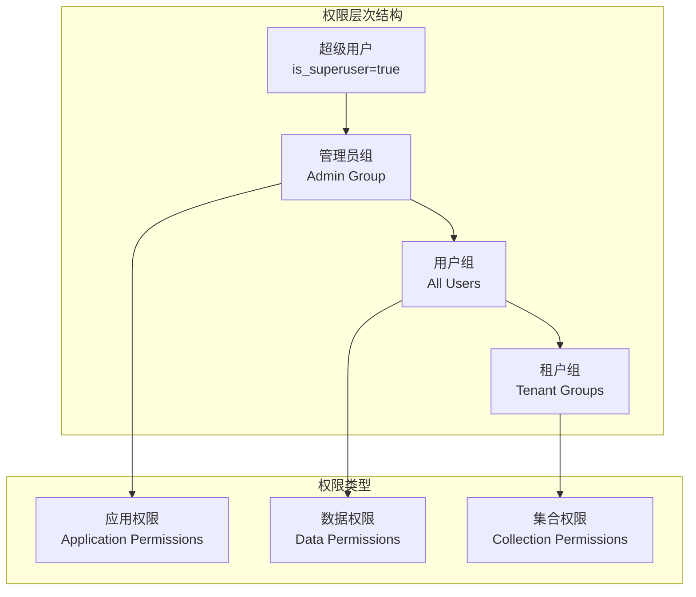

**图表来源**
- [permissions.clj](file://src/metabase/permissions/core.clj#L1-L50)
- [permissions_group_membership.clj](file://src/metabase/permissions/models/permissions_group_membership.clj#L1-L50)

### 权限修复机制

系统提供多种权限修复功能：

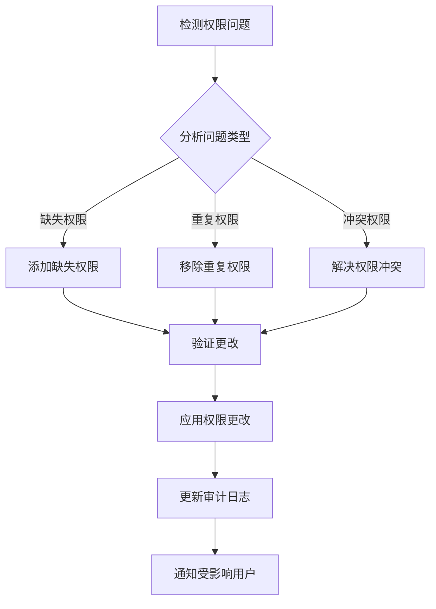

**图表来源**
- [permissions_group_membership.clj](file://src/metabase/permissions/models/permissions_group_membership.clj#L100-L150)

### 权限同步策略

| 同步时机 | 触发条件 | 操作内容 |
|----------|----------|----------|
| 用户创建 | 新用户注册 | 添加到默认组，分配基本权限 |
| 权限组变更 | 组成员变动 | 同步用户权限继承关系 |
| 系统升级 | 版本更新 | 应用新的权限规则 |
| 手动修复 | 管理员操作 | 批量调整权限设置 |

**章节来源**
- [permissions.clj](file://src/metabase/permissions/core.clj#L1-L127)
- [permissions_group_membership.clj](file://src/metabase/permissions/models/permissions_group_membership.clj#L1-L225)

## 审计日志系统

### 审计事件分类

系统记录全面的审计事件以支持合规性和安全监控：

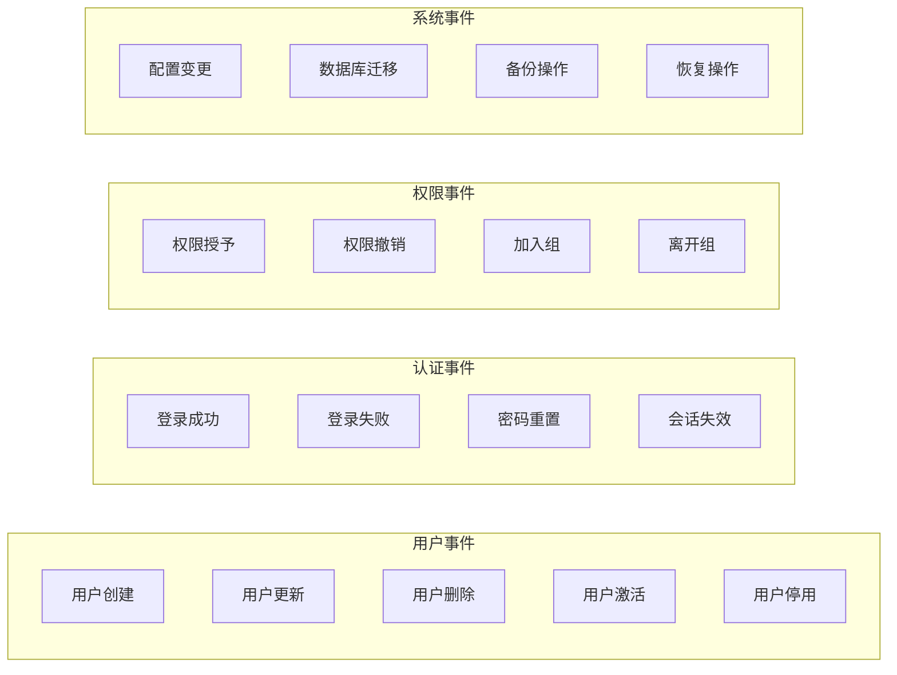

**图表来源**
- [audit_log.clj](file://src/metabase/audit_app/events/audit_log.clj#L250-L340)

### 审计表清理

系统自动清理过期的审计数据以控制存储空间：

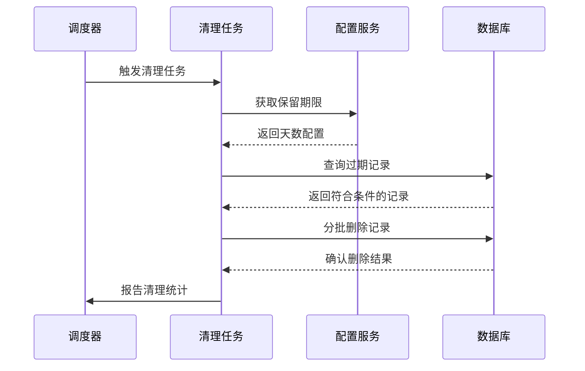

**图表来源**
- [truncate_audit_tables.clj](file://src/metabase/audit_app/task/truncate_audit_tables.clj#L50-L90)

### 存储优化策略

| 表名 | 保留期限 | 清理频率 | 批量大小 |
|------|----------|----------|----------|
| audit_log | 1年 | 每12小时 | 1000条 |
| query_execution | 6个月 | 每12小时 | 500条 |
| view_log | 3个月 | 每12小时 | 200条 |
| session | 30天 | 每天 | 无限制 |

**章节来源**
- [audit_log.clj](file://src/metabase/audit_app/events/audit_log.clj#L1-L341)
- [truncate_audit_tables.clj](file://src/metabase/audit_app/task/truncate_audit_tables.clj#L1-L93)

## 系统维护任务

### 数据库迁移管理

系统提供完整的数据库迁移功能：

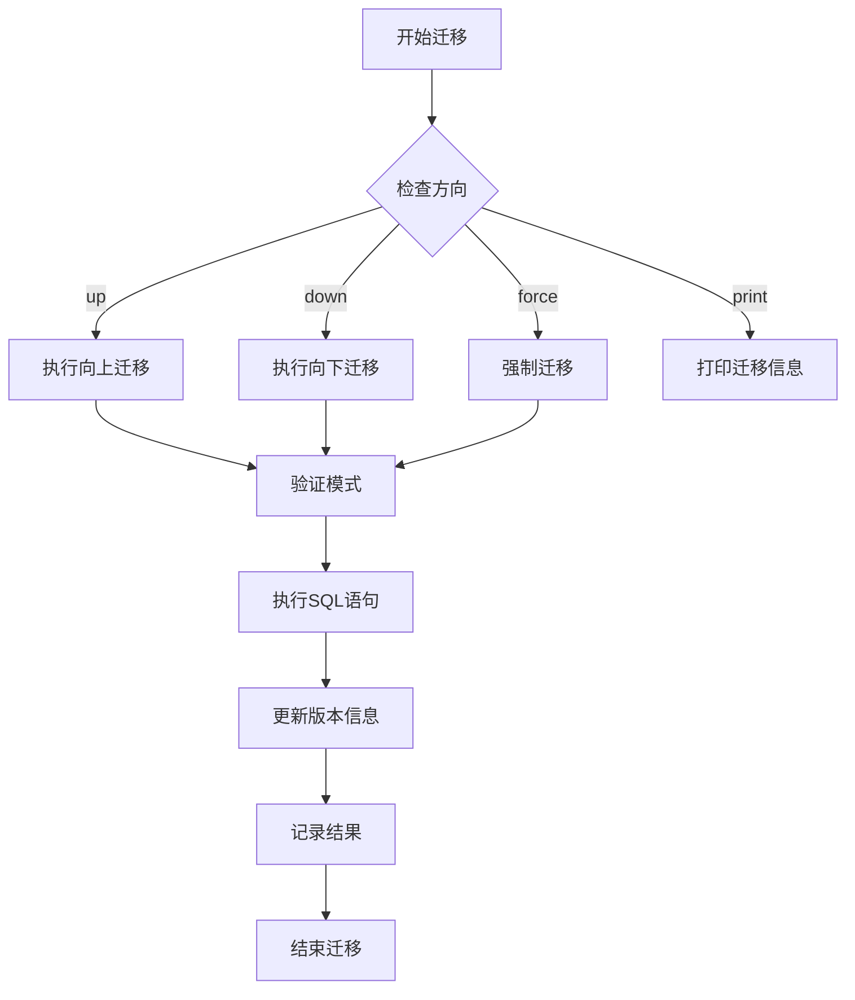

**图表来源**
- [migrate.clj](file://src/metabase/cmd/migrate.clj#L1-L9)

### 系统健康检查

定期执行的系统维护任务包括：

| 任务名称 | 执行频率 | 检查内容 | 处理方式 |
|----------|----------|----------|----------|
| 会话清理 | 每小时 | 过期会话、无效连接 | 自动删除 |
| 审计清理 | 每12小时 | 超期审计记录 | 批量删除 |
| 缓存刷新 | 每天 | 缓存一致性、内存使用 | 强制刷新 |
| 权限同步 | 按需 | 权限配置、用户状态 | 自动修复 |

### 性能监控指标

系统监控以下关键性能指标：

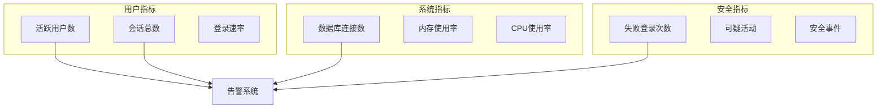

**章节来源**
- [migrate.clj](file://src/metabase/cmd/migrate.clj#L1-L9)
- [core.clj](file://src/metabase/cmd/core.clj#L280-L320)

## 自动化维护脚本

### 基础维护脚本模板

以下是推荐的自动化维护脚本结构：

```bash
#!/bin/bash
# Metabase系统维护脚本
# 功能：执行定期维护任务、监控系统状态、清理过期数据

METABASE_JAR="/path/to/metabase.jar"
LOG_FILE="/var/log/metabase/maintenance.log"
DATE=$(date +%Y-%m-%d_%H-%M-%S)

# 日志记录函数
log_message() {
    echo "[$(date '+%Y-%m-%d %H:%M:%S')] $1" | tee -a $LOG_FILE
}

# 检查Metabase进程状态
check_metabase_health() {
    log_message "检查Metabase健康状态..."
    # 实现健康检查逻辑
}

# 执行数据库迁移
run_database_migrations() {
    log_message "执行数据库迁移..."
    java -jar $METABASE_JAR migrate up
}

# 清理过期会话
cleanup_expired_sessions() {
    log_message "清理过期会话..."
    # 实现会话清理逻辑
}

# 执行审计数据清理
cleanup_audit_data() {
    log_message "清理审计数据..."
    # 实现审计清理逻辑
}

# 主程序
main() {
    log_message "=== 开始Metabase维护任务 ==="
    
    # 执行各项维护任务
    check_metabase_health
    run_database_migrations
    cleanup_expired_sessions
    cleanup_audit_data
    
    log_message "=== Metabase维护任务完成 ==="
}

# 执行主程序
main "$@"
```

### 权限修复脚本示例

```bash
#!/bin/bash
# 权限修复脚本

fix_user_permissions() {
    local user_email=$1
    
    log_message "修复用户权限: $user_email"
    
    # 检查用户是否存在
    if ! java -jar $METABASE_JAR reset-password "$user_email"; then
        log_message "错误：用户不存在或无法访问"
        return 1
    fi
    
    # 验证权限修复结果
    log_message "权限修复完成"
}

# 批量修复权限
repair_all_users() {
    log_message "批量修复所有用户权限..."
    
    # 获取需要修复的用户列表
    local users=$(get_users_needing_fix)
    
    for user in $users; do
        fix_user_permissions "$user"
    done
}
```

### 监控脚本示例

```bash
#!/bin/bash
# 系统监控脚本

monitor_system_health() {
    # 检查磁盘空间
    disk_usage=$(df -h / | tail -1 | awk '{print $5}' | sed 's/%//')
    if [ $disk_usage -gt 80 ]; then
        log_message "警告：磁盘使用率过高 ($disk_usage%)"
    fi
    
    # 检查内存使用
    memory_usage=$(free | grep Mem | awk '{printf("%.1f", $3/$2 * 100.0)}')
    if [ $(echo "$memory_usage > 85" | bc) -eq 1 ]; then
        log_message "警告：内存使用率过高 ($memory_usage%)"
    fi
    
    # 检查数据库连接
    check_db_connections
}

# 发送监控报告
send_monitoring_report() {
    local subject="Metabase系统监控报告 - $DATE"
    local body=$(generate_report_content)
    
    echo "$body" | mail -s "$subject" admin@example.com
}
```

## 安全考量

### 密码安全策略

系统实施多层次的密码安全措施：

| 安全层级 | 实施措施 | 技术细节 |
|----------|----------|----------|
| 密码存储 | BCrypt哈希 | 盐值长度128位，迭代次数12 |
| 传输安全 | HTTPS加密 | TLS 1.2+，证书验证 |
| 会话安全 | 加密存储 | AES-256-CBC，随机IV |
| CSRF防护 | 双重提交 | 32位随机令牌，绑定会话 |
| 重放攻击 | 时间戳验证 | 48小时有效期窗口 |

### 访问控制机制

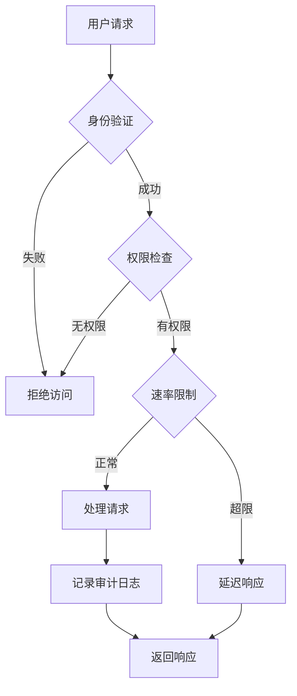

### 审计追踪要求

系统必须满足以下审计要求：

1. **完整性**：审计记录不可篡改
2. **可追溯性**：每个操作都能追溯到具体用户
3. **及时性**：审计事件实时记录
4. **全面性**：涵盖所有关键操作
5. **合规性**：符合相关法规要求

## 故障排除指南

### 常见问题诊断

| 问题症状 | 可能原因 | 解决方案 |
|----------|----------|----------|
| 密码重置失败 | 用户不存在或邮箱错误 | 验证用户邮箱地址 |
| 会话频繁失效 | 会话超时设置过短 | 调整会话超时配置 |
| 权限同步失败 | 数据库连接问题 | 检查数据库连接状态 |
| 审计日志丢失 | 清理任务配置错误 | 检查清理策略设置 |
| 系统性能下降 | 缓存未及时刷新 | 执行缓存清理任务 |

### 排查步骤

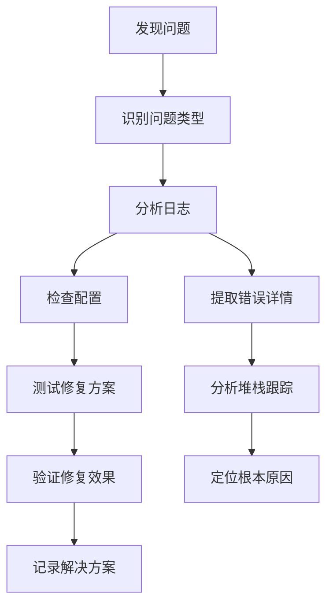

### 性能优化建议

1. **数据库优化**
   - 定期重建索引
   - 优化查询语句
   - 调整连接池参数

2. **缓存策略**
   - 合理设置缓存过期时间
   - 使用分布式缓存
   - 监控缓存命中率

3. **监控告警**
   - 设置关键指标阈值
   - 实现自动告警机制
   - 建立应急响应流程

## 总结

Metabase的用户管理与系统维护功能构成了一个完整的企业级解决方案。通过模块化的架构设计，系统实现了：

### 核心优势

1. **安全性**：多重身份验证、加密存储、审计追踪
2. **可靠性**：自动备份、故障恢复、监控告警
3. **可维护性**：自动化脚本、标准化流程、详细日志
4. **可扩展性**：插件架构、模块化设计、API接口

### 最佳实践建议

1. **定期维护**：按照预定计划执行维护任务
2. **监控告警**：建立完善的监控体系
3. **备份策略**：制定全面的数据备份计划
4. **安全更新**：及时应用安全补丁和更新
5. **文档管理**：保持维护文档的及时更新

### 未来发展方向

随着技术的发展，系统将在以下方面持续改进：

- **AI辅助管理**：智能故障诊断和预测性维护
- **云原生支持**：容器化部署和微服务架构
- **增强安全**：零信任架构和行为分析
- **用户体验**：简化管理界面和自动化程度

通过遵循本文档的指导原则和最佳实践，可以确保Metabase系统的稳定运行和持续发展。