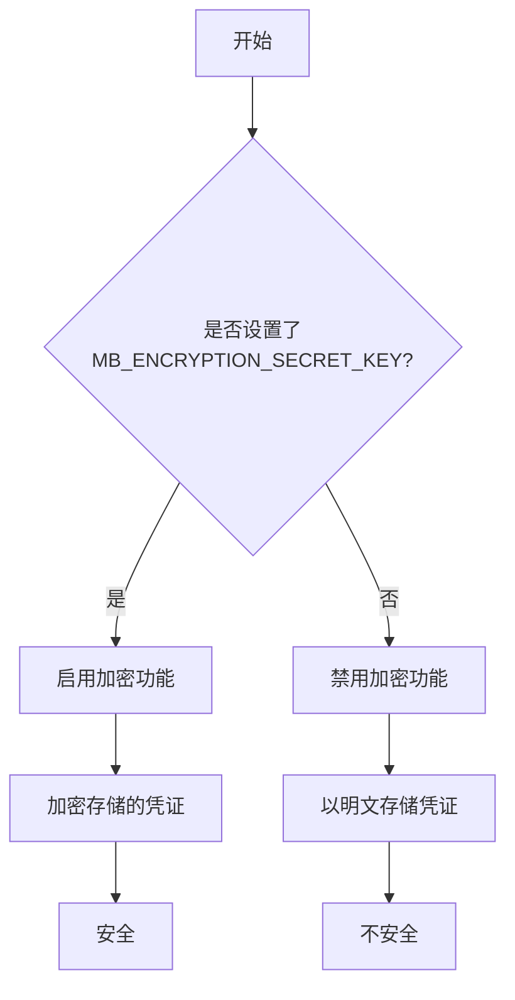
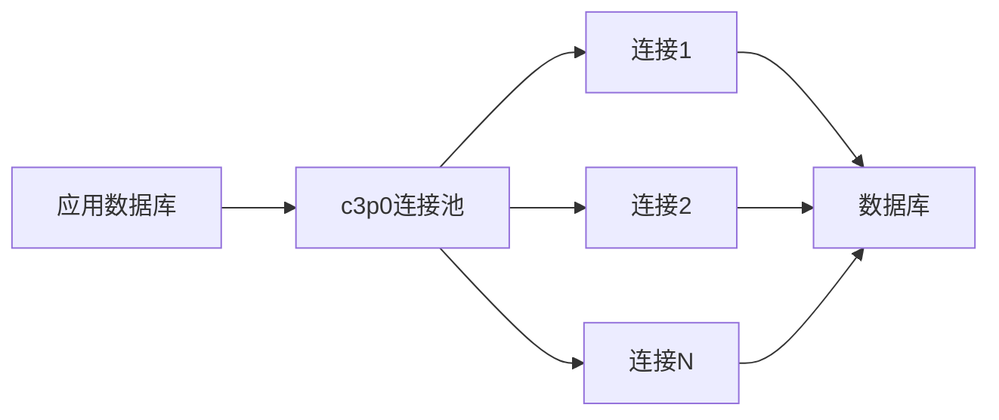
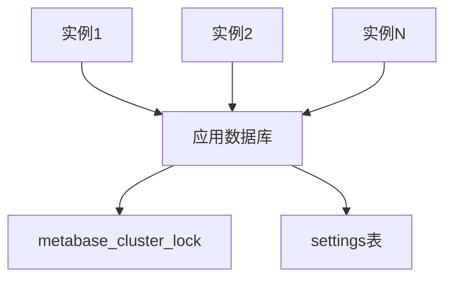

# 运行时配置最佳实践

<cite>
**本文档中引用的文件**  
- [core.clj](file://src/metabase/config/core.clj)
- [config_from_file.clj](file://src/metabase/core/config_from_file.clj)
- [env.clj](file://src/metabase/app_db/env.clj)
- [connection_pool_setup.clj](file://src/metabase/app_db/connection_pool_setup.clj)
- [settings.clj](file://src/metabase/system/settings.clj)
- [cache/settings.clj](file://src/metabase/cache/settings.clj)
- [server/settings.clj](file://src/metabase/server/settings.clj)
- [util/encryption.clj](file://src/metabase/util/encryption.clj)
- [settings/core.clj](file://src/metabase/settings/core.clj)
- [settings/models/setting/cache.clj](file://src/metabase/settings/models/setting/cache.clj)
</cite>

## 目录
1. [引言](#引言)
2. [生产环境配置安全建议](#生产环境配置安全建议)
3. [性能调优参数](#性能调优参数)
4. [高可用部署配置](#高可用部署配置)
5. [版本升级配置兼容性](#版本升级配置兼容性)
6. [动态配置重载机制](#动态配置重载机制)
7. [配置变更验证方法](#配置变更验证方法)
8. [结论](#结论)

## 引言
Metabase是一个开源的数据分析和可视化平台，其运行时配置对生产环境的稳定性、安全性和性能至关重要。本文档旨在为Metabase的运行时配置提供最佳实践指南，涵盖安全性建议、性能调优、高可用部署、版本升级兼容性、动态配置重载机制的局限性以及配置变更后的验证方法。通过深入分析Metabase的代码实现，本文将为系统管理员和开发人员提供全面的配置指导。

## 生产环境配置安全建议

### 敏感信息保护
在生产环境中，保护敏感信息是首要任务。Metabase通过环境变量和加密机制来管理敏感配置。

**应用数据库连接信息**：Metabase支持通过环境变量或JDBC连接字符串来配置应用数据库。推荐使用JDBC连接字符串（`MB_DB_CONNECTION_URI`）以避免在多个环境中暴露数据库凭据。如果使用单独的环境变量（如`MB_DB_USER`和`MB_DB_PASS`），请确保这些变量在生产环境中被安全地管理。

**加密密钥**：为了保护存储在数据库中的凭证，必须设置`MB_ENCRYPTION_SECRET_KEY`。该密钥用于加密和解密敏感数据。根据代码实现，密钥必须至少16个字符长。如果未设置此密钥，Metabase将记录警告信息，表明加密功能已禁用。

**Section sources**
- [env.clj](file://src/metabase/app_db/env.clj#L80-L141)
- [encryption.clj](file://src/metabase/util/encryption.clj#L35-L66)

### 安全相关的设置
Metabase提供了多个安全相关的设置，以增强系统的安全性。

**HTTPS重定向**：通过设置`redirect-all-requests-to-https`为`true`，可以强制所有流量使用HTTPS。此设置依赖于`site-url`的协议，如果`site-url`不是HTTPS，则无法启用此功能。

**CORS配置**：`disable-cors-on-localhost`设置可以防止来自localhost的请求收到CORS头，从而减少潜在的安全风险。

**堆栈跟踪隐藏**：`hide-stacktraces`设置可以防止异常中间件在响应中包含堆栈跟踪，避免泄露内部实现细节。

**Section sources**
- [server/settings.clj](file://src/metabase/server/settings.clj#L45-L76)

## 性能调优参数

### 连接池大小
连接池的大小直接影响Metabase的性能和资源利用率。Metabase使用c3p0连接池来管理应用数据库的连接。

**最大连接池大小**：`MB_APPLICATION_DB_MAX_CONNECTION_POOL_SIZE`环境变量用于设置应用数据库的最大连接池大小。默认值为15。根据生产环境的负载情况，可以适当调整此值。过大的连接池可能导致数据库资源耗尽，而过小的连接池可能导致连接争用。

**连接池属性**：Metabase为c3p0连接池配置了多个属性，包括`idleConnectionTestPeriod`（60秒）、`maxIdleTimeExcessConnections`（10分钟）和`maxConnectionAge`（1小时）。这些属性有助于保持连接池的健康状态，避免长时间空闲的连接占用资源。

**Section sources**
- [connection_pool_setup.clj](file://src/metabase/app_db/connection_pool_setup.clj#L85-L108)

### 缓存策略
缓存是提高Metabase性能的关键。Metabase支持查询结果缓存，可以显著减少重复查询的执行时间。

**启用查询缓存**：`enable-query-caching`设置用于启用或禁用查询结果缓存。默认值为`true`。启用缓存后，查询结果将被存储在数据库中，后续相同的查询可以直接从缓存中获取结果。

**缓存大小限制**：`query-caching-max-kb`设置用于限制每个保存的查询结果的缓存大小，单位为KB。默认值为2000KB（2MB）。此设置的全局最大值为200MB，以防止缓存占用过多内存。

**缓存TTL**：`query-caching-max-ttl`设置用于限制缓存结果的最长保留时间，单位为秒。默认值为35天。超过此时间的缓存结果将被自动清除。

**Section sources**
- [cache/settings.clj](file://src/metabase/cache/settings.clj#L1-L46)

## 高可用部署配置

### 集群模式
在高可用部署中，多个Metabase实例可以共享同一个应用数据库，以实现负载均衡和故障转移。

**集群锁**：Metabase使用`metabase_cluster_lock`表来管理集群中的锁。当一个实例需要执行独占操作时（如数据库迁移），它会尝试获取集群锁。如果获取成功，则执行操作；否则，等待其他实例释放锁。

**缓存更新检查**：在集群环境中，设置的缓存需要定期检查是否过期。`cache-update-check-interval-ms`常量定义了检查间隔，默认为1分钟。当检测到其他实例修改了设置时，当前实例会重新加载缓存。

**Section sources**
- [cluster_lock.clj](file://src/metabase/app_db/cluster_lock.clj#L28-L59)
- [setting/cache.clj](file://src/metabase/settings/models/setting/cache.clj#L118-L146)

### 调度器管理
在集群环境中，需要确保调度器的协调，以避免重复执行任务。

**禁用调度器**：通过设置`MB_DISABLE_SCHEDULER`为`true`，可以禁用Metabase的调度器。这在测试或特定部署场景中非常有用。在高可用部署中，通常只有一个实例启用调度器，其他实例禁用调度器以避免冲突。

**Section sources**
- [other-env-vars.md](file://src/metabase/cmd/resources/other-env-vars.md#L137-L188)

## 版本升级配置兼容性

### 配置迁移
在升级Metabase版本时，可能会遇到配置不兼容的问题。Metabase提供了一些机制来处理这些情况。

**加密设置迁移**：当某些设置不再需要加密时，`migrate-encrypted-settings!`函数会检查数据库中是否存在已加密的值，并将其重新保存为未加密的值。此过程确保了升级后的兼容性。

**设置格式验证**：`validate-settings-formatting!`函数用于检查应用设置的格式是否正确。例如，JSON字符串是否有效。如果发现格式错误，该函数会抛出异常或记录警告。

**Section sources**
- [setting.clj](file://src/metabase/settings/models/setting.clj#L1617-L1660)

### 向后兼容性
Metabase在设计时考虑了向后兼容性，但某些重大变更仍可能影响现有配置。

**弃用的设置**：某些设置在新版本中被弃用，并可能在未来的版本中移除。例如，`uploads-enabled`设置在0.50.0版本中被弃用，建议使用数据库级别的`uploads_enabled`设置。

**Section sources**
- [upload/settings.clj](file://src/metabase/upload/settings.clj#L33-L58)

## 动态配置重载机制

### 重载机制的局限性
Metabase的动态配置重载机制允许在不重启服务的情况下更新某些设置。然而，这种机制存在一些局限性。

**缓存更新延迟**：设置的缓存每分钟检查一次是否过期。这意味着在集群环境中，配置变更可能需要最多1分钟才能在所有实例中生效。

**环境变量优先级**：环境变量的优先级高于数据库中的设置。如果某个设置通过环境变量定义，则无法通过动态重载机制更改其值。

**Section sources**
- [setting/cache.clj](file://src/metabase/settings/models/setting/cache.clj#L118-L146)
- [core.clj](file://src/metabase/config/core.clj#L1-L234)

## 配置变更验证方法

### 日志验证
通过检查Metabase的日志，可以验证配置变更是否生效。

**启动日志**：在启动过程中，Metabase会记录应用数据库的连接信息和加密状态。例如，如果`MB_ENCRYPTION_SECRET_KEY`已设置，日志中会显示“Saved credentials encryption is ENABLED”。

**运行时日志**：在运行时，Metabase会记录与配置相关的事件。例如，当设置缓存被重新加载时，会记录“Settings have been changed on another instance, and will be reloaded here.”。

**Section sources**
- [encryption.clj](file://src/metabase/util/encryption.clj#L64-L98)
- [setting/cache.clj](file://src/metabase/settings/models/setting/cache.clj#L118-L146)

### API验证
通过调用Metabase的API，可以验证配置的当前值。

**获取设置值**：使用`GET /api/setting`端点可以获取所有可读设置的值。这有助于确认配置变更是否已正确应用。

**检查可用设置**：使用`GET /api/database/:id/settings-available`端点可以检查特定数据库的可用设置及其启用状态。

**Section sources**
- [warehouses_rest/api.clj](file://src/metabase/warehouses_rest/api.clj#L1353-L1385)

## 结论
本文档详细介绍了Metabase运行时配置的最佳实践，涵盖了安全性、性能、高可用性、版本升级和动态重载等方面。通过遵循这些最佳实践，可以确保Metabase在生产环境中的稳定、安全和高效运行。建议系统管理员和开发人员在部署和维护Metabase时，仔细参考本文档中的建议，并根据具体需求进行调整。