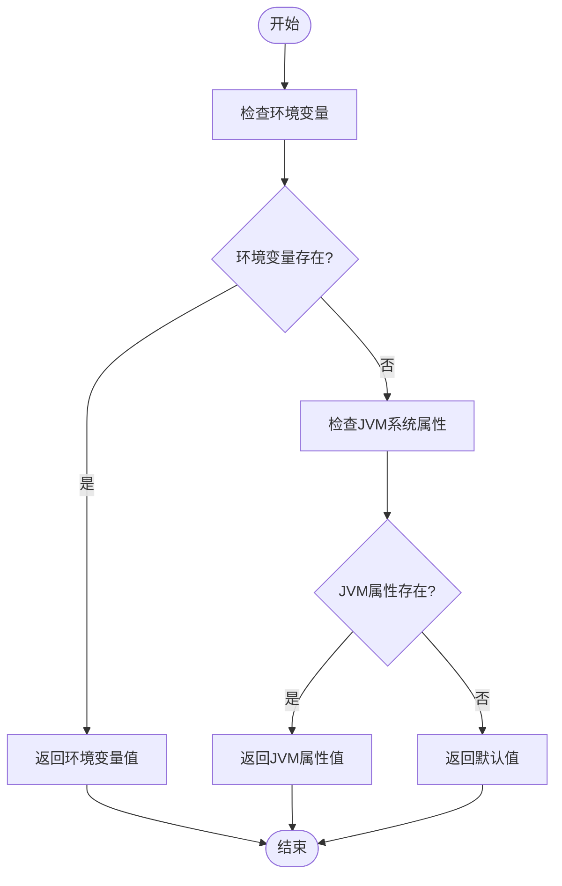
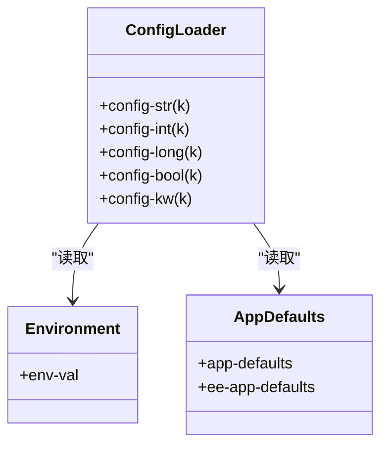
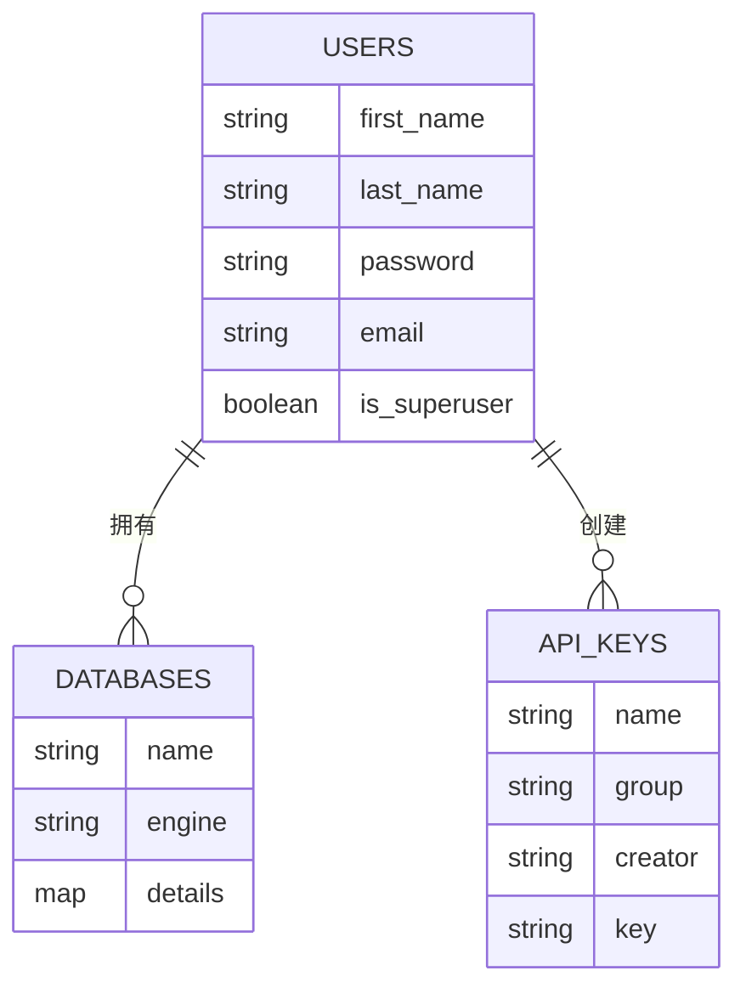
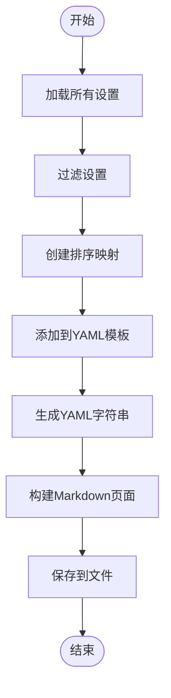

# 运行时配置管理

<cite>
**本文档中引用的文件**  
- [core.clj](file://src/metabase/config/core.clj)
- [config_file_gen.clj](file://src/metabase/cmd/config_file_gen.clj)
- [config-template.yaml](file://src/metabase/cmd/resources/config-template.yaml)
- [setting.clj](file://src/metabase/settings/models/setting.clj)
- [env.clj](file://src/metabase/app_db/env.clj)
- [core.clj](file://src/metabase/core/core.clj)
</cite>

## 目录
1. [简介](#简介)
2. [配置加载机制](#配置加载机制)
3. [配置优先级与合并策略](#配置优先级与合并策略)
4. [配置文件详解](#配置文件详解)
5. [配置文件生成工具](#配置文件生成工具)
6. [生产环境配置最佳实践](#生产环境配置最佳实践)

## 简介
Metabase 提供了灵活的运行时配置管理系统，支持通过 YAML 配置文件、环境变量和 JVM 系统属性三种方式加载设置。本指南将深入分析 Metabase 的配置管理机制，重点介绍 `config/core.clj` 中的配置解析流程，说明优先级规则和合并策略。我们将逐项解释 `config-template.yaml` 中各项配置的用途，包括缓存、嵌入式分析、文件上传限制等。同时，指导用户使用 `config_file_gen.clj` 工具生成安全的配置文件模板，并提供生产环境配置的最佳实践。

## 配置加载机制
Metabase 的配置加载机制通过 `config/core.clj` 文件中的 `config-str` 函数实现。该函数按照特定优先级顺序从三个来源获取配置值：环境变量、JVM 系统属性和硬编码的默认值。配置键可以是关键字或字符串，系统会自动进行转换。

**Diagram sources**
- [core.clj](file://src/metabase/config/core.clj#L100-L110)

**Section sources**
- [core.clj](file://src/metabase/config/core.clj#L100-L130)

## 配置优先级与合并策略
Metabase 遵循明确的配置优先级规则，确保配置值的确定性。优先级从高到低依次为：环境变量、JVM 系统属性、硬编码默认值。这种设计允许用户在不同环境中灵活覆盖配置，同时保证了基本功能的稳定性。

配置解析流程从 `core.clj` 文件中的 `config-str` 函数开始，该函数首先尝试从环境变量获取值，然后是 JVM 系统属性，最后返回硬编码的默认值。对于布尔值、整数、长整数和关键字类型的配置，Metabase 提供了专门的解析函数 `config-bool`、`config-int`、`config-long` 和 `config-kw`，确保类型安全。

**Diagram sources**
- [core.clj](file://src/metabase/config/core.clj#L100-L130)

**Section sources**
- [core.clj](file://src/metabase/config/core.clj#L100-L130)

## 配置文件详解
`config-template.yaml` 文件提供了 Metabase 配置的完整模板，包含用户、数据库和 API 密钥等核心配置项。该文件作为生成实际配置文件的基础，通过 `config_file_gen.clj` 工具动态添加所有可配置的设置及其默认值。

配置文件中的主要部分包括：
- **users**: 定义初始用户，包括姓名、密码和电子邮件地址
- **databases**: 配置连接到外部数据库的详细信息，如 PostgreSQL 和 MySQL
- **api-keys**: 设置 API 密钥，用于程序化访问 Metabase

**Diagram sources**
- [config-template.yaml](file://src/metabase/cmd/resources/config-template.yaml#L1-L42)

**Section sources**
- [config-template.yaml](file://src/metabase/cmd/resources/config-template.yaml#L1-L42)

## 配置文件生成工具
`config_file_gen.clj` 是一个用于生成 Metabase 配置文件文档的工具，它能够创建包含所有可配置设置及其默认值的示例配置文件。该工具通过读取 `config-template.yaml` 模板，添加从 `dox/get-settings` 获取的设置信息，并生成最终的 Markdown 文档。

工具的主要功能包括：
- 从所有 Metabase 命名空间加载 `defsetting` 定义
- 过滤掉不应文档化的设置
- 创建排序的设置映射
- 将设置添加到 YAML 模板中
- 生成包含介绍和结尾信息的完整 Markdown 文档

**Diagram sources**
- [config_file_gen.clj](file://src/metabase/cmd/config_file_gen.clj#L30-L100)

**Section sources**
- [config_file_gen.clj](file://src/metabase/cmd/config_file_gen.clj#L30-L100)

## 生产环境配置最佳实践
在生产环境中配置 Metabase 时，应遵循以下最佳实践以确保系统的稳定性和安全性：

1. **数据库选择**：避免使用 H2 作为生产环境的应用数据库，推荐使用 PostgreSQL、MySQL 或 MariaDB
2. **SSL 配置**：对于 PostgreSQL 连接，确保在连接字符串中包含 `sslmode=require`
3. **环境变量管理**：使用环境变量而非配置文件来管理敏感信息，如数据库密码和 API 密钥
4. **会话管理**：根据安全需求调整会话长度，生产环境建议设置合理的会话超时时间
5. **缓存配置**：根据系统资源和性能需求配置查询缓存后端

此外，应定期备份应用数据库，并在部署新版本前进行充分测试。对于企业版用户，可以利用高级配置文件功能实现更精细的配置管理。

**Section sources**
- [env.clj](file://src/metabase/app_db/env.clj#L150-L180)
- [core.clj](file://src/metabase/core/core.clj#L200-L250)