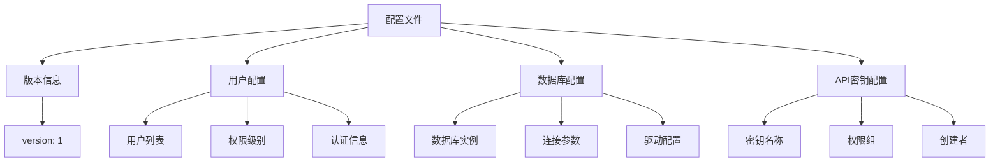
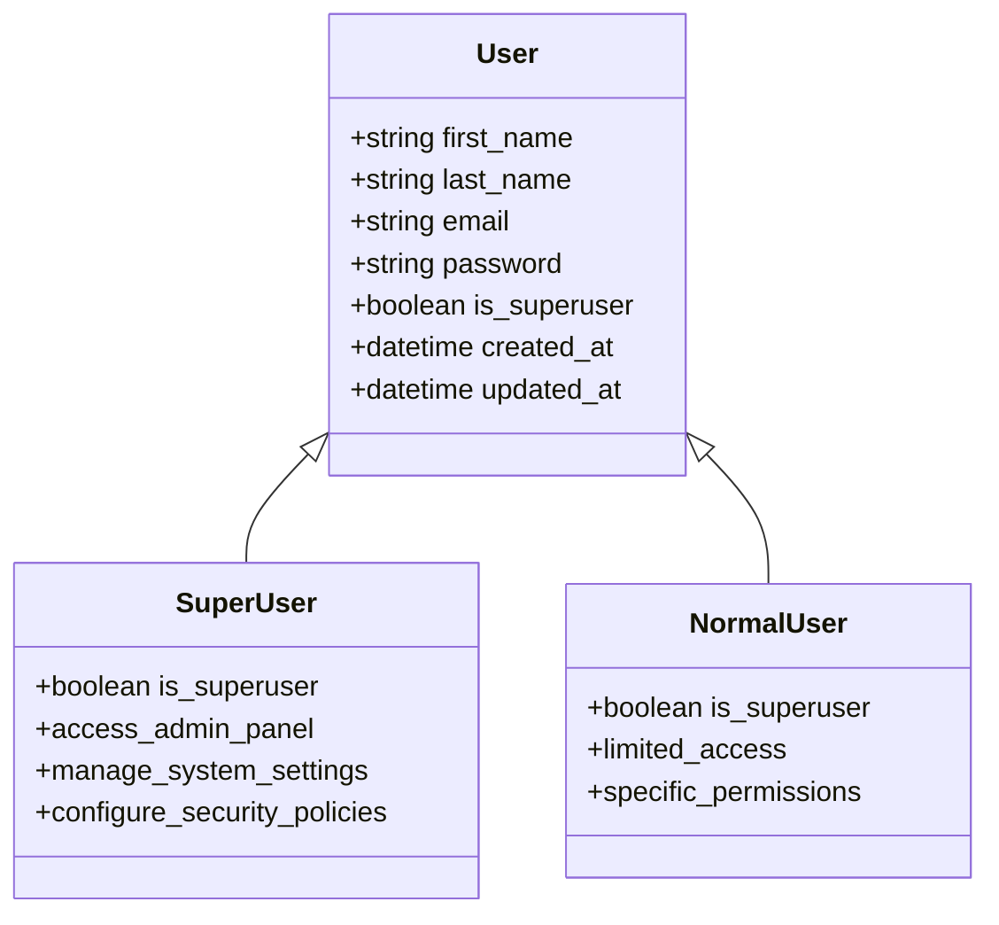
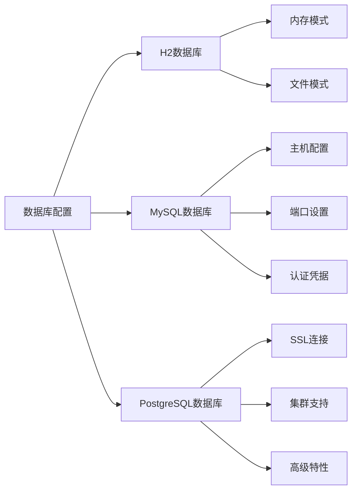
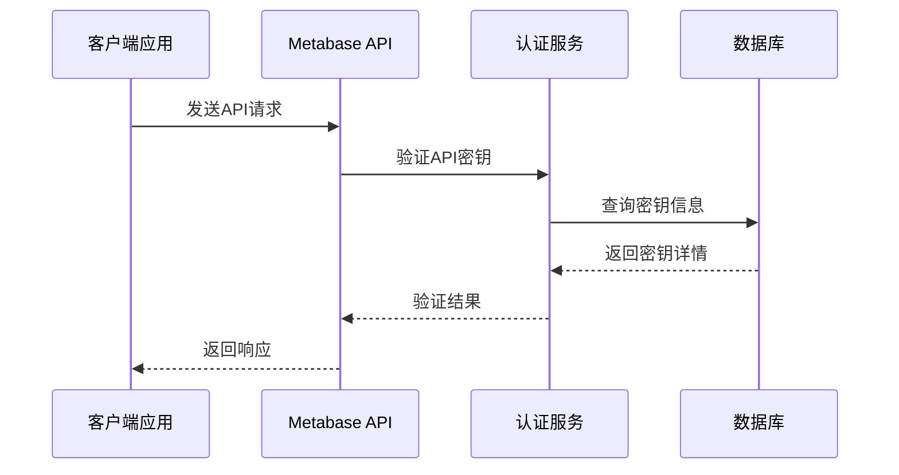
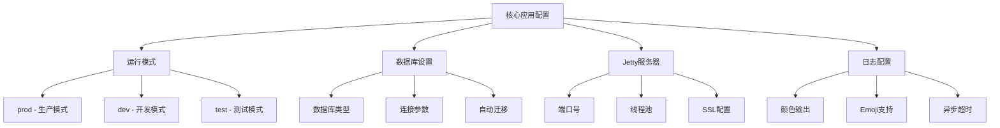
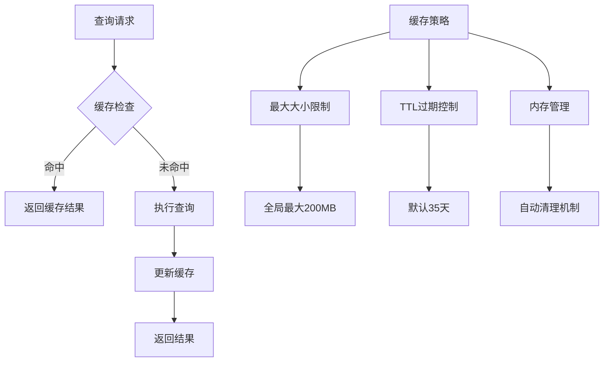
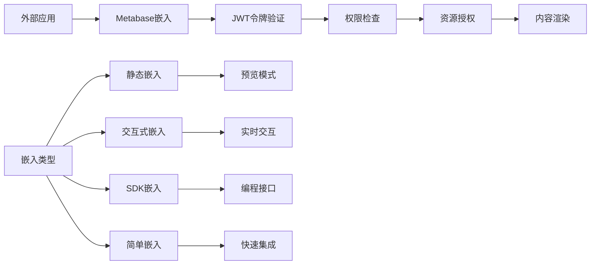
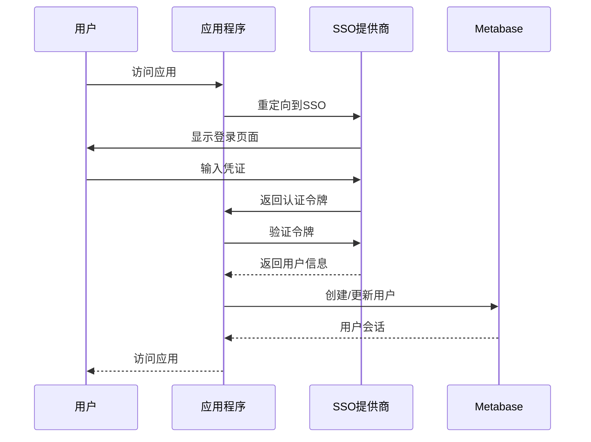
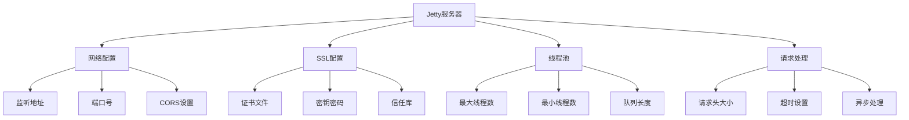
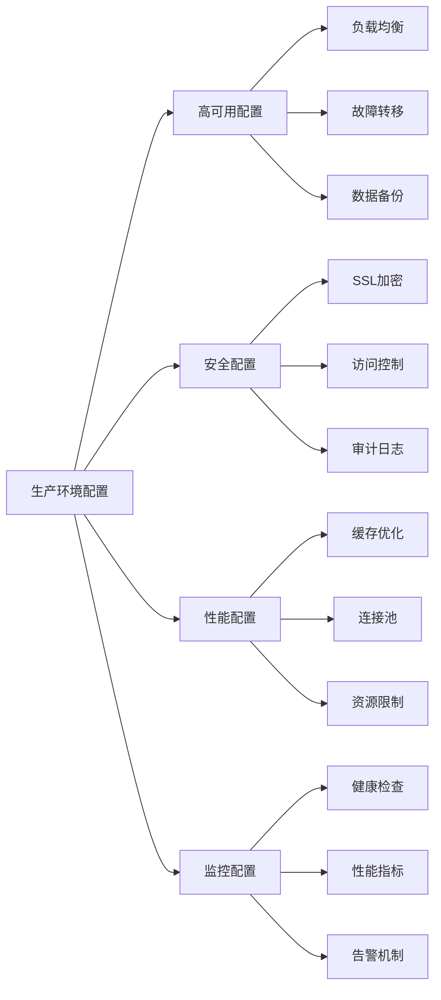

# 配置文件模板详解

<cite>
**本文档中引用的文件**
- [config-template.yaml](file://src/metabase/cmd/resources/config-template.yaml)
- [config-file-intro.md](file://src/metabase/cmd/resources/config-file-intro.md)
- [config-from-file.clj](file://src/metabase/core/config_from_file.clj)
- [core.clj](file://src/metabase/config/core.clj)
- [settings.clj](file://src/metabase/app_db/settings.clj)
- [settings.clj](file://src/metabase/cache/settings.clj)
- [settings.clj](file://src/metabase/embedding/settings.clj)
- [settings.clj](file://src/metabase/sso/settings.clj)
- [settings.clj](file://src/metabase/server/settings.clj)
- [instance.clj](file://src/metabase/server/instance.clj)
- [env-var-intro.md](file://src/metabase/cmd/resources/env-var-intro.md)
</cite>

## 目录
1. [简介](#简介)
2. [配置文件结构概述](#配置文件结构概述)
3. [用户管理配置](#用户管理配置)
4. [数据库连接配置](#数据库连接配置)
5. [API密钥配置](#api密钥配置)
6. [核心应用配置](#核心应用配置)
7. [缓存配置](#缓存配置)
8. [嵌入式BI配置](#嵌入式bi配置)
9. [单点登录配置](#单点登录配置)
10. [服务器配置](#服务器配置)
11. [生产环境推荐配置](#生产环境推荐配置)
12. [配置最佳实践](#配置最佳实践)

## 简介

Metabase配置文件模板提供了完整的系统配置选项，支持通过YAML格式进行集中化配置管理。该模板包含了用户管理、数据库连接、缓存设置、嵌入式BI、安全策略等多个方面的配置选项，为生产环境部署提供了灵活且可扩展的配置方案。

配置文件采用版本化设计（当前版本1），支持环境变量模板替换，具备完善的配置验证机制和默认值设置。通过配置文件，管理员可以实现零代码修改的系统配置，提高部署效率和维护便利性。

## 配置文件结构概述

### 基本结构

配置文件采用分层结构设计，包含以下主要部分：



**图表来源**
- [config-template.yaml](file://src/metabase/cmd/resources/config-template.yaml#L1-L43)

### 版本兼容性

配置文件使用版本控制机制确保向后兼容性：
- 当前版本：1.0
- 支持版本升级路径
- 兼容旧版配置格式
- 提供迁移指导

**章节来源**
- [config-template.yaml](file://src/metabase/cmd/resources/config-template.yaml#L1-L5)

## 用户管理配置

### 用户账户结构

用户配置支持多层次的用户管理，包括超级用户、普通用户和访客用户：



**图表来源**
- [config-template.yaml](file://src/metabase/cmd/resources/config-template.yaml#L3-L16)

### 用户配置选项

| 配置项 | 类型 | 必需 | 默认值 | 描述 |
|--------|------|------|--------|------|
| first_name | string | 是 | - | 用户名 |
| last_name | string | 是 | - | 用户姓氏 |
| email | string | 是 | - | 用户邮箱地址 |
| password | string | 是 | - | 用户密码 |
| is_superuser | boolean | 否 | false | 是否为超级用户 |

### 权限级别说明

1. **超级用户（Superuser）**
   - 拥有完全的系统管理权限
   - 可以配置所有系统设置
   - 能够管理其他用户账户
   - 具备审计和监控权限

2. **普通用户（Normal User）**
   - 有限的数据访问权限
   - 可以创建和分享查询
   - 不能修改系统配置
   - 受权限策略约束

3. **访客用户（Guest User）**
   - 最小权限级别
   - 仅能访问公开数据
   - 无法修改任何设置
   - 用于演示和测试场景

**章节来源**
- [config-template.yaml](file://src/metabase/cmd/resources/config-template.yaml#L3-L16)

## 数据库连接配置

### 支持的数据库类型

Metabase配置文件支持多种数据库引擎，每种数据库都有特定的连接参数：



**图表来源**
- [config-template.yaml](file://src/metabase/cmd/resources/config-template.yaml#L17-L32)

### 数据库配置参数

| 数据库类型 | 主机 | 端口 | 用户 | 密码 | 数据库名 |
|------------|------|------|------|------|----------|
| H2 | localhost | 3306 | metabase | metasample123 | sample |
| MySQL | mysql-data | 3306 | metabase | metasample123 | sample |
| PostgreSQL | postgres-data | 5432 | metabase | metasample123 | sample |

### 连接配置详解

#### H2数据库配置
- **用途**：开发和测试环境
- **特点**：内存存储，无需外部依赖
- **配置示例**：自动配置，无需手动设置

#### MySQL数据库配置
- **主机**：mysql-data（容器化部署）
- **端口**：3306（标准端口）
- **认证**：用户名密码认证
- **SSL**：支持SSL加密连接

#### PostgreSQL数据库配置
- **主机**：postgres-data（容器化部署）
- **端口**：5432（标准端口）
- **高级功能**：支持集群和复制
- **SSL**：强加密支持

**章节来源**
- [config-template.yaml](file://src/metabase/cmd/resources/config-template.yaml#L17-L32)

## API密钥配置

### API密钥管理

API密钥配置提供了系统与外部应用程序集成的安全机制：



**图表来源**
- [config-template.yaml](file://src/metabase/cmd/resources/config-template.yaml#L33-L42)

### API密钥配置选项

| 配置项 | 类型 | 描述 | 示例值 |
|--------|------|------|--------|
| name | string | 密钥显示名称 | "Admin API key" |
| group | string | 权限组 | "admin", "all-users" |
| creator | string | 创建者邮箱 | "first@example.com" |
| key | string | API密钥 | mb_firsttestapikey123 |

### 权限组说明

1. **admin组**
   - 完全的系统访问权限
   - 可以执行所有API操作
   - 具备数据导出和导入权限
   - 能够管理其他API密钥

2. **all-users组**
   - 标准用户权限
   - 受限的数据访问
   - 不能修改系统设置
   - 符合最小权限原则

**章节来源**
- [config-template.yaml](file://src/metabase/cmd/resources/config-template.yaml#L33-L42)

## 核心应用配置

### 应用程序基础设置

核心应用配置涵盖了Metabase运行的基本参数：



**图表来源**
- [core.clj](file://src/metabase/config/core.clj#L40-L60)

### 关键配置参数

| 配置项 | 默认值 | 描述 | 影响 |
|--------|--------|------|------|
| mb-run-mode | prod | 运行模式 | 性能优化和安全策略 |
| mb-db-type | h2 | 数据库类型 | 存储引擎选择 |
| mb-jetty-port | 3000 | 服务器端口 | 外部访问端口 |
| max-session-age | 20160 | 会话有效期 | 用户登录状态 |

### 运行模式配置

1. **生产模式（prod）**
   - 性能优化
   - 安全增强
   - 日志级别调整
   - 缓存策略启用

2. **开发模式（dev）**
   - 调试信息详细
   - 热重载支持
   - 错误堆栈显示
   - 开发工具集成

3. **测试模式（test）**
   - 单元测试支持
   - 模拟数据加载
   - 并发测试能力
   - 性能基准测试

**章节来源**
- [core.clj](file://src/metabase/config/core.clj#L40-L60)

## 缓存配置

### 查询缓存系统

缓存配置提供了高性能的数据查询加速机制：



**图表来源**
- [settings.clj](file://src/metabase/cache/settings.clj#L10-L46)

### 缓存配置参数

| 配置项 | 默认值 | 最大值 | 描述 | 性能影响 |
|--------|--------|--------|------|----------|
| enable-query-caching | true | - | 启用查询缓存 | 显著提升查询性能 |
| query-caching-max-kb | 2000 | 204800KB | 单个查询最大缓存大小 | 内存使用量控制 |
| query-caching-max-ttl | 3024000 | - | 缓存最大生存时间 | 数据新鲜度保证 |

### 缓存策略说明

1. **启用状态**
   - 全局开关控制
   - 动态启用/禁用
   - 对所有查询生效

2. **大小限制**
   - 单个查询2000KB默认限制
   - 全局最大200MB限制
   - 自动溢出处理

3. **时间控制**
   - 默认35天TTL
   - 可配置自定义时间
   - 自动过期清理

**章节来源**
- [settings.clj](file://src/metabase/cache/settings.clj#L6-L46)

## 嵌入式BI配置

### 嵌入式BI架构

嵌入式BI配置支持将Metabase仪表板和查询嵌入到其他应用程序中：



**图表来源**
- [settings.clj](file://src/metabase/embedding/settings.clj#L10-L100)

### 嵌入配置选项

| 配置项 | 类型 | 默认值 | 描述 | 安全考虑 |
|--------|------|--------|------|----------|
| embedding-secret-key | string | 自动生成 | JWT签名密钥 | 必须保密 |
| enable-embedding-sdk | boolean | false | 启用SDK嵌入 | 访问控制 |
| enable-embedding-interactive | boolean | false | 启用交互式嵌入 | 会话管理 |
| embedding-app-origins-sdk | string | "" | 允许的SDK源 | CORS策略 |

### 嵌入类型详解

1. **静态嵌入（Static Embedding）**
   - 预览模式展示
   - 不支持用户交互
   - 适合报告和仪表板
   - 需要有效许可证

2. **交互式嵌入（Interactive Embedding）**
   - 实时数据交互
   - 用户过滤器支持
   - 会话状态保持
   - 权限细粒度控制

3. **SDK嵌入（SDK Embedding）**
   - 编程方式集成
   - 自定义UI组件
   - 高度可定制化
   - 需要开发者技能

4. **简单嵌入（Simple Embedding）**
   - 快速集成方案
   - 基础功能支持
   - 最小配置要求
   - 适合原型开发

**章节来源**
- [settings.clj](file://src/metabase/embedding/settings.clj#L10-L150)

## 单点登录配置

### SSO认证架构

单点登录配置支持多种认证提供商集成：



**图表来源**
- [settings.clj](file://src/metabase/sso/settings.clj#L15-L100)

### LDAP配置参数

| 配置项 | 类型 | 默认值 | 描述 | 安全级别 |
|--------|------|--------|------|----------|
| ldap-host | string | - | LDAP服务器主机 | 中等 |
| ldap-port | integer | 389 | LDAP服务器端口 | 中等 |
| ldap-security | keyword | :none | 安全协议 | 高 |
| ldap-bind-dn | string | - | 绑定DN | 高 |
| ldap-password | string | - | 绑定密码 | 极高 |
| ldap-user-base | string | - | 用户搜索基 | 中等 |

### Google认证配置

| 配置项 | 类型 | 描述 | 必需 |
|--------|------|------|------|
| google-auth-client-id | string | Google客户端ID | 是 |
| google-auth-enabled | boolean | 启用Google认证 | 否 |
| google-auth-auto-create-accounts-domain | string | 自动创建账户域名 | 否 |

### SSO安全策略

1. **认证流程**
   - 多因素认证支持
   - 会话超时控制
   - 异常登录检测
   - 审计日志记录

2. **权限映射**
   - LDAP组同步
   - 角色权限绑定
   - 动态权限更新
   - 权限继承机制

3. **安全加固**
   - SSL/TLS强制加密
   - 证书验证
   - 访问频率限制
   - 异常行为监控

**章节来源**
- [settings.clj](file://src/metabase/sso/settings.clj#L15-L227)

## 服务器配置

### Jetty服务器设置

服务器配置控制Web服务器的核心参数：



**图表来源**
- [instance.clj](file://src/metabase/server/instance.clj#L32-L61)

### 服务器配置参数

| 配置项 | 默认值 | 描述 | 性能影响 |
|--------|--------|------|----------|
| mb-jetty-port | 3000 | HTTP端口 | 外部访问端口 |
| mb-jetty-ssl-port | - | HTTPS端口 | 加密通信 |
| mb-jetty-maxthreads | - | 最大线程数 | 并发处理能力 |
| mb-jetty-request-header-size | - | 请求头大小限制 | 安全防护 |

### 安全配置选项

| 配置项 | 类型 | 默认值 | 描述 | 安全级别 |
|--------|------|--------|------|----------|
| redirect-all-requests-to-https | boolean | false | 强制HTTPS重定向 | 高 |
| disable-cors-on-localhost | boolean | false | 禁用本地CORS | 中等 |
| hide-stacktraces | boolean | false | 隐藏错误堆栈 | 中等 |
| allowed-iframe-hosts | string | 预定义列表 | 允许的iframe主机 | 中等 |

### SSL/TLS配置

1. **证书管理**
   - Keystore文件配置
   - 密钥密码保护
   - 证书链验证
   - 自动续期支持

2. **加密协议**
   - TLS 1.2+支持
   - 强加密算法
   - 证书固定验证
   - 安全参数优化

**章节来源**
- [settings.clj](file://src/metabase/server/settings.clj#L15-L76)
- [instance.clj](file://src/metabase/server/instance.clj#L25-L61)

## 生产环境推荐配置

### 系统级配置

基于生产环境的最佳实践，以下是推荐的配置组合：



### 推荐配置值

#### 数据库配置
```yaml
databases:
  - name: Production PostgreSQL
    engine: postgres
    details:
      host: prod-db-cluster.internal
      port: 5432
      user: metabase_prod
      password: ${DB_PASSWORD}
      dbname: metabase_production
      ssl-cert: /etc/ssl/certs/prod-ca.pem
```

#### 缓存配置
```yaml
config:
  cache:
    enable-query-caching: true
    query-caching-max-kb: 102400
    query-caching-max-ttl: 86400
```

#### 嵌入式BI配置
```yaml
config:
  embedding:
    embedding-secret-key: ${EMBED_SECRET_KEY}
    enable-embedding-sdk: true
    enable-embedding-interactive: true
    embedding-app-origins-sdk: "https://app.example.com https://admin.example.com"
```

#### 安全配置
```yaml
config:
  security:
    redirect-all-requests-to-https: true
    hide-stacktraces: true
    allowed-iframe-hosts: "trusted-apps.example.com dashboard-widget.com"
```

### 性能优化建议

1. **数据库优化**
   - 使用专用生产数据库
   - 配置适当的连接池大小
   - 启用查询计划缓存
   - 定期维护和索引优化

2. **缓存策略**
   - 启用多级缓存
   - 配置合理的TTL
   - 监控缓存命中率
   - 实施缓存失效策略

3. **服务器调优**
   - 优化JVM参数
   - 配置合适的线程池
   - 启用压缩和GZIP
   - 设置合理的超时时间

### 安全加固措施

1. **网络安全**
   - 使用VPN或专线连接
   - 配置防火墙规则
   - 启用DDoS防护
   - 监控异常流量

2. **访问控制**
   - 实施多因素认证
   - 配置细粒度权限
   - 定期审查用户权限
   - 启用会话超时

3. **数据保护**
   - 启用数据加密
   - 定期备份数据
   - 实施数据脱敏
   - 监控数据访问

## 配置最佳实践

### 配置管理策略

1. **版本控制**
   - 将配置文件纳入版本控制系统
   - 使用环境特定的配置文件
   - 实施配置变更审批流程
   - 保留配置历史记录

2. **环境隔离**
   - 开发、测试、生产环境分离
   - 使用不同的密钥和证书
   - 配置参数环境变量化
   - 实施配置验证机制

3. **安全实践**
   - 敏感信息加密存储
   - 定期轮换密钥和密码
   - 限制配置文件访问权限
   - 启用配置审计日志

### 监控和维护

1. **配置监控**
   - 监控配置变更
   - 检查配置有效性
   - 验证配置一致性
   - 实施配置回归测试

2. **定期维护**
   - 更新配置文档
   - 清理过期配置
   - 优化配置参数
   - 备份配置文件

3. **故障排除**
   - 建立配置问题排查流程
   - 准备配置恢复方案
   - 记录常见配置问题
   - 提供配置培训材料

### 扩展性考虑

1. **水平扩展**
   - 支持集群部署
   - 实现配置共享
   - 优化分布式配置
   - 监控集群状态

2. **垂直扩展**
   - 优化资源配置
   - 调整性能参数
   - 实施资源限制
   - 监控资源使用

通过遵循这些最佳实践，可以确保Metabase配置的有效性、安全性和可维护性，为生产环境提供稳定可靠的支撑。