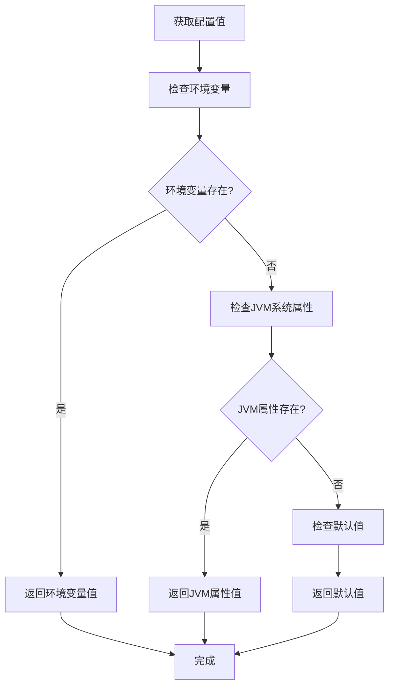
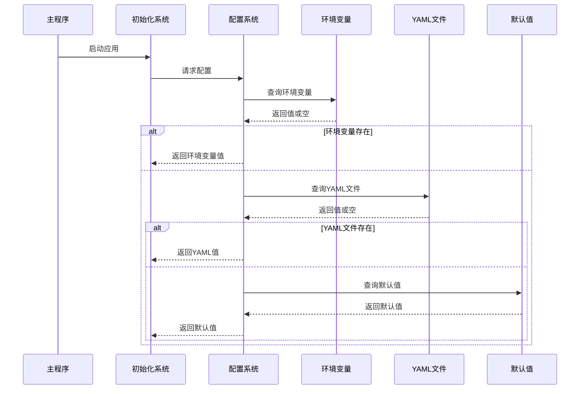
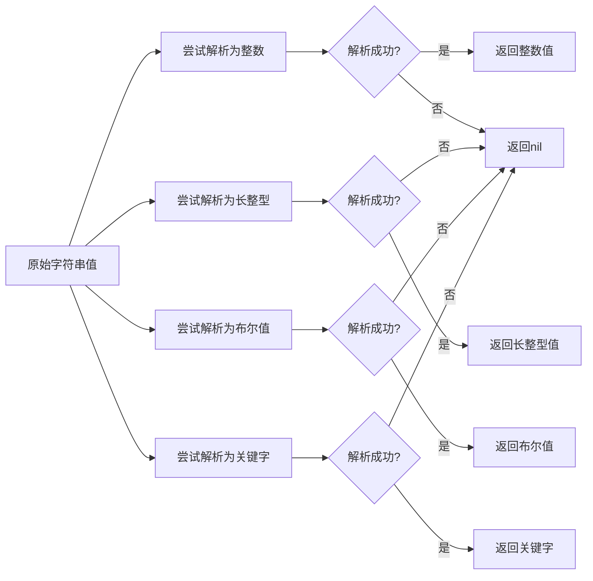
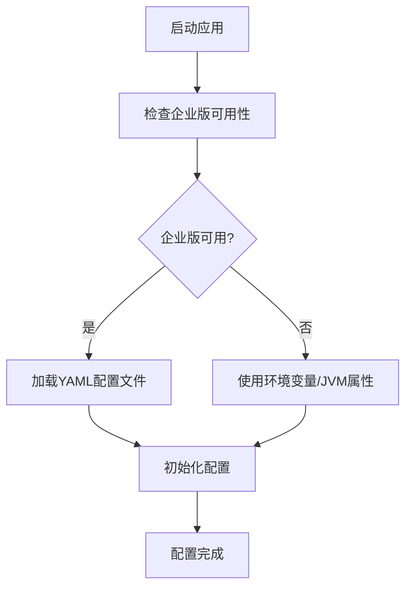

# 配置源与优先级

<cite>
**本文档中引用的文件**  
- [core.clj](file://src/metabase/config/core.clj)
- [config_from_file.clj](file://src/metabase/core/config_from_file.clj)
- [setting.clj](file://src/metabase/settings/models/setting.clj)
- [init.clj](file://src/metabase/core/init.clj)
- [core.clj](file://src/metabase/core/core.clj)
</cite>

## 目录
1. [简介](#简介)
2. [配置源概述](#配置源概述)
3. [优先级机制](#优先级机制)
4. [核心实现分析](#核心实现分析)
5. [配置加载流程](#配置加载流程)
6. [类型转换逻辑](#类型转换逻辑)
7. [实际使用示例](#实际使用示例)
8. [常见配置冲突解决](#常见配置冲突解决)
9. [企业版配置文件支持](#企业版配置文件支持)

## 简介
Metabase 提供了灵活的配置管理机制，允许通过多种方式设置系统参数。本文档详细说明了 Metabase 如何从环境变量、YAML 配置文件和 JVM 系统属性中加载配置，并明确了它们之间的优先级关系。系统采用分层配置策略，确保配置的灵活性和可管理性。

## 配置源概述
Metabase 支持三种主要的配置源：

1. **环境变量**：以 `MB_` 开头的环境变量，如 `MB_DB_TYPE`
2. **YAML 配置文件**：通过企业版功能支持的配置文件
3. **JVM 系统属性**：通过 `-D` 参数设置的 Java 系统属性
4. **默认值**：代码中定义的硬编码默认值

这些配置源为不同部署环境提供了灵活的配置选项，从开发环境到生产环境都能找到合适的配置方式。

## 优先级机制
Metabase 配置系统遵循明确的优先级规则：

**环境变量 > YAML 文件 > JVM 系统属性 > 默认值**

当同一配置项在多个源中存在时，系统会按照此优先级顺序选择值。这种设计确保了：
- 环境变量具有最高优先级，便于在容器化部署中动态配置
- YAML 文件提供结构化的配置管理
- JVM 属性作为传统 Java 应用的配置方式
- 默认值确保系统在无外部配置时仍能正常运行

## 核心实现分析
配置系统的核心实现在 `config/core.clj` 文件中，主要通过 `config-str` 函数实现配置值的获取。



**图示来源**  
- [core.clj](file://src/metabase/config/core.clj#L100-L120)

**本节来源**  
- [core.clj](file://src/metabase/config/core.clj#L100-L150)

## 配置加载流程
配置加载发生在系统启动的初始化阶段，主要流程如下：



**图示来源**  
- [core.clj](file://src/metabase/config/core.clj#L100-L150)
- [init.clj](file://src/metabase/core/init.clj#L1-L40)

**本节来源**  
- [core.clj](file://src/metabase/config/core.clj#L100-L150)
- [init.clj](file://src/metabase/core/init.clj#L1-L40)

## 类型转换逻辑
Metabase 提供了多种类型转换函数，确保配置值能够正确解析：

- `config-int`：将配置值解析为整数
- `config-long`：将配置值解析为长整型
- `config-bool`：将配置值解析为布尔值
- `config-kw`：将配置值解析为关键字

这些函数采用安全的解析策略，使用 `some->` 宏确保在值为空或无效时返回 `nil` 而不是抛出异常。



**图示来源**  
- [core.clj](file://src/metabase/config/core.clj#L130-L140)

**本节来源**  
- [core.clj](file://src/metabase/config/core.clj#L130-L140)

## 实际使用示例
### 环境变量配置
```bash
export MB_DB_TYPE=postgres
export MB_DB_HOST=localhost
export MB_DB_PORT=5432
export MB_JETTY_PORT=8080
```

### JVM 系统属性配置
```bash
java -Dmb.db.type=postgres -Dmb.db.host=localhost -Dmb.jetty.port=8080 -jar metabase.jar
```

### 默认值配置
在 `core.clj` 中定义的默认值：
```clojure
(def ^:private app-defaults
  {:mb-run-mode "prod"
   :mb-db-type "h2"
   :mb-db-file "metabase.db"
   :mb-jetty-port "3000"})
```

当没有设置环境变量或 JVM 属性时，系统将使用这些默认值。

**本节来源**  
- [core.clj](file://src/metabase/config/core.clj#L50-L90)

## 常见配置冲突解决
### 端口冲突
当多个配置源设置了不同的端口时，遵循优先级规则：

1. 检查环境变量 `MB_JETTY_PORT`
2. 如果不存在，检查 JVM 属性 `mb.jetty.port`
3. 如果都不存在，使用默认值 `3000`

### 数据库类型冲突
数据库类型配置的优先级处理：

```clojure
(config-str :mb-db-type)
```

此调用会按顺序检查：
1. 环境变量 `MB_DB_TYPE`
2. JVM 属性 `mb.db.type`
3. 默认值 `h2`

### 布尔值配置
布尔值配置需要特别注意字符串到布尔值的转换：

```clojure
(config-bool :mb-db-automigrate)
```

此函数会将字符串 `"true"` 或 `"false"` 正确解析为布尔值，忽略大小写。

**本节来源**  
- [core.clj](file://src/metabase/config/core.clj#L130-L140)

## 企业版配置文件支持
企业版 Metabase 支持通过 YAML 文件进行配置，实现方式如下：



企业版配置文件功能通过动态加载 `metabase-enterprise.advanced-config.file` 命名空间实现，确保社区版不受影响。

**图示来源**  
- [config_from_file.clj](file://src/metabase/core/config_from_file.clj#L10-L20)

**本节来源**  
- [config_from_file.clj](file://src/metabase/core/config_from_file.clj#L1-L20)