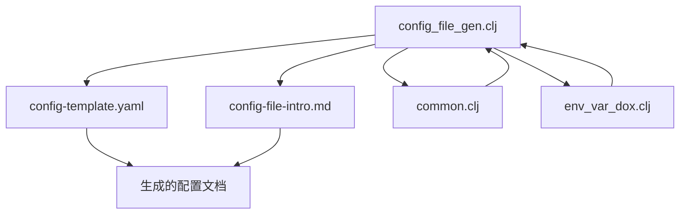
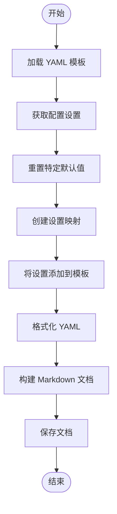
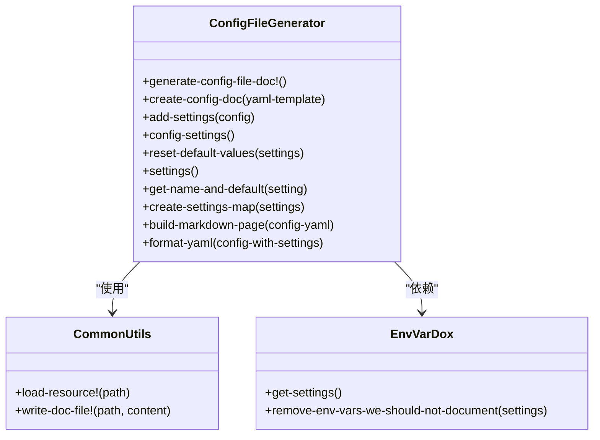
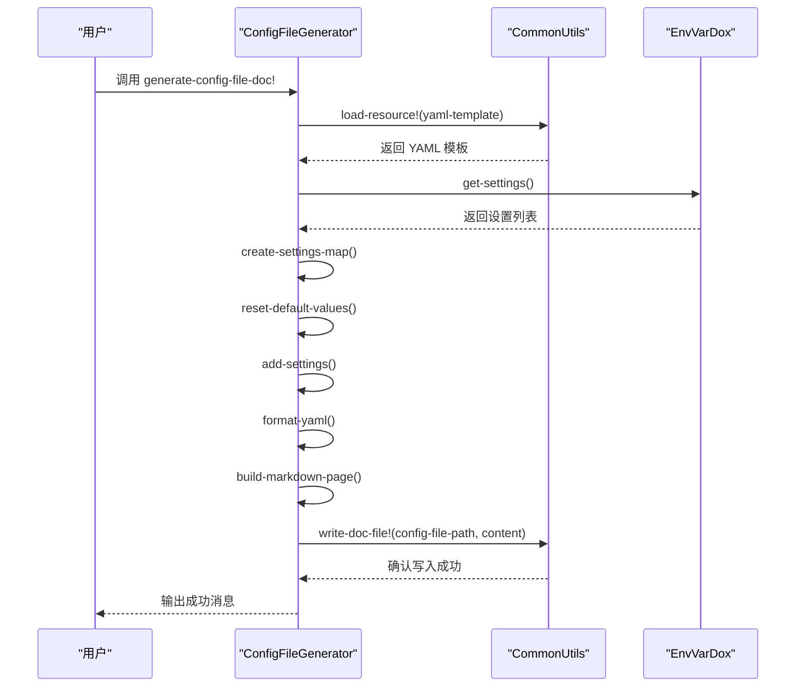
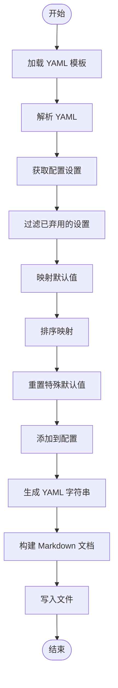
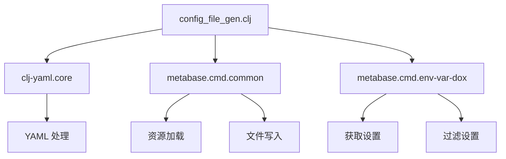

# 配置生成工具使用

<cite>
**本文档中引用的文件**  
- [config_file_gen.clj](file://src/metabase/cmd/config_file_gen.clj)
- [config-template.yaml](file://src/metabase/cmd/resources/config-template.yaml)
- [config-file-intro.md](file://src/metabase/cmd/resources/config-file-intro.md)
- [common.clj](file://src/metabase/cmd/common.clj)
- [env_var_dox.clj](file://src/metabase/cmd/env_var_dox.clj)
- [core.clj](file://src/metabase/cmd/core.clj)
</cite>

## 目录
1. [简介](#简介)
2. [项目结构](#项目结构)
3. [核心组件](#核心组件)
4. [架构概述](#架构概述)
5. [详细组件分析](#详细组件分析)
6. [依赖分析](#依赖分析)
7. [性能考虑](#性能考虑)
8. [故障排除指南](#故障排除指南)
9. [结论](#结论)
10. [附录](#附录)（如有必要）

## 简介
`config_file_gen.clj` 是 Metabase 项目中的一个命令行工具，用于生成安全的配置文件模板。该工具能够创建包含所有可配置设置及其默认值的 YAML 配置模板，并将其嵌入到 Markdown 文档中，便于文档化和分发。此工具特别适用于在 CI/CD 流程中自动化生成配置文件，并结合加密密钥管理实践确保配置安全。

## 项目结构
该工具位于 `src/metabase/cmd/` 目录下，主要由 `config_file_gen.clj` 文件实现，依赖于 `resources` 目录下的模板文件和资源文件。工具通过读取配置模板、注入设置值并生成最终的文档文件来工作。

**Diagram sources**
- [config_file_gen.clj](file://src/metabase/cmd/config_file_gen.clj)
- [config-template.yaml](file://src/metabase/cmd/resources/config-template.yaml)
- [config-file-intro.md](file://src/metabase/cmd/resources/config-file-intro.md)
- [common.clj](file://src/metabase/cmd/common.clj)
- [env_var_dox.clj](file://src/metabase/cmd/env_var_dox.clj)

**Section sources**
- [config_file_gen.clj](file://src/metabase/cmd/config_file_gen.clj)
- [config-template.yaml](file://src/metabase/cmd/resources/config-template.yaml)

## 核心组件
`config_file_gen.clj` 工具的核心功能包括获取设置、重置特定默认值、创建设置映射、将设置添加到 YAML 模板以及构建最终的 Markdown 文档。这些功能通过一系列函数实现，确保生成的配置文件既完整又安全。

**Section sources**
- [config_file_gen.clj](file://src/metabase/cmd/config_file_gen.clj#L0-L101)

## 架构概述
该工具的架构设计简洁明了，主要包括以下几个步骤：
1. 读取基础 YAML 模板。
2. 获取所有有效的配置设置及其默认值。
3. 对某些需要重置的默认值进行处理。
4. 将处理后的设置映射添加到 YAML 模板中。
5. 将最终的 YAML 内容嵌入到 Markdown 文档中，并保存到指定位置。

**Diagram sources**
- [config_file_gen.clj](file://src/metabase/cmd/config_file_gen.clj#L0-L101)

## 详细组件分析

### 组件 A 分析
`config_file_gen.clj` 中的 `generate-config-file-doc!` 函数是生成配置文档的主要入口点。该函数调用一系列辅助函数，逐步构建最终的文档内容。

#### 对于对象导向的组件：

**Diagram sources**
- [config_file_gen.clj](file://src/metabase/cmd/config_file_gen.clj#L0-L101)
- [common.clj](file://src/metabase/cmd/common.clj#L0-L37)
- [env_var_dox.clj](file://src/metabase/cmd/env_var_dox.clj#L0-L199)

#### 对于 API/服务组件：

**Diagram sources**
- [config_file_gen.clj](file://src/metabase/cmd/config_file_gen.clj#L0-L101)
- [common.clj](file://src/metabase/cmd/common.clj#L0-L37)
- [env_var_dox.clj](file://src/metabase/cmd/env_var_dox.clj#L0-L199)

#### 对于复杂逻辑组件：

**Diagram sources**
- [config_file_gen.clj](file://src/metabase/cmd/config_file_gen.clj#L0-L101)

**Section sources**
- [config_file_gen.clj](file://src/metabase/cmd/config_file_gen.clj#L0-L101)

### 概念概述
该工具的设计理念是通过自动化生成配置文件模板，减少手动配置错误的风险，并确保所有配置项都得到正确记录。通过结合环境变量文档生成工具，可以进一步增强配置的安全性和可维护性。

[无来源，因为此图表显示的是概念工作流，而非实际代码结构]

[无来源，因为此部分不分析特定文件]

## 依赖分析
`config_file_gen.clj` 依赖于多个内部模块和外部库，包括 `clj-yaml.core` 用于 YAML 处理，`metabase.cmd.common` 提供通用工具函数，`metabase.cmd.env-var-dox` 用于获取环境变量设置。这些依赖关系确保了工具的功能完整性和灵活性。

**Diagram sources**
- [config_file_gen.clj](file://src/metabase/cmd/config_file_gen.clj#L0-L101)
- [common.clj](file://src/metabase/cmd/common.clj#L0-L37)
- [env_var_dox.clj](file://src/metabase/cmd/env_var_dox.clj#L0-L199)

**Section sources**
- [config_file_gen.clj](file://src/metabase/cmd/config_file_gen.clj#L0-L101)
- [common.clj](file://src/metabase/cmd/common.clj#L0-L37)
- [env_var_dox.clj](file://src/metabase/cmd/env_var_dox.clj#L0-L199)

## 性能考虑
虽然 `config_file_gen.clj` 主要用于生成静态文档，但在大规模部署或频繁调用的情况下，仍需注意性能优化。例如，可以通过缓存设置获取结果来减少重复计算，或者优化 YAML 解析和生成过程以提高效率。

[无来源，因为此部分提供一般性指导]

## 故障排除指南
在使用 `config_file_gen.clj` 时，可能会遇到资源文件缺失或写入权限不足等问题。建议检查文件路径是否正确，确保运行环境具有足够的权限，并验证依赖库是否已正确安装。

**Section sources**
- [common.clj](file://src/metabase/cmd/common.clj#L0-L37)

## 结论
`config_file_gen.clj` 是一个强大且灵活的工具，能够有效支持 Metabase 的配置管理和文档化需求。通过自动化生成配置文件模板，不仅可以提高配置的一致性和安全性，还能显著简化维护工作。结合 CI/CD 流程和加密密钥管理实践，可以进一步提升系统的整体安全性和可靠性。

[无来源，因为此部分总结而不分析特定文件]