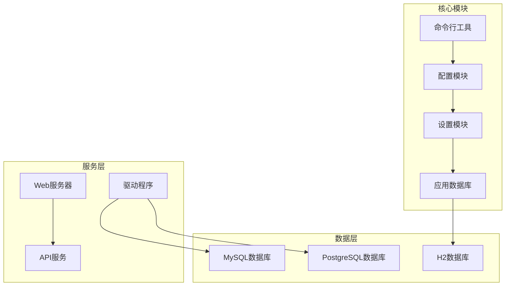
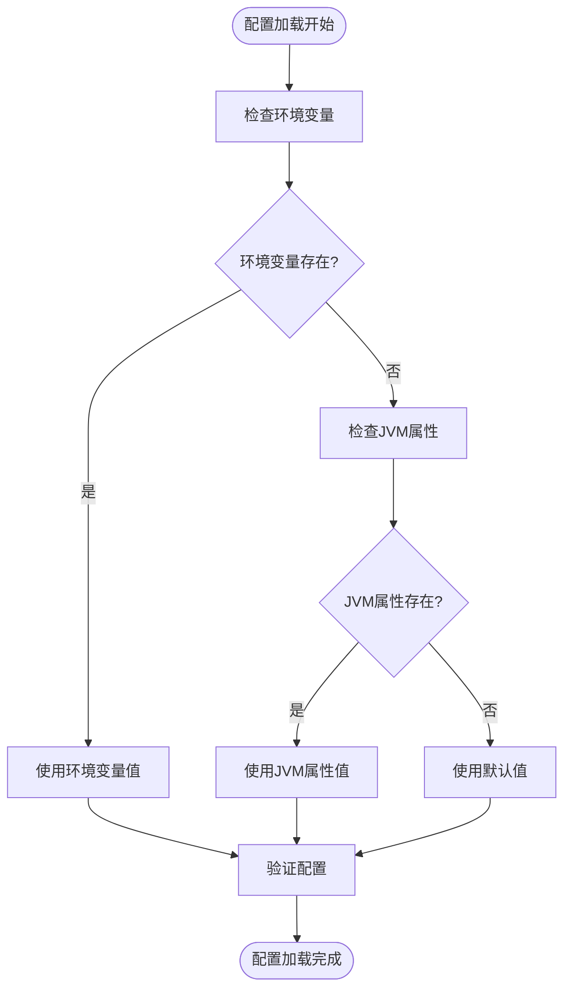
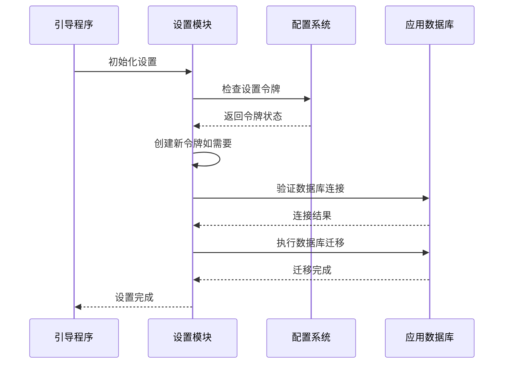
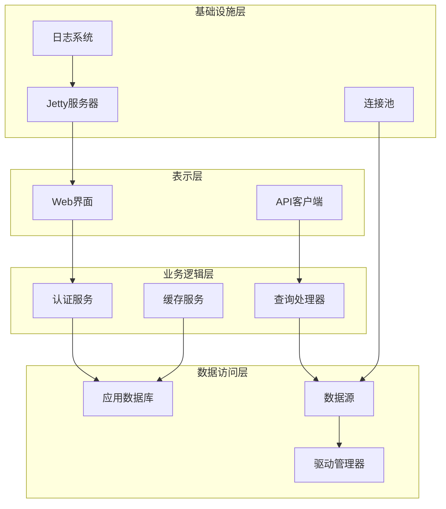
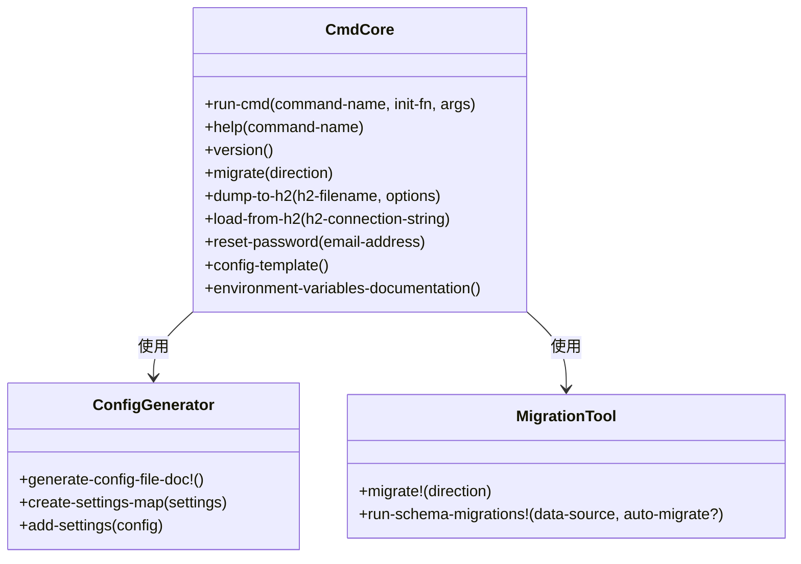
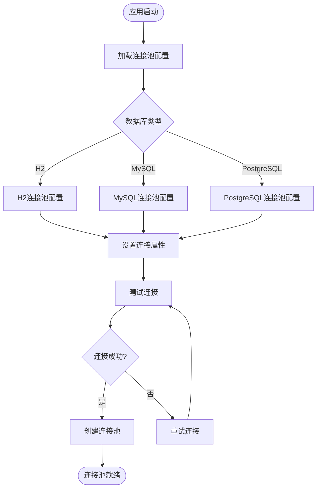
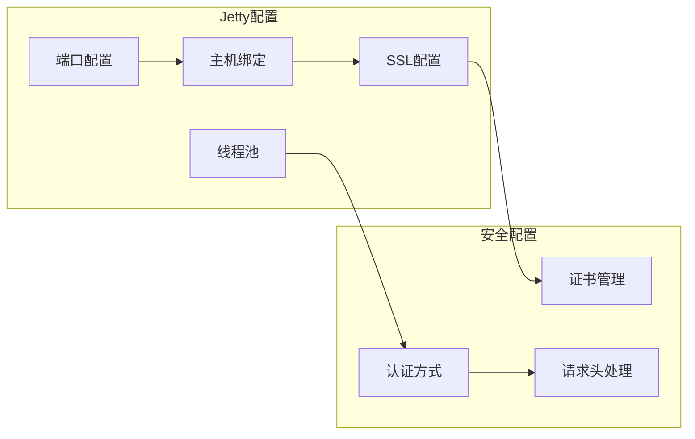
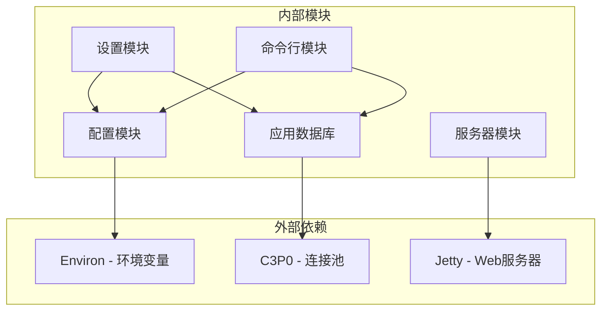

# 部署配置

<cite>
**本文档中引用的文件**
- [config-template.yaml](file://src/metabase/cmd/resources/config-template.yaml)
- [config-file-gen.clj](file://src/metabase/cmd/config_file_gen.clj)
- [core.clj](file://src/metabase/config/core.clj)
- [setup.clj](file://src/metabase/setup/core.clj)
- [settings.clj](file://src/metabase/setup/settings.clj)
- [cmd-core.clj](file://src/metabase/cmd/core.clj)
- [migrate.clj](file://src/metabase/cmd/migrate.clj)
- [setup-db.clj](file://src/metabase/app_db/setup.clj)
- [init.clj](file://src/metabase/core/init.clj)
- [bootstrap.clj](file://src/metabase/core/bootstrap.clj)
- [connection_pool_setup.clj](file://src/metabase/app_db/connection_pool_setup.clj)
- [env-var-intro.md](file://src/metabase/cmd/resources/env-var-intro.md)
- [other-env-vars.md](file://src/metabase/cmd/resources/other-env-vars.md)
- [instance.clj](file://src/metabase/server/instance.clj)
</cite>

## 目录
1. [简介](#简介)
2. [项目结构概览](#项目结构概览)
3. [核心组件分析](#核心组件分析)
4. [架构概览](#架构概览)
5. [详细组件分析](#详细组件分析)
6. [依赖关系分析](#依赖关系分析)
7. [性能考虑](#性能考虑)
8. [故障排除指南](#故障排除指南)
9. [结论](#结论)

## 简介

本文档为系统管理员提供了从零开始部署Metabase的完整说明。我们将深入探讨`setup`模块的引导流程、配置加载机制、高可用部署策略以及数据库连接池配置等关键方面。

Metabase是一个开源的数据可视化平台，其部署配置涉及多个层次：环境变量配置、配置文件管理、数据库设置、Web服务器配置以及高可用性部署。本指南将帮助您理解这些组件的工作原理，并提供最佳实践建议。

## 项目结构概览

Metabase采用模块化架构设计，主要模块包括：



**图表来源**
- [config/core.clj](file://src/metabase/config/core.clj#L1-L50)
- [setup/core.clj](file://src/metabase/setup/core.clj#L1-L28)
- [cmd/core.clj](file://src/metabase/cmd/core.clj#L1-L50)

**章节来源**
- [init.clj](file://src/metabase/core/init.clj#L1-L77)
- [bootstrap.clj](file://src/metabase/core/bootstrap.clj#L1-L37)

## 核心组件分析

### 配置管理系统

Metabase的配置系统支持多层级配置源，优先级从高到低为：

1. **环境变量** - 最高优先级
2. **JVM系统属性** - 中等优先级  
3. **默认值** - 最低优先级



**图表来源**
- [config/core.clj](file://src/metabase/config/core.clj#L80-L100)

### 设置模块引导流程

设置模块负责初始化Metabase实例，包括用户设置令牌管理和初始配置检查：



**图表来源**
- [setup/core.clj](file://src/metabase/setup/core.clj#L15-L28)
- [setup/settings.clj](file://src/metabase/setup/settings.clj#L15-L49)

**章节来源**
- [setup/core.clj](file://src/metabase/setup/core.clj#L1-L28)
- [setup/settings.clj](file://src/metabase/setup/settings.clj#L1-L49)

## 架构概览

Metabase采用分层架构设计，确保各组件间的松耦合和高内聚：



**图表来源**
- [server/instance.clj](file://src/metabase/server/instance.clj#L32-L61)
- [app_db/setup.clj](file://src/metabase/app_db/setup.clj#L1-L50)

## 详细组件分析

### 命令行工具模块

命令行工具模块提供了完整的CLI接口，支持配置生成、数据库迁移、密码重置等功能：



**图表来源**
- [cmd/core.clj](file://src/metabase/cmd/core.clj#L50-L150)
- [config_file_gen.clj](file://src/metabase/cmd/config_file_gen.clj#L1-L50)

#### 配置文件生成器

配置文件生成器能够自动生成包含所有可配置设置的YAML模板：

| 功能特性 | 描述 | 默认值 |
|---------|------|--------|
| 设置提取 | 从设置定义中提取所有配置项 | 自动生成 |
| YAML格式化 | 将设置转换为YAML格式 | 块样式 |
| 文档生成 | 生成Markdown格式的配置文档 | 包含示例 |
| 环境变量映射 | 映射设置名称到环境变量名 | MB_前缀 |

**章节来源**
- [cmd/core.clj](file://src/metabase/cmd/core.clj#L1-L318)
- [config_file_gen.clj](file://src/metabase/cmd/config_file_gen.clj#L1-L102)

### 数据库连接池配置

Metabase使用C3P0连接池管理数据库连接，支持多种数据库类型：



**图表来源**
- [connection_pool_setup.clj](file://src/metabase/app_db/connection_pool_setup.clj#L108-L150)

#### 连接池参数优化

| 参数名称 | 默认值 | 说明 | 调优建议 |
|---------|--------|------|----------|
| `minPoolSize` | 0 | 最小连接数 | 根据并发需求调整 |
| `maxPoolSize` | 15 | 最大连接数 | 通常设为CPU核心数×2 |
| `maxIdleTime` | 3小时 | 连接空闲超时 | 根据网络稳定性调整 |
| `maxConnectionAge` | 1小时 | 连接最大生命周期 | 避免长时间连接 |
| `testConnectionOnCheckout` | true | 检出时测试连接 | 确保连接有效性 |

**章节来源**
- [connection_pool_setup.clj](file://src/metabase/app_db/connection_pool_setup.clj#L85-L150)

### Web服务器配置

Jetty服务器配置支持HTTP和HTTPS协议，提供灵活的部署选项：



**图表来源**
- [instance.clj](file://src/metabase/server/instance.clj#L32-L61)

**章节来源**
- [instance.clj](file://src/metabase/server/instance.clj#L1-L139)

## 依赖关系分析

Metabase的模块间依赖关系呈现清晰的分层结构：



**图表来源**
- [config/core.clj](file://src/metabase/config/core.clj#L1-L20)
- [init.clj](file://src/metabase/core/init.clj#L1-L50)

**章节来源**
- [init.clj](file://src/metabase/core/init.clj#L1-L77)

## 性能考虑

### 数据库性能优化

1. **连接池调优**
   - 监控连接使用率，避免连接泄漏
   - 根据负载调整最大连接数
   - 启用连接健康检查

2. **查询性能**
   - 合理设置查询超时时间
   - 使用适当的缓存策略
   - 优化索引和查询计划

3. **内存管理**
   - 监控JVM堆内存使用
   - 配置合适的垃圾回收器
   - 避免内存泄漏

### Web服务器性能

1. **线程池配置**
   - 根据CPU核心数调整线程数
   - 监控线程使用情况
   - 避免线程池耗尽

2. **SSL/TLS优化**
   - 使用现代加密算法
   - 启用会话复用
   - 配置适当的证书链

## 故障排除指南

### 常见部署问题

1. **数据库连接失败**
   - 检查数据库服务状态
   - 验证连接字符串配置
   - 确认网络连通性

2. **配置加载错误**
   - 验证环境变量格式
   - 检查配置文件语法
   - 确认权限设置

3. **Web服务器启动失败**
   - 检查端口占用情况
   - 验证SSL证书配置
   - 查看启动日志

### 监控和诊断

1. **连接池监控**
   ```
   # 检查连接池状态
   java -jar metabase.jar migrate print
   
   # 监控连接使用
   tail -f metabase.log | grep "App DB connections"
   ```

2. **性能指标**
   ```
   # 监控线程使用
   tail -f metabase.log | grep "Jetty threads"
   
   # 检查查询性能
   grep "Query execution time" metabase.log
   ```

**章节来源**
- [migrate.clj](file://src/metabase/cmd/migrate.clj#L1-L9)
- [setup-db.clj](file://src/metabase/app_db/setup.clj#L100-L200)

## 结论

本文档详细介绍了Metabase的部署配置过程，涵盖了从基础配置到高级优化的各个方面。通过理解各个组件的工作原理和相互关系，系统管理员可以更好地部署和维护Metabase实例。

关键要点：
- 配置系统支持多层级优先级
- 命令行工具提供了完整的运维功能
- 连接池配置对性能至关重要
- 监控和诊断是运维的重要组成部分

建议在生产环境中实施以下最佳实践：
- 使用专用的配置文件而非环境变量
- 定期备份数据库和配置
- 监控系统资源使用情况
- 制定应急响应计划

通过遵循本文档的指导，您可以成功部署和维护一个高性能、高可用的Metabase实例。