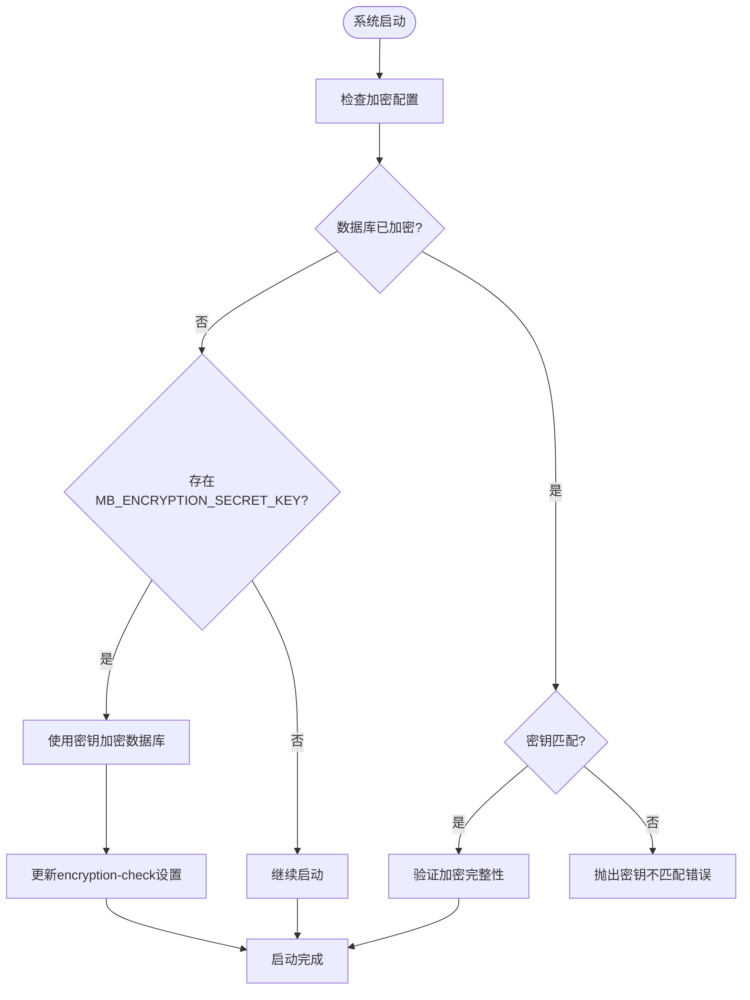
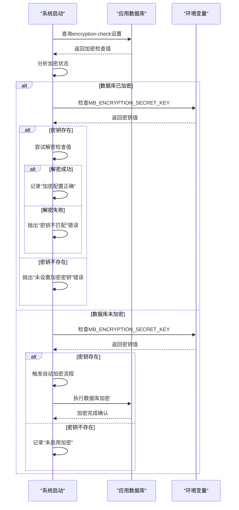
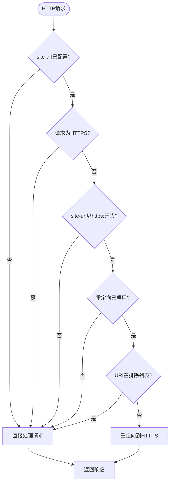

# 安全配置与敏感信息管理

<cite>
**本文档引用的文件**  
- [encryption.clj](file://src/metabase/util/encryption.clj)
- [app_db/encryption.clj](file://src/metabase/app_db/encryption.clj)
- [cmd/rotate_encryption_key.clj](file://src/metabase/cmd/rotate_encryption_key.clj)
- [server/middleware/security.clj](file://src/metabase/server/middleware/security.clj)
- [server/middleware/ssl.clj](file://src/metabase/server/middleware/ssl.clj)
- [secrets/models/secret.clj](file://src/metabase/secrets/models/secret.clj)
- [app_db/setup.clj](file://src/metabase/app_db/setup.clj)
- [audit_app/models/audit_log.clj](file://src/metabase/audit_app/models/audit_log.clj)
</cite>

## 目录
1. [加密密钥管理](#加密密钥管理)
2. [敏感信息加密实现](#敏感信息加密实现)
3. [健康检查与故障诊断](#健康检查与故障诊断)
4. [外部密钥管理服务集成](#外部密钥管理服务集成)
5. [HTTPS配置](#https配置)
6. [内容安全策略与安全头信息](#内容安全策略与安全头信息)
7. [敏感信息泄露防范](#敏感信息泄露防范)
8. [审计日志配置](#审计日志配置)

## 加密密钥管理

Metabase使用AES-256加密算法保护敏感数据，加密密钥通过环境变量`MB_ENCRYPTION_SECRET_KEY`进行管理。系统在首次启动时会检查加密配置状态，并根据需要自动创建或应用加密密钥。

当系统检测到`MB_ENCRYPTION_SECRET_KEY`环境变量已设置但数据库尚未加密时，会自动触发数据库加密流程。加密状态通过应用数据库中的`encryption-check`设置项进行跟踪，该设置项存储一个加密的UUID值来验证加密完整性。

密钥轮换通过命令行工具`rotate-encryption-key`实现，允许在不中断服务的情况下更新加密密钥。轮换过程首先使用当前密钥解密数据，然后使用新密钥重新加密，确保数据在转换过程中的安全性。



**Diagram sources**
- [app_db/setup.clj](file://src/metabase/app_db/setup.clj#L124-L165)
- [app_db/encryption.clj](file://src/metabase/app_db/encryption.clj#L25-L60)

**Section sources**
- [util/encryption.clj](file://src/metabase/util/encryption.clj#L0-L261)
- [app_db/encryption.clj](file://src/metabase/app_db/encryption.clj#L0-L60)

## 敏感信息加密实现

Metabase应用数据库中存储的敏感字段（如SMTP密码、数据库连接信息）使用AES-256-CBC-HMAC-SHA512算法进行加密。加密过程结合了100,000次迭代的PBKDF2+SHA512密钥派生函数，将用户提供的密钥转换为64字节的加密密钥。

系统通过`metabase.util.encryption`命名空间提供加密功能，主要包含以下核心函数：
- `encrypt-bytes`：使用指定密钥加密字节数组
- `decrypt-bytes`：使用指定密钥解密字节数组
- `maybe-encrypt`：根据加密配置决定是否加密字符串
- `maybe-decrypt`：根据加密配置决定是否解密数据

对于数据库连接详情等复杂数据结构，系统采用JSON序列化后加密的策略。每个敏感字段在存储前都会经过加密处理，读取时自动解密，确保敏感信息在静态存储中的安全性。

```mermaid
classDiagram
class EncryptionUtil {
+secret-key->hash(secret-key) bytes
+validate-and-hash-secret-key(secret-key) bytes
+encrypt-bytes(b, secret-key) String
+decrypt-bytes(b, secret-key) String
+encrypt(s, secret-key) String
+decrypt(s, secret-key) String
+maybe-encrypt(s) String
+maybe-decrypt(v) Object
+possibly-encrypted-string?(s) boolean
}
class DatabaseEncryption {
+do-encryption(db-type, data-source, encrypting?, make-encrypt-fn) void
+encrypt-db(db-type, data-source, to-key) void
+decrypt-db(db-type, data-source) void
}
class SecretManager {
+upsert-secret-value!(existing-id, nm, kind, src, value) Secret
+latest-for-id(id) Secret
+value-as-string(driver, details, secret-property) String
+value-as-file!(driver, details, secret-property, ext) File
}
EncryptionUtil --> DatabaseEncryption : "用于"
EncryptionUtil --> SecretManager : "用于"
DatabaseEncryption --> "应用数据库" : "操作"
SecretManager --> "应用数据库" : "操作"
```

**Diagram sources**
- [util/encryption.clj](file://src/metabase/util/encryption.clj#L0-L261)
- [app_db/encryption.clj](file://src/metabase/app_db/encryption.clj#L0-L60)
- [secrets/models/secret.clj](file://src/metabase/secrets/models/secret.clj#L0-L403)

**Section sources**
- [util/encryption.clj](file://src/metabase/util/encryption.clj#L0-L261)
- [app_db/encryption.clj](file://src/metabase/app_db/encryption.clj#L0-L60)

## 健康检查与故障诊断

Metabase提供加密状态的健康检查机制，通过应用数据库中的`encryption-check`设置项验证加密配置的完整性和正确性。系统在启动时执行以下健康检查流程：

1. 读取`encryption-check`设置项的原始值
2. 检查值是否等于"unencrypted"以确定数据库是否已加密
3. 如果数据库已加密，验证`MB_ENCRYPTION_SECRET_KEY`环境变量是否存在
4. 尝试解密`encryption-check`值以验证密钥匹配性
5. 记录检查结果并采取相应措施

当检测到配置问题时，系统会抛出详细的错误信息，帮助管理员诊断和解决问题。例如，如果数据库已加密但未设置密钥，会抛出"Database is encrypted but the MB_ENCRYPTION_SECRET_KEY environment variable was NOT set"错误。

故障诊断方法包括：
- 检查系统日志中的加密状态信息
- 验证环境变量`MB_ENCRYPTION_SECRET_KEY`是否正确设置
- 确认密钥长度至少为16个字符
- 检查应用数据库连接是否正常



**Diagram sources**
- [app_db/setup.clj](file://src/metabase/app_db/setup.clj#L124-L165)

**Section sources**
- [app_db/setup.clj](file://src/metabase/app_db/setup.clj#L124-L165)

## 外部密钥管理服务集成

Metabase支持通过外部密钥管理服务（KMS）集成来增强密钥安全性。虽然核心系统依赖环境变量`MB_ENCRYPTION_SECRET_KEY`，但可以通过外部系统管理此密钥的生命周期。

集成指导原则包括：
1. 使用云服务商提供的KMS服务（如AWS KMS、Azure Key Vault、Google Cloud KMS）存储和管理主加密密钥
2. 在应用启动时从KMS获取密钥并设置为环境变量
3. 实现密钥轮换策略，定期从KMS获取新密钥
4. 使用IAM策略严格控制对KMS的访问权限
5. 启用KMS操作的审计日志记录

对于文件路径类型的密钥存储，系统支持上传文件内容作为密钥源。这种机制允许将证书、私钥等敏感文件安全地存储在Metabase中，而无需直接在配置中暴露文件内容。

**Section sources**
- [secrets/models/secret.clj](file://src/metabase/secrets/models/secret.clj#L0-L403)

## HTTPS配置

Metabase通过SSL中间件实现HTTPS重定向功能，确保所有通信都通过加密连接进行。HTTPS配置由`redirect-all-requests-to-https`设置项控制，当启用时，所有HTTP请求都会被重定向到相应的HTTPS URL。

系统在以下条件下执行HTTPS重定向：
- `site-url`配置以"https:"开头
- `redirect-all-requests-to-https`设置为true
- 请求不是HTTPS协议
- 请求URI不在排除列表中

特殊URI`/api/health`被排除在重定向之外，确保健康检查端点可以在HTTP上访问，便于负载均衡器和监控系统进行检测。



**Diagram sources**
- [server/middleware/ssl.clj](file://src/metabase/server/middleware/ssl.clj#L0-L52)

**Section sources**
- [server/middleware/ssl.clj](file://src/metabase/server/middleware/ssl.clj#L0-L52)

## 内容安全策略与安全头信息

Metabase实施严格的内容安全策略（CSP）和安全头信息，以防范跨站脚本（XSS）、点击劫持等Web安全威胁。安全头信息通过`add-security-headers`中间件自动添加到所有响应中。

主要安全头信息包括：
- `Content-Security-Policy`：定义内容安全策略，限制资源加载来源
- `Strict-Transport-Security`：强制使用HTTPS连接
- `X-Frame-Options`：防止点击劫持攻击
- `X-XSS-Protection`：启用浏览器XSS过滤
- `X-Content-Type-Options`：防止MIME类型混淆攻击

内容安全策略采用nonce机制，为每个响应生成唯一的随机值，确保只有带有正确nonce的内联脚本才能执行。这有效防止了基于内联脚本的XSS攻击。

```mermaid
classDiagram
class SecurityHeaders {
+generate-nonce() String
+security-headers(origin, nonce, allow-iframes?, allow-cache?) Map
+content-security-policy-header(nonce) Map
+add-security-headers(handler) Middleware
}
class CSPConfig {
+script-src : Array
+style-src : Array
+frame-src : Array
+connect-src : Array
+img-src : Array
+font-src : Array
}
SecurityHeaders --> CSPConfig : "包含"
SecurityHeaders --> "HTTP响应" : "添加"
```

**Diagram sources**
- [server/middleware/security.clj](file://src/metabase/server/middleware/security.clj#L0-L324)

**Section sources**
- [server/middleware/security.clj](file://src/metabase/server/middleware/security.clj#L0-L324)

## 敏感信息泄露防范

Metabase采用多层次机制防范敏感信息泄露，包括数据加密、API响应过滤和安全编码实践。

在API响应中，系统自动过滤敏感字段，确保密码类信息不会暴露。通过`driver.u/default-sensitive-fields`定义的敏感字段集合，包括`:password`、`:pass`、`:tunnel-pass`等，这些字段在序列化为JSON时会被替换为占位符`**MetabasePass**`。

对于数据库连接详情，系统实现专门的JSON转换逻辑，根据用户权限决定暴露程度：
- 无写权限用户：完全隐藏`details`字段
- 有写权限用户：显示`details`但红化敏感字段

此外，系统在日志记录时也会过滤敏感信息，避免密码等机密数据被意外记录。

**Section sources**
- [warehouses/models/database.clj](file://src/metabase/warehouses/models/database.clj#L469-L521)
- [driver/util.clj](file://src/metabase/driver/util.clj#L641-L668)
- [secrets/models/secret.clj](file://src/metabase/secrets/models/secret.clj#L294-L328)

## 审计日志配置

Metabase审计应用提供详细的审计日志功能，记录用户在系统中的关键操作。审计日志模型跟踪各种事件类型，包括仪表板创建、卡片更新、用户管理等操作。

审计日志配置包括：
- `audit-max-retention-days`：设置审计日志的最大保留天数，默认720天，最小30天
- `last-analytics-checksum`：存储分析校验和，用于启动时检查

系统通过`record-event!`函数记录审计事件，该函数接收事件主题、参数映射和当前用户ID作为输入。审计事件包含事件类型、用户ID、模型名称、模型ID和详细信息等字段。

审计日志的详细信息根据事件类型和模型动态生成，确保记录足够的上下文信息用于安全审计和故障排查。

```mermaid
classDiagram
class AuditLog {
+record-event!(topic, params) AuditLog
+construct-event(topic, params, current-user-id) Map
+model-details(entity, event-type) Map
+model-name(instance-or-model) String
+prepare-update-event-data(object, previous-object) Map
}
class EventParams {
+object : Map
+previous-object : Map
+user-id : Integer
+model : Keyword/String
+model-id : Integer
+details : Map
+details-changed? : Boolean
}
AuditLog --> EventParams : "使用"
AuditLog --> "审计日志表" : "写入"
```

**Diagram sources**
- [audit_app/models/audit_log.clj](file://src/metabase/audit_app/models/audit_log.clj#L0-L252)

**Section sources**
- [audit_app/models/audit_log.clj](file://src/metabase/audit_app/models/audit_log.clj#L0-L252)