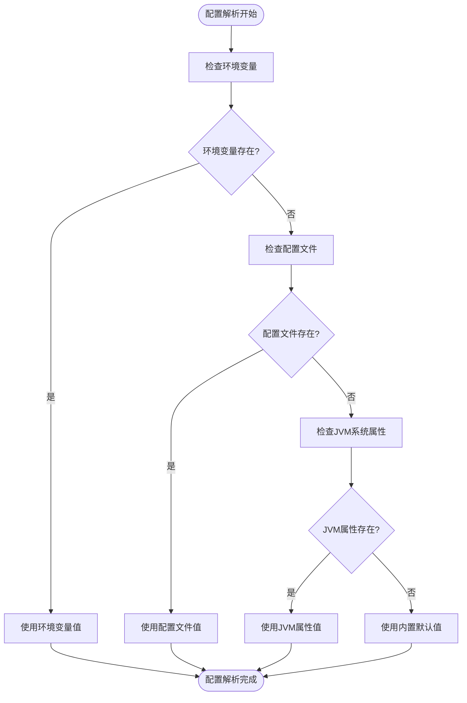
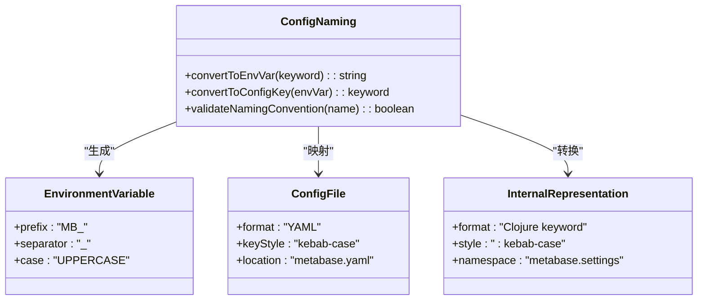
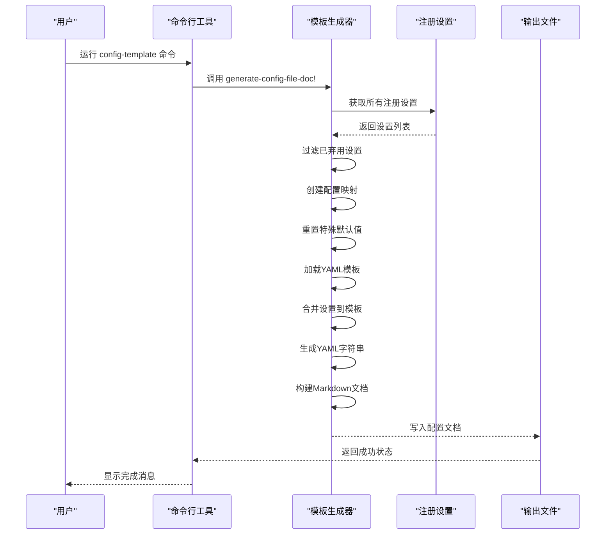
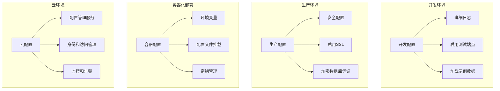
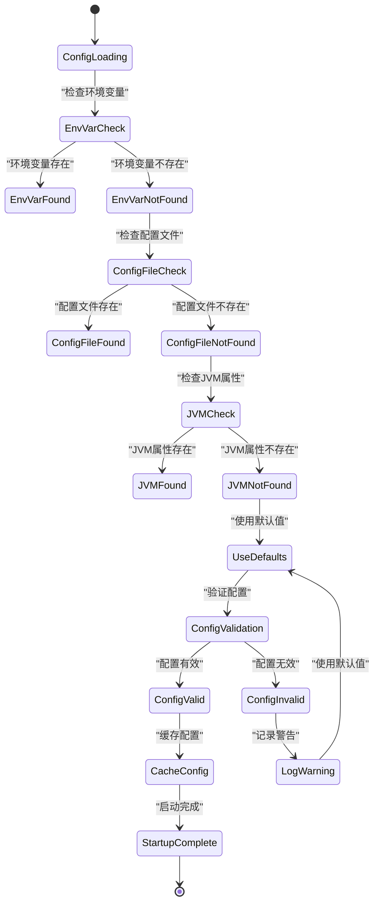

# 环境变量与配置文件

<cite>
**本文档中引用的文件**  
- [config-template.yaml](file://src/metabase/cmd/resources/config-template.yaml)
- [core.clj](file://src/metabase/config/core.clj)
- [instance.clj](file://src/metabase/server/instance.clj)
- [setting.clj](file://src/metabase/settings/models/setting.clj)
- [config_file_gen.clj](file://src/metabase/cmd/config_file_gen.clj)
- [env_var_dox.clj](file://src/metabase/cmd/env_var_dox.clj)
- [other-env-vars.md](file://src/metabase/cmd/resources/other-env-vars.md)
- [config-file-intro.md](file://src/metabase/cmd/resources/config-file-intro.md)
</cite>

## 目录
1. [配置机制概述](#配置机制概述)
2. [配置优先级与解析流程](#配置优先级与解析流程)
3. [配置文件YAML结构规范](#配置文件yaml结构规范)
4. [配置项命名转换规则](#配置项命名转换规则)
5. [配置文件模板生成工具](#配置文件模板生成工具)
6. [不同环境的配置最佳实践](#不同环境的配置最佳实践)
7. [配置加载失败的降级处理](#配置加载失败的降级处理)
8. [常见环境变量清单](#常见环境变量清单)

## 配置机制概述

Metabase提供了三种主要的配置方式：环境变量、配置文件（metabase.yaml）和JVM系统属性。这些配置机制共同构成了Metabase灵活的配置体系，允许用户在不同部署环境中以最适合的方式进行系统配置。环境变量是最常用的配置方式，特别适合容器化部署和云环境；配置文件提供了结构化的配置管理，适合复杂的配置需求；JVM系统属性则主要用于底层系统配置。

**Section sources**
- [core.clj](file://src/metabase/config/core.clj#L1-L242)
- [other-env-vars.md](file://src/metabase/cmd/resources/other-env-vars.md#L1-L500)

## 配置优先级与解析流程

Metabase配置系统的优先级顺序为：环境变量 > 配置文件 > JVM系统属性 > 内置默认值。系统在启动时按照这一优先级顺序解析配置项。首先检查环境变量，如果存在则直接使用；如果环境变量未设置，则检查配置文件中的对应项；如果配置文件中也未设置，则尝试从JVM系统属性中获取；最后，如果以上三种方式都未提供配置值，则使用内置的默认值。

配置解析流程从`metabase.config.core`命名空间开始，通过`config-str`函数实现。该函数首先从环境变量中查找配置值，然后检查JVM系统属性，最后返回内置默认值。对于需要特定数据类型的配置项，系统提供了`config-int`、`config-bool`等辅助函数进行类型转换和解析。



**Diagram sources**
- [core.clj](file://src/metabase/config/core.clj#L155-L165)

**Section sources**
- [core.clj](file://src/metabase/config/core.clj#L155-L165)
- [setting.clj](file://src/metabase/settings/models/setting.clj#L462-L493)

## 配置文件YAML结构规范

Metabase的配置文件采用YAML格式，文件名为`metabase.yaml`。配置文件的顶层结构包括`version`和`config`两个主要部分。`version`字段指定配置文件的版本，当前为1；`config`字段包含实际的配置内容，分为`users`、`databases`、`api-keys`和`settings`等子部分。

数据库连接配置位于`databases`部分，每个数据库配置包含`name`、`engine`和`details`字段。`details`字段包含具体的连接信息，如`host`、`port`、`user`、`password`和`dbname`。Jetty服务器配置通过`settings`部分的`mb-jetty-*`前缀的配置项进行设置，包括端口、主机、线程数等。缓存配置同样通过`settings`部分的相关配置项进行管理。

```yaml
version: 1
config:
  users:
    - first_name: First
      last_name: Person
      password: metabot1
      email: first@example.com
  databases:
    - name: Sample PostgreSQL
      engine: postgres
      details:
        host: postgres-data
        port: 5432
        user: metabase
        password: metasample123
        dbname: sample
  settings:
    site-url: "http://localhost:3000"
    allow-signup: true
```

**Section sources**
- [config-template.yaml](file://src/metabase/cmd/resources/config-template.yaml#L1-L43)
- [core.clj](file://src/metabase/config/core.clj#L50-L100)

## 配置项命名转换规则

Metabase配置项在不同配置方式之间遵循特定的命名转换规则。Clojure代码中的关键字形式（如`:site-url`）在环境变量中转换为大写并用下划线连接的形式（如`MB_SITE_URL`）。这种转换通过`setting-env-map-name`函数实现，将连字符（-）转换为下划线（_），并在前面添加`MB_`前缀。

配置文件中的配置项名称保持与Clojure关键字相同的形式，但作为YAML键使用。这种命名转换规则确保了配置项在不同配置方式之间的一致性和可预测性。例如，`MB_JETTY_PORT`环境变量对应于配置文件中的`:mb-jetty-port`配置项，两者都映射到内部的`:mb-jetty-port`关键字。



**Diagram sources**
- [setting.clj](file://src/metabase/settings/models/setting.clj#L462-L493)
- [core.clj](file://src/metabase/config/core.clj#L155-L165)

**Section sources**
- [setting.clj](file://src/metabase/settings/models/setting.clj#L462-L493)
- [core.clj](file://src/metabase/config/core.clj#L155-L165)

## 配置文件模板生成工具

Metabase提供了命令行工具来生成配置文件模板，该工具位于`metabase.cmd.config-file-gen`命名空间。通过运行`clojure -M:doc:ee config-template`命令，可以生成包含所有可配置设置及其默认值的配置文件文档。该工具从系统注册的设置中提取信息，创建一个完整的配置模板，帮助用户了解所有可用的配置选项。

生成的配置文件模板包括数据库连接、用户账户、API密钥和各种系统设置的示例。工具会自动排除已弃用的设置，并为某些需要特殊处理的默认值设置为null。生成的文档还包含使用说明，指导用户如何修改和使用配置文件。



**Diagram sources**
- [config_file_gen.clj](file://src/metabase/cmd/config_file_gen.clj#L1-L102)
- [env_var_dox.clj](file://src/metabase/cmd/env_var_dox.clj#L1-L229)

**Section sources**
- [config_file_gen.clj](file://src/metabase/cmd/config_file_gen.clj#L1-L102)
- [env_var_dox.clj](file://src/metabase/cmd/env_var_dox.clj#L1-L229)

## 不同环境的配置最佳实践

在不同环境中，Metabase的配置策略应有所不同。在开发环境中，建议使用简单的配置，启用测试端点和详细的日志记录，以便于调试和开发。可以使用`MB_ENABLE_TEST_ENDPOINTS=true`环境变量来启用测试API。在生产环境中，应禁用所有测试功能，启用安全配置，如SSL加密和数据库凭证加密。

对于容器化部署，推荐使用环境变量进行配置，因为这与Docker和Kubernetes的最佳实践相一致。可以使用`-e`参数在Docker运行命令中设置环境变量。对于复杂的配置需求，可以使用配置文件，并通过卷挂载的方式将其注入容器。在云环境中，应利用云平台提供的配置管理服务，如AWS Systems Manager Parameter Store或Azure Key Vault。



**Section sources**
- [other-env-vars.md](file://src/metabase/cmd/resources/other-env-vars.md#L1-L500)
- [core.clj](file://src/metabase/config/core.clj#L50-L100)

## 配置加载失败的降级处理

当配置加载失败时，Metabase有一套完整的降级处理机制。系统首先尝试从最高优先级的配置源（环境变量）读取配置，如果失败则依次降级到配置文件、JVM系统属性，最后使用内置默认值。这种分层的降级策略确保了系统在配置缺失或错误的情况下仍能正常启动。

对于关键配置项，系统会进行验证并在配置无效时抛出异常。例如，数据库连接配置必须包含必要的连接信息，否则系统将无法启动。非关键配置项在无效时会使用默认值，并记录警告日志。配置缓存机制也提供了额外的容错能力，当数据库连接暂时不可用时，系统可以使用缓存的配置值继续运行。



**Diagram sources**
- [core.clj](file://src/metabase/config/core.clj#L155-L165)
- [setting.clj](file://src/metabase/settings/models/setting.clj#L462-L493)

**Section sources**
- [core.clj](file://src/metabase/config/core.clj#L155-L165)
- [setting.clj](file://src/metabase/settings/models/setting.clj#L462-L493)

## 常见环境变量清单

Metabase支持大量的环境变量，涵盖了系统配置、数据库连接、安全设置等多个方面。常见的环境变量包括`MB_JETTY_PORT`（设置HTTP端口）、`MB_SITE_URL`（设置站点URL）、`MB_DB_TYPE`（设置数据库类型）等。这些环境变量提供了灵活的配置方式，特别适合自动化部署和环境特定的配置。

安全相关的环境变量如`MB_ENCRYPTION_SECRET_KEY`用于加密数据库凭证，`MB_JETTY_SSL`用于启用HTTPS。性能相关的环境变量如`MB_JETTY_MAXTHREADS`和`MB_JETTY_MINTHREADS`用于调整Jetty服务器的线程池大小。这些环境变量的命名都遵循`MB_`前缀和大写下划线的约定，便于识别和管理。

**Section sources**
- [other-env-vars.md](file://src/metabase/cmd/resources/other-env-vars.md#L1-L500)
- [core.clj](file://src/metabase/config/core.clj#L50-L100)