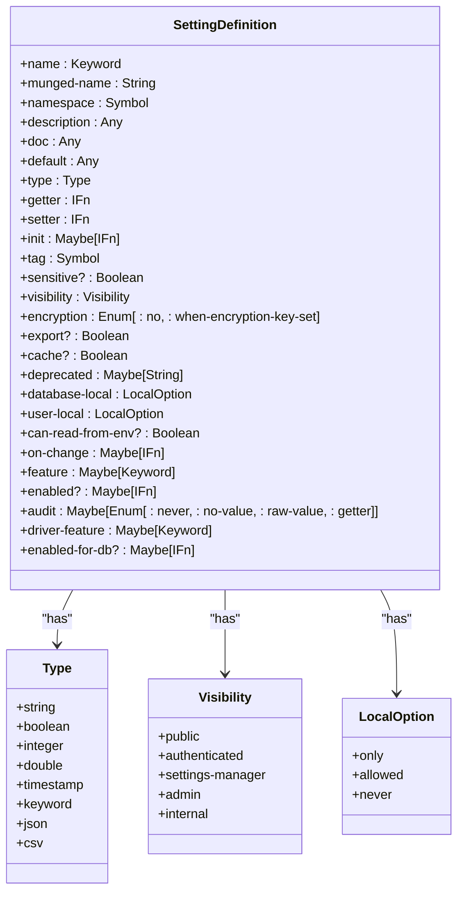
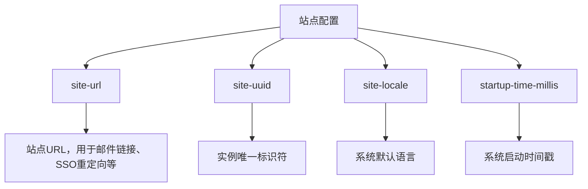
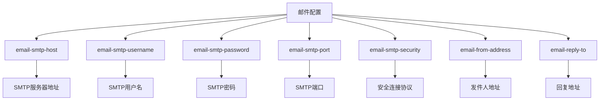
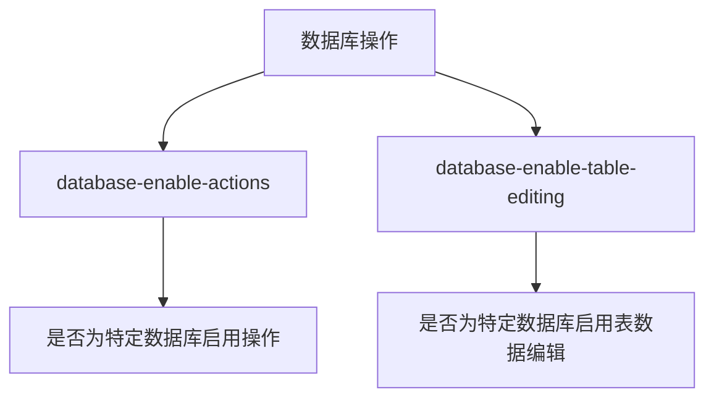
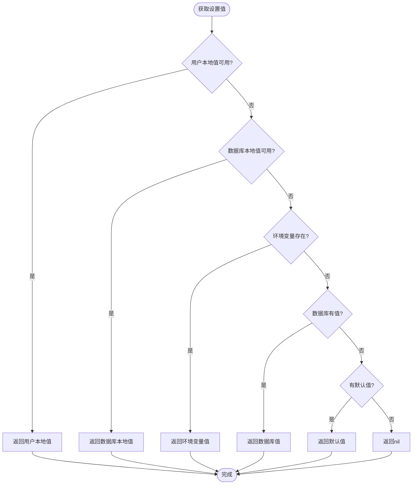
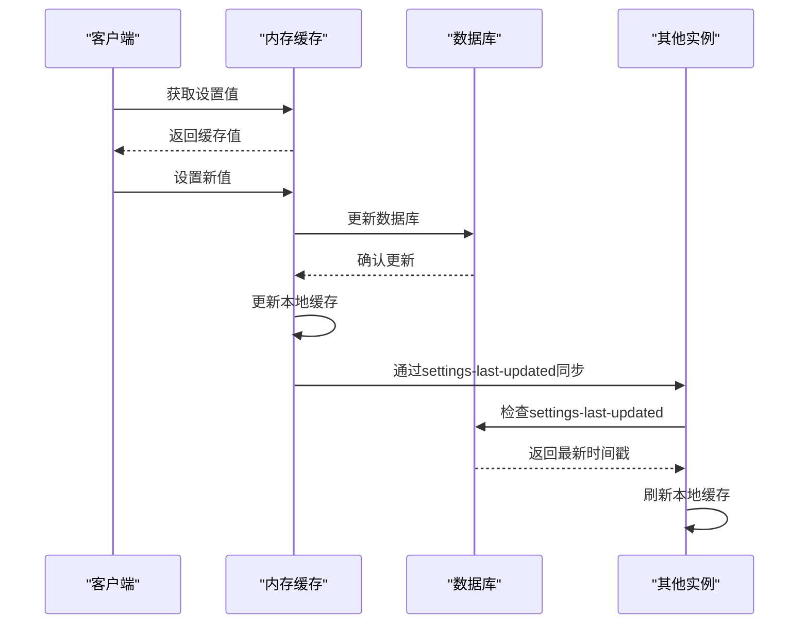
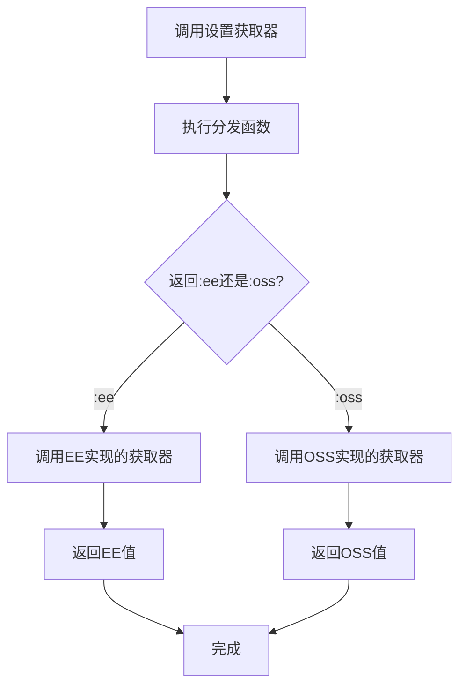
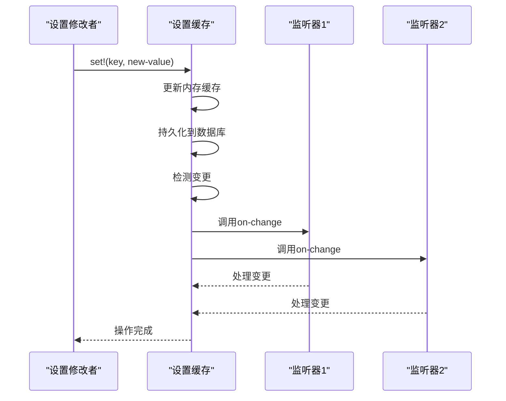

# 系统设置管理

<cite>
**本文档中引用的文件**  
- [core.clj](file://src/metabase/settings/core.clj)
- [api.clj](file://src/metabase/settings/api.clj)
- [setting.clj](file://src/metabase/settings/models/setting.clj)
- [cache.clj](file://src/metabase/settings/models/setting/cache.clj)
- [multi_setting.clj](file://src/metabase/settings/models/setting/multi_setting.clj)
- [actions.clj](file://src/metabase/actions/settings.clj)
- [settings.clj](file://src/metabase/settings/settings.clj)
- [system/settings.clj](file://src/metabase/system/settings.clj)
- [channel/settings.clj](file://src/metabase/channel/settings.clj)
</cite>

## 目录
1. [引言](#引言)
2. [Toucan2 ORM设置存储机制](#toucan2-orm设置存储机制)
3. [Setting模型结构与元数据定义](#setting模型结构与元数据定义)
4. [核心设置项详解](#核心设置项详解)
5. [设置的读取、写入与缓存策略](#设置的读取写入与缓存策略)
6. [通过API动态修改设置](#通过api动态修改设置)
7. [multi-setting特殊处理逻辑](#multi-setting特殊处理逻辑)
8. [设置变更事件的监听与响应](#设置变更事件的监听与响应)
9. [调试技巧与常见配置错误排查](#调试技巧与常见配置错误排查)
10. [总结](#总结)

## 引言
Metabase系统设置管理机制提供了一种高效、灵活的配置管理方式，基于Toucan2 ORM实现设置的持久化存储。该系统支持通过管理界面、环境变量或API等多种方式配置系统行为，涵盖了从站点URL到邮件服务器配置等关键参数。设置系统采用智能缓存机制，在保证配置实时性的同时实现了超快的查找性能（约60µs）。本文档将深入解析Metabase设置系统的架构、实现细节和最佳实践。

## Toucan2 ORM设置存储机制
Metabase使用Toucan2 ORM作为其设置存储的核心机制，实现了设置数据的持久化和高效访问。设置数据存储在名为`setting`的数据库表中，采用键值对的形式保存，其中键（key）为设置项的名称，值（value）为序列化后的字符串形式。

Toucan2 ORM通过`defmethod t2/table-name`和`t2/primary-keys`等方法定义了Setting模型与数据库表的映射关系，确保了数据访问的类型安全和一致性。每个设置项在数据库中以一行记录的形式存在，主键为`key`字段，这保证了设置项名称的唯一性。

设置系统支持三种不同范围的值存储：
- **站点级设置**：全局生效的配置，存储在`setting`表中
- **数据库级设置**：特定数据库的覆盖配置，存储在`Database.settings`列中
- **用户级设置**：特定用户的个性化配置，存储在`User.settings`列中

这种分层的存储机制允许更细粒度的配置管理，例如允许为特定数据库启用或禁用某些功能，而不会影响其他数据库的配置。

**Section sources**
- [setting.clj](file://src/metabase/settings/models/setting.clj#L20-L50)
- [core.clj](file://src/metabase/settings/core.clj#L1-L20)

## Setting模型结构与元数据定义
Setting模型的结构由`SettingDefinition`这个Malli schema定义，包含了设置项的各种元数据属性。每个设置项都由一个包含多个关键字的映射定义，这些关键字控制着设置的行为和可见性。



**Diagram sources**
- [setting.clj](file://src/metabase/settings/models/setting.clj#L250-L350)

### 核心元数据属性
设置项的元数据定义包含以下关键属性：

| 属性 | 类型 | 描述 |
|------|------|------|
| `:name` | 关键字 | 设置项的唯一标识符，如`:site-url` |
| `:type` | 类型 | 设置值的数据类型，如`:string`、`:boolean`等 |
| `:default` | 任意值 | 设置项的默认值，当未显式设置时使用 |
| `:visibility` | 可见性 | 控制设置项的可见范围和可修改权限 |
| `:sensitive?` | 布尔值 | 是否为敏感信息，如密码等 |
| `:encryption` | 加密选项 | 是否需要加密存储 |
| `:database-local` | 本地选项 | 是否允许数据库级别的覆盖设置 |
| `:user-local` | 本地选项 | 是否允许用户级别的覆盖设置 |
| `:getter` | 函数 | 自定义获取器函数，用于读取设置值 |
| `:setter` | 函数 | 自定义设置器函数，用于写入设置值 |
| `:on-change` | 函数 | 值变更时的回调函数 |

这些元数据属性共同定义了设置项的行为特征，使得系统能够根据不同的配置需求提供灵活的管理能力。

**Section sources**
- [setting.clj](file://src/metabase/settings/models/setting.clj#L250-L400)
- [core.clj](file://src/metabase/settings/core.clj#L1-L20)

## 核心设置项详解
Metabase系统定义了多个核心设置项，这些设置项控制着系统的关键行为和功能。以下是一些重要的核心设置项及其业务含义：

### 站点配置设置项


**Diagram sources**
- [system/settings.clj](file://src/metabase/system/settings.clj#L1-L50)

#### site-url
- **名称**: `site-url`
- **类型**: 字符串
- **默认值**: 无
- **可见性**: 公开
- **业务含义**: 站点URL用于创建邮件中的链接、认证重定向、嵌入场景等。更改此设置可能导致功能中断或被锁定在实例之外。该设置会自动规范化，移除尾部斜杠并添加协议前缀（如果没有）。

#### site-uuid
- **名称**: `site-uuid`
- **类型**: 字符串
- **默认值**: 随机生成
- **可见性**: 认证用户
- **业务含义**: 实例的唯一标识符，首次获取时设置并保持不变。用于生成取消订阅URL等需要唯一性的场景。

#### site-locale
- **名称**: `site-locale`
- **类型**: 字符串
- **默认值**: "en"
- **可见性**: 公开
- **业务含义**: 系统UI、系统邮件、Pulse和警报的默认语言。用户可以在自己的账户设置中单独覆盖此默认语言。

### 邮件配置设置项


**Diagram sources**
- [channel/settings.clj](file://src/metabase/channel/settings.clj#L1-L100)

#### email-smtp-host
- **名称**: `email-smtp-host`
- **类型**: 字符串
- **默认值**: 无
- **可见性**: 设置管理员
- **业务含义**: 处理邮件的SMTP服务器地址。可以被自定义SMTP服务器覆盖。

#### email-smtp-port
- **名称**: `email-smtp-port`
- **类型**: 整数
- **默认值**: 无
- **可见性**: 设置管理员
- **业务含义**: SMTP服务器用于发送邮件的端口。支持465、587和2525端口。

#### email-from-address
- **名称**: `email-from-address`
- **类型**: 字符串
- **默认值**: "notifications@metabase.com"
- **可见性**: 设置管理员
- **业务含义**: 邮件发送者的电子邮件地址。

### 数据库操作设置项


**Diagram sources**
- [actions/settings.clj](file://src/metabase/actions/settings.clj#L1-L30)

#### database-enable-actions
- **名称**: `database-enable-actions`
- **类型**: 布尔值
- **默认值**: false
- **可见性**: 公开
- **数据库本地**: 仅限
- **业务含义**: 是否为特定数据库启用操作功能。这是一个数据库本地设置，只能为特定数据库设置。

#### database-enable-table-editing
- **名称**: `database-enable-table-editing`
- **类型**: 布尔值
- **默认值**: false
- **可见性**: 公开
- **数据库本地**: 仅限
- **业务含义**: 是否为特定数据库启用表数据编辑功能。该设置的启用状态取决于数据库是否支持相关功能。

**Section sources**
- [system/settings.clj](file://src/metabase/system/settings.clj#L1-L100)
- [channel/settings.clj](file://src/metabase/channel/settings.clj#L1-L200)
- [actions/settings.clj](file://src/metabase/actions/settings.clj#L1-L60)

## 设置的读取、写入与缓存策略
Metabase设置系统采用多层读取策略和智能缓存机制，确保配置的高效访问和一致性。

### 读取策略
设置值的读取遵循优先级顺序，系统会按以下顺序尝试获取设置值：

1. **用户本地值**：如果设置允许用户本地值且当前用户上下文已绑定，则优先使用用户本地值
2. **数据库本地值**：如果设置允许数据库本地值且当前数据库上下文已绑定，则优先使用数据库本地值
3. **环境变量**：检查对应的环境变量（如`MB_SITE_URL`）
4. **数据库持久化值**：从应用数据库中读取已设置的值
5. **默认值**：如果以上均未设置，则返回定义时指定的默认值

这种分层的读取策略确保了更具体的配置能够覆盖更通用的配置，实现了灵活的配置继承机制。



**Diagram sources**
- [setting.clj](file://src/metabase/settings/models/setting.clj#L700-L800)

### 写入策略
设置值的写入操作通过`set!`函数实现，遵循以下流程：

1. **权限检查**：验证当前用户是否有权修改该设置
2. **值验证**：根据设置定义的类型和约束验证新值
3. **缓存更新**：更新内存中的设置缓存
4. **数据库持久化**：将新值写入数据库
5. **变更通知**：触发`on-change`回调函数（如果定义）

对于用户本地或数据库本地设置，写入操作会直接更新相应实体的`settings`列，而不是全局的`setting`表。

### 缓存策略
设置系统采用内存缓存与数据库持久化的协同机制，实现高性能的配置访问：

- **缓存结构**：使用原子引用（atom）存储一个映射，键为设置名称，值为设置值
- **缓存更新**：当设置值变更时，立即更新缓存并持久化到数据库
- **缓存失效**：通过`settings-last-updated`特殊设置项实现跨实例缓存同步
- **性能优势**：缓存查找时间约60µs，相比数据库查找（约1800µs）有显著提升



**Diagram sources**
- [cache.clj](file://src/metabase/settings/models/setting/cache.clj#L1-L100)
- [setting.clj](file://src/metabase/settings/models/setting.clj#L800-L900)

**Section sources**
- [setting.clj](file://src/metabase/settings/models/setting.clj#L700-L900)
- [cache.clj](file://src/metabase/settings/models/setting/cache.clj#L1-L100)

## 通过API动态修改设置
Metabase提供了RESTful API接口，允许通过HTTP请求动态修改系统设置。这些API端点位于`/api/setting`路径下，支持对单个或多个设置项的读写操作。

### API端点
```mermaid
flowchart TD
A[/api/setting] --> B[GET /]
A --> C[PUT /]
A --> D[GET /:key]
A --> E[PUT /:key]
B --> F["获取所有可写设置"]
C --> G["批量更新多个设置"]
D --> H["获取单个设置值"]
E --> I["更新单个设置值"]
```

**Diagram sources**
- [api.clj](file://src/metabase/settings/api.clj#L1-L70)

### 批量更新设置
通过`PUT /api/setting`端点可以一次性更新多个设置项。请求体应包含一个映射，键为设置名称（使用kebab-case），值为要设置的新值。

```json
{
  "site-url": "https://my-metabase.example.com",
  "email-smtp-host": "smtp.example.com",
  "email-smtp-port": 587
}
```

此操作需要超级用户权限或设置管理权限。对于非超级用户，只能更新用户本地设置。

### 单个设置更新
通过`PUT /api/setting/:key`端点可以更新单个设置项。`:key`路径参数指定要更新的设置名称。

```bash
curl -X PUT \
  -H "X-Metabase-Session: <session-id>" \
  -H "Content-Type: application/json" \
  -d '{"value": "https://my-metabase.example.com"}' \
  http://localhost:3000/api/setting/site-url
```

要删除一个设置，可以将其值设置为`null`。

### 变更实时生效机制
设置变更通过以下机制实现实时生效：

1. **内存缓存立即更新**：设置变更时，内存缓存会立即更新，确保后续读取操作能获取最新值
2. **跨实例同步**：通过`settings-last-updated`设置项，其他实例会定期检查并刷新本地缓存
3. **on-change回调**：如果设置定义了`on-change`函数，该函数会在值变更后立即执行，用于触发相关组件的重新配置

这种机制确保了设置变更能够在毫秒级时间内在整个系统中生效，无需重启服务。

**Section sources**
- [api.clj](file://src/metabase/settings/api.clj#L1-L70)
- [setting.clj](file://src/metabase/settings/models/setting.clj#L900-L1000)

## multi-setting特殊处理逻辑
multi-setting是Metabase设置系统的一个高级特性，允许一个设置项根据运行时条件拥有多个不同的获取器和设置器实现。这种机制最初是为了支持企业版（EE）和开源版（OSS）的不同实现而设计的，但可以扩展到任意数量的实现。

### 定义multi-setting
使用`define-multi-setting`宏定义一个multi-setting，需要指定一个分发函数（dispatch function），该函数在运行时决定使用哪个实现。

```clojure
(define-multi-setting my-setting
  "一个可以根据环境变化的设置"
  (fn [] (if (enterprise-enabled?) :ee :oss))
  :type :string
  :default "default-value")
```

### 定义multi-setting实现
使用`define-multi-setting-impl`宏为multi-setting定义具体的实现。每个实现可以有自己的获取器和设置器。

```clojure
(define-multi-setting-impl my-setting :oss
  :getter (fn [] "OSS值")
  :setter (fn [new-value] (println "设置OSS值:" new-value)))

(define-multi-setting-impl my-setting :ee
  :getter (fn [] "EE值")
  :setter (fn [new-value] (println "设置EE值:" new-value)))
```

### 执行流程


**Diagram sources**
- [multi_setting.clj](file://src/metabase/settings/models/setting/multi_setting.clj#L1-L50)

这种机制使得Metabase能够根据运行环境动态选择不同的功能实现，而无需在代码中进行复杂的条件判断，提高了代码的模块化和可维护性。

**Section sources**
- [multi_setting.clj](file://src/metabase/settings/models/setting/multi_setting.clj#L1-L84)

## 设置变更事件的监听与响应
Metabase设置系统提供了完善的事件监听机制，允许在设置值变更时执行自定义逻辑。这种机制通过`on-change`回调函数和缓存变更通知实现。

### on-change回调
每个设置项可以在定义时指定一个`on-change`函数，该函数在设置值变更后被调用。函数接收旧值和新值作为参数，可以用于触发相关的系统行为。

```clojure
(defsetting site-locale
  "系统默认语言"
  :type :string
  :default "en"
  :on-change (fn [old-value new-value]
               (when (not= old-value new-value)
                 (java.util.Locale/setDefault (java.util.Locale/forLanguageTag new-value)))))
```

在这个例子中，当`site-locale`设置变更时，会自动更新Java虚拟机的默认语言环境。

### 缓存变更通知
设置缓存的变更通过`call-on-change`多方法实现全局通知。每当缓存更新时，系统会调用所有注册的监听器。

```clojure
(defmethod setting.cache/call-on-change :default
  [old new]
  (let [rs @registered-settings
        [d1 d2] (data/diff old new)]
    (doseq [changed-setting (into (set (keys d1)) (set (keys d2)))]
      (when-let [on-change (get-in rs [(keyword changed-setting) :on-change])]
        (on-change (core/get old changed-setting) (core/get new changed-setting))))))
```

这种机制确保了所有依赖于设置变更的组件都能及时收到通知并做出相应调整。

### 事件监听模式


**Diagram sources**
- [setting.clj](file://src/metabase/settings/models/setting.clj#L1000-L1100)

这种事件驱动的架构使得系统组件能够松耦合地响应配置变更，提高了系统的灵活性和可扩展性。

**Section sources**
- [setting.clj](file://src/metabase/settings/models/setting.clj#L1000-L1100)
- [cache.clj](file://src/metabase/settings/models/setting/cache.clj#L100-L150)

## 调试技巧与常见配置错误排查
在配置Metabase系统设置时，可能会遇到各种问题。以下是一些常见的配置错误及其排查方法。

### 常见配置错误
| 错误类型 | 症状 | 解决方案 |
|---------|------|---------|
| 站点URL配置错误 | SSO认证失败、邮件链接无效 | 确保`site-url`与实际访问地址完全匹配，包括协议和端口 |
| 邮件配置错误 | 无法发送测试邮件 | 使用`/api/email/test`端点测试邮件配置，检查SMTP设置 |
| 时区配置错误 | 时间显示不正确 | 检查`report-timezone`设置，确保与数据库时区一致 |
| 权限配置错误 | 无法访问设置页面 | 确认用户具有`setting`权限或为超级用户 |
| 加密配置错误 | 敏感信息未加密 | 确保设置了`MB_ENCRYPTION_SECRET_KEY`环境变量 |

### 调试技巧
1. **启用详细日志**：在启动Metabase时添加`-Dlog4j.configurationFile=log4j2-debug.xml`参数，获取更详细的日志输出
2. **检查环境变量**：使用`printenv | grep MB_`命令检查所有Metabase相关的环境变量
3. **验证设置值**：通过`/api/setting`API端点或数据库查询验证设置值是否正确持久化
4. **清除缓存**：如果怀疑缓存问题，可以重启Metabase服务或手动清除应用数据库中的设置缓存
5. **使用测试端点**：对于邮件等外部服务配置，使用相应的测试API端点验证配置正确性

### 邮件配置调试示例
当配置邮件设置时，可以按照以下步骤进行调试：

```bash
# 1. 检查当前邮件设置
curl -H "X-Metabase-Session: <session-id>" http://localhost:3000/api/setting/email-smtp-host

# 2. 更新邮件设置
curl -X PUT \
  -H "X-Metabase-Session: <session-id>" \
  -H "Content-Type: application/json" \
  -d '{"email-smtp-host": "smtp.example.com", "email-smtp-port": 587}' \
  http://localhost:3000/api/email

# 3. 测试邮件配置
curl -X POST \
  -H "X-Metabase-Session: <session-id>" \
  http://localhost:3000/api/email/test
```

通过这些调试技巧，可以快速定位和解决大多数配置问题，确保Metabase系统的稳定运行。

**Section sources**
- [api.clj](file://src/metabase/settings/api.clj#L1-L70)
- [channel/api/email.clj](file://src/metabase/channel/api/email.clj#L1-L60)
- [setting.clj](file://src/metabase/settings/models/setting.clj#L1100-L1200)

## 总结
Metabase的系统设置管理机制是一个功能强大且设计精巧的配置管理系统。基于Toucan2 ORM的存储机制提供了可靠的数据持久化能力，而智能缓存策略确保了配置访问的高性能。系统支持站点级、数据库级和用户级的分层配置，满足了不同场景下的配置需求。

通过`defsetting`宏定义的设置项具有丰富的元数据属性，包括类型、默认值、可见性、加密选项等，使得配置管理既灵活又安全。multi-setting机制进一步增强了系统的可扩展性，允许根据运行时条件动态选择不同的实现。

API接口提供了对设置的动态管理能力，结合实时生效机制，使得系统配置变更无需重启服务即可生效。事件监听模式确保了系统组件能够及时响应配置变更，保持系统状态的一致性。

在实际使用中，理解这些机制的原理和最佳实践，可以帮助管理员更有效地配置和维护Metabase系统，确保其稳定、安全地运行。同时，这些设计模式也为开发类似的配置管理系统提供了有价值的参考。

**Section sources**
- [core.clj](file://src/metabase/settings/core.clj#L1-L165)
- [setting.clj](file://src/metabase/settings/models/setting.clj#L1-L1696)
- [cache.clj](file://src/metabase/settings/models/setting/cache.clj#L1-L166)
- [multi_setting.clj](file://src/metabase/settings/models/setting/multi_setting.clj#L1-L84)