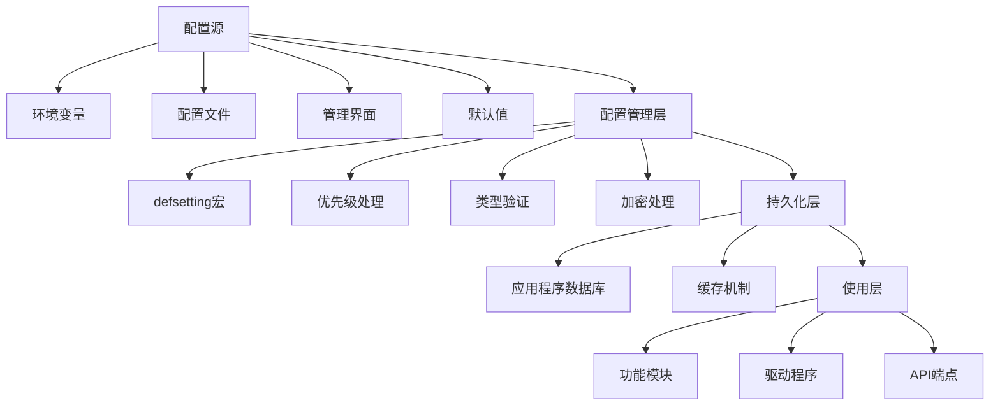
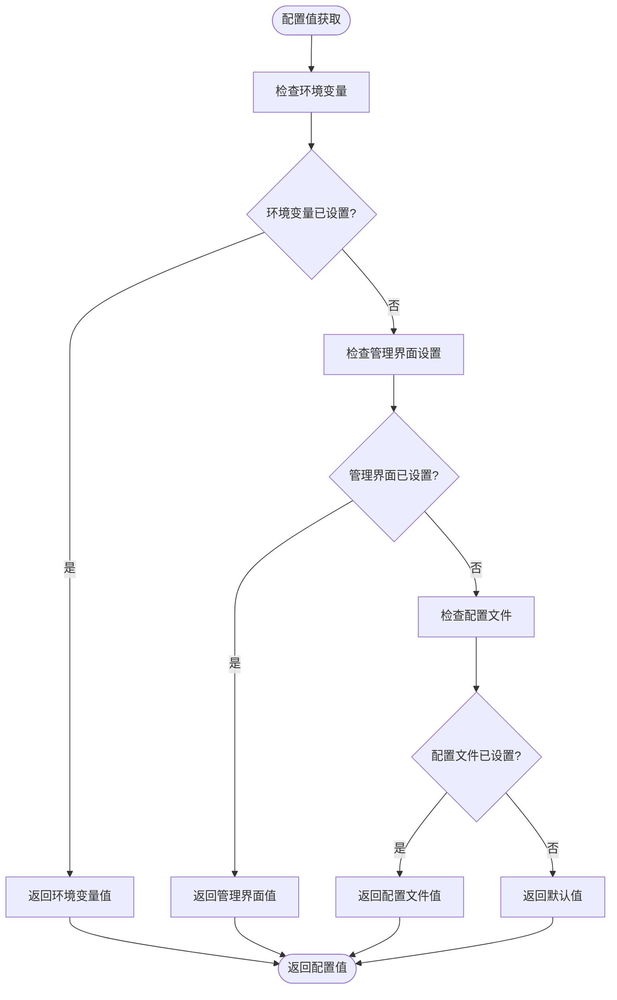
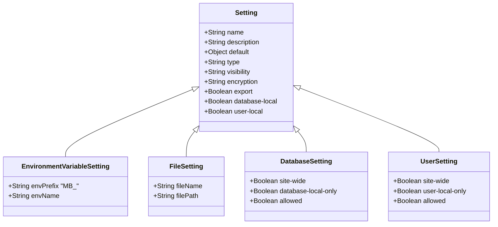
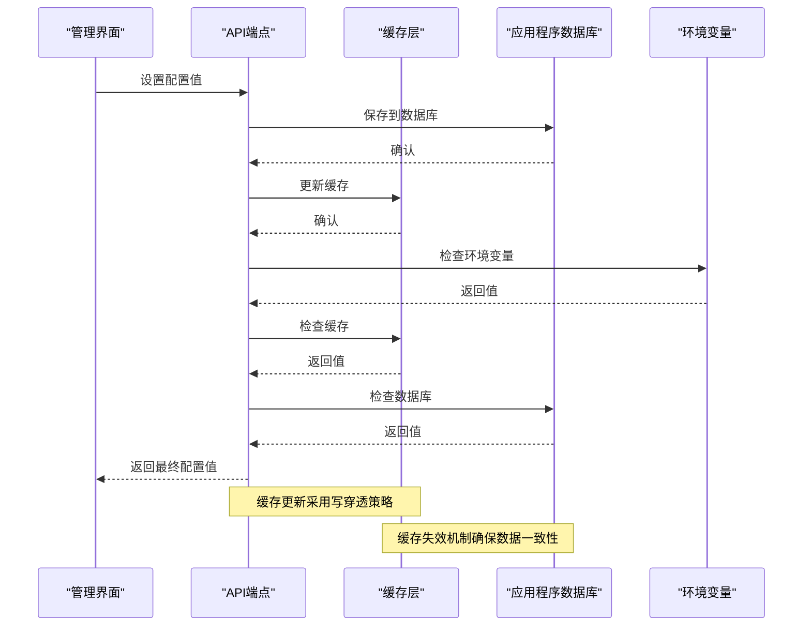
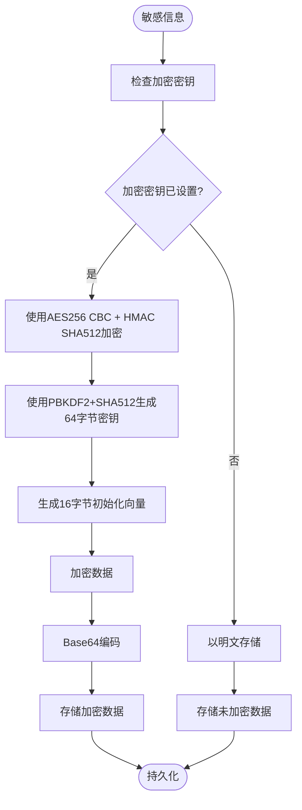
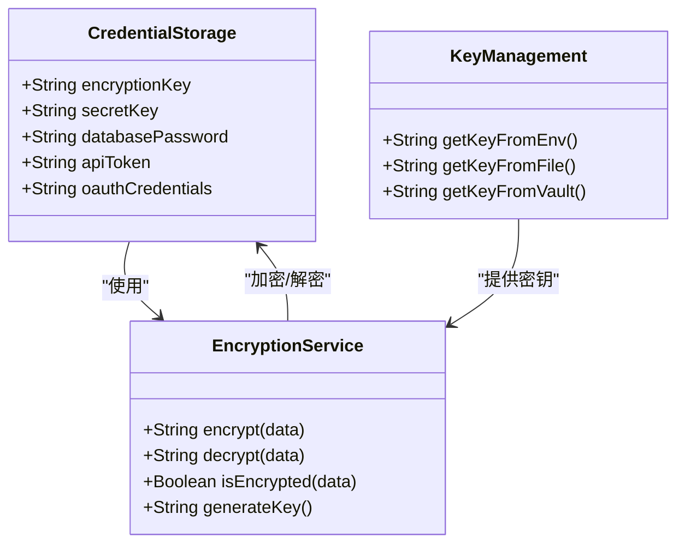
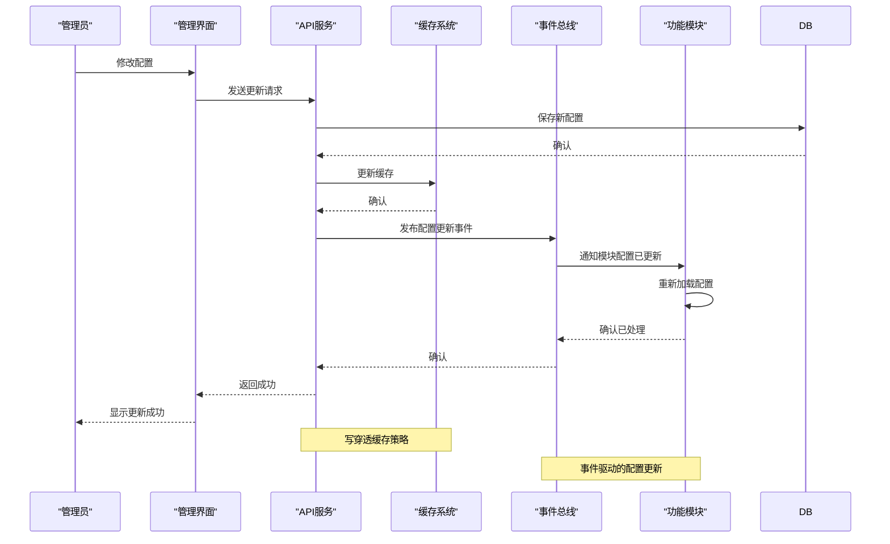

# 配置与设置

<cite>
**本文档中引用的文件**  
- [settings.clj](file://src/metabase/settings/core.clj)
- [env.clj](file://src/metabase/app_db/env.clj)
- [config_from_file.clj](file://src/metabase/core/config_from_file.clj)
- [encryption.clj](file://src/metabase/util/encryption.clj)
- [env_var_dox.clj](file://src/metabase/cmd/env_var_dox.clj)
- [actions/settings.clj](file://src/metabase/actions/settings.clj)
- [api/settings.clj](file://src/metabase/api/settings.clj)
- [analytics/settings.clj](file://src/metabase/analytics/settings.clj)
- [cache/settings.clj](file://src/metabase/cache/settings.clj)
- [driver/settings.clj](file://src/metabase/driver/settings.clj)
- [embedding/settings.clj](file://src/metabase/embedding/settings.clj)
- [permissions/settings.clj](file://src/metabase/permissions/settings.clj)
</cite>

## 目录
1. [简介](#简介)
2. [配置系统架构](#配置系统架构)
3. [配置优先级处理](#配置优先级处理)
4. [可配置选项详解](#可配置选项详解)
5. [序列化与持久化机制](#序列化与持久化机制)
6. [部署场景最佳实践](#部署场景最佳实践)
7. [敏感信息管理](#敏感信息管理)
8. [动态配置更新](#动态配置更新)
9. [故障排除指南](#故障排除指南)
10. [结论](#结论)

## 简介

Metabase配置系统提供了一套完整的机制来管理运行时配置、环境变量和配置文件。该系统允许通过多种方式设置和管理配置，包括管理界面、环境变量和配置文件，为不同部署场景提供了灵活性和安全性。

配置系统的核心是`defsetting`宏，它定义了可配置的设置项，这些设置项可以存储在应用程序数据库中，并通过智能缓存实现快速查找。配置项可以通过管理界面设置，也可以通过相应的环境变量（格式为`MB_设置名`，其中设置名转换为大写并用下划线替换连字符）或配置文件进行设置。

**Section sources**
- [settings.clj](file://src/metabase/settings/core.clj#L1-L165)

## 配置系统架构

Metabase配置系统采用分层架构，支持多种配置源和优先级处理机制。系统主要由以下几个组件构成：



**Diagram sources**
- [settings.clj](file://src/metabase/settings/core.clj#L1-L165)
- [env.clj](file://src/metabase/app_db/env.clj#L1-L203)

**Section sources**
- [settings.clj](file://src/metabase/settings/core.clj#L1-L165)
- [env.clj](file://src/metabase/app_db/env.clj#L1-L203)

## 配置优先级处理

Metabase配置系统遵循明确的优先级顺序来确定最终的配置值。优先级从高到低如下：

1. **环境变量**：具有最高优先级，通过`MB_`前缀的环境变量设置
2. **管理界面设置**：通过管理界面设置的值
3. **配置文件**：通过YAML配置文件设置的值
4. **默认值**：在`defsetting`宏中定义的默认值

当存在用户本地或数据库本地设置时，优先级处理会更加复杂。对于允许用户本地或数据库本地的设置，系统会优先返回用户或数据库特定的值，而不是站点范围的值。



**Diagram sources**
- [settings.clj](file://src/metabase/settings/core.clj#L1-L165)
- [env.clj](file://src/metabase/app_db/env.clj#L1-L203)

**Section sources**
- [settings.clj](file://src/metabase/settings/core.clj#L1-L165)
- [env.clj](file://src/metabase/app_db/env.clj#L1-L203)

## 可配置选项详解

Metabase提供了丰富的可配置选项，涵盖了系统各个方面。每个配置选项都通过`defsetting`宏定义，包含以下属性：

- **名称和描述**：配置项的名称和描述
- **默认值**：配置项的默认值
- **类型**：配置项的数据类型（布尔值、整数、字符串等）
- **可见性**：配置项的可见性级别（公共、内部、管理员等）
- **加密**：是否对配置值进行加密
- **导出**：是否在序列化设置中导出

### 核心配置选项



**Diagram sources**
- [settings.clj](file://src/metabase/settings/core.clj#L1-L165)
- [env_var_dox.clj](file://src/metabase/cmd/env_var_dox.clj#L1-L228)

**Section sources**
- [settings.clj](file://src/metabase/settings/core.clj#L1-L165)
- [env_var_dox.clj](file://src/metabase/cmd/env_var_dox.clj#L1-L228)

### 特定模块配置

#### 分析与监控配置

```mermaid
classDiagram
class AnalyticsSettings {
+Integer prometheus-server-port
+String analytics-uuid
+Boolean anon-tracking-enabled
+Boolean snowplow-available
+Boolean snowplow-enabled
+String snowplow-url
+String instance-creation
+Boolean non-table-chart-generated
}
AnalyticsSettings : prometheus-server-port : Prometheus服务器端口
AnalyticsSettings : analytics-uuid : 雪plow分析的唯一标识符
AnalyticsSettings : anon-tracking-enabled : 是否启用匿名使用数据收集
AnalyticsSettings : snowplow-available : Snowplow收集器是否可用
AnalyticsSettings : snowplow-enabled : 是否向Snowplow发送分析事件
AnalyticsSettings : snowplow-url : Snowplow收集器的URL
AnalyticsSettings : instance-creation : 实例创建时间戳
AnalyticsSettings : non-table-chart-generated : 是否已生成非表格图表
```

**Diagram sources**
- [analytics/settings.clj](file://src/metabase/analytics/settings.clj#L1-L109)

#### 缓存配置

```mermaid
classDiagram
class CacheSettings {
+Boolean enable-query-caching
+Integer query-caching-max-kb
+Double query-caching-max-ttl
}
CacheSettings : enable-query-caching : 是否允许缓存查询结果
CacheSettings : query-caching-max-kb : 每个保存问题的缓存最大大小KB
CacheSettings : query-caching-max-ttl : 缓存查询结果的绝对最大保留时间秒
```

**Diagram sources**
- [cache/settings.clj](file://src/metabase/cache/settings.clj#L1-L46)

#### 驱动程序配置

```mermaid
classDiagram
class DriverSettings {
+Integer ssh-heartbeat-interval-sec
+String report-timezone
+String report-timezone-short
+String report-timezone-long
+Integer db-connection-timeout-ms
+Integer db-query-timeout-minutes
+Integer jdbc-data-warehouse-max-connection-pool-size
+Integer jdbc-data-warehouse-unreturned-connection-timeout-seconds
+Boolean jdbc-data-warehouse-debug-unreturned-connection-stack-traces
+Integer sql-jdbc-fetch-size
+Integer nested-field-columns-value-length-limit
+Map engines
+Integer sync-leaf-fields-limit
}
DriverSettings : ssh-heartbeat-interval-sec : SSH隧道建立时发送心跳的频率秒
DriverSettings : report-timezone : 执行查询时使用的连接时区
DriverSettings : report-timezone-short : 当前报告时区缩写
DriverSettings : report-timezone-long : 当前报告时区字符串
DriverSettings : db-connection-timeout-ms : 连接数据库的超时时间毫秒
DriverSettings : db-query-timeout-minutes : 数据库查询执行的超时时间分钟
DriverSettings : jdbc-data-warehouse-max-connection-pool-size : c3p0连接池的最大大小
DriverSettings : jdbc-data-warehouse-unreturned-connection-timeout-seconds : 未返回连接的超时时间秒
DriverSettings : jdbc-data-warehouse-debug-unreturned-connection-stack-traces : 是否记录被终止连接的堆栈跟踪
DriverSettings : sql-jdbc-fetch-size : 结果集的获取大小
DriverSettings : nested-field-columns-value-length-limit : 同步JSON展开时JSON字符串的最大长度
DriverSettings : engines : 可用的数据库引擎
DriverSettings : sync-leaf-fields-limit : 每个文档数据库集合同步的最大叶字段数
```

**Diagram sources**
- [driver/settings.clj](file://src/metabase/driver/settings.clj#L1-L189)

#### 嵌入配置

```mermaid
classDiagram
class EmbeddingSettings {
+String embedding-secret-key
+Boolean show-static-embed-terms
+Boolean show-sdk-embed-terms
+Boolean show-simple-embed-terms
+Boolean enable-embedding
+String embedding-app-origin
+Boolean enable-embedding-sdk
+Boolean enable-embedding-simple
+Boolean enable-embedding-interactive
+String embedding-app-origins-interactive
+Boolean enable-embedding-static
+String embedding-app-origins-sdk
+Keyword embedding-homepage
+Boolean setup-embedding-autoenabled
+Boolean setup-license-active-at-setup
+Boolean embedding-hub-test-embed-snippet-created
+Boolean embedding-hub-production-embed-snippet-created
}
EmbeddingSettings : embedding-secret-key : 用于签名JWT的密钥
EmbeddingSettings : show-static-embed-terms : 是否显示静态嵌入许可
EmbeddingSettings : show-sdk-embed-terms : 管理员是否应看到SDK许可条款弹窗
EmbeddingSettings : show-simple-embed-terms : 管理员是否应看到简单嵌入条款弹窗
EmbeddingSettings : enable-embedding : 是否允许管理员安全嵌入问题和仪表板
EmbeddingSettings : embedding-app-origin : 允许此来源嵌入完整的Metabase应用程序
EmbeddingSettings : enable-embedding-sdk : 是否允许管理员通过SDK嵌入Metabase
EmbeddingSettings : enable-embedding-simple : 是否允许管理员通过嵌入分析JS嵌入Metabase
EmbeddingSettings : enable-embedding-interactive : 是否允许管理员通过交互式嵌入嵌入Metabase
EmbeddingSettings : embedding-app-origins-interactive : 允许这些空格分隔的来源嵌入Metabase交互式
EmbeddingSettings : enable-embedding-static : 是否允许管理员通过静态嵌入嵌入Metabase
EmbeddingSettings : embedding-app-origins-sdk : 允许Metabase SDK访问这些空格分隔的来源
EmbeddingSettings : embedding-homepage : 嵌入主页状态
EmbeddingSettings : setup-embedding-autoenabled : 设置期间是否自动启用嵌入
EmbeddingSettings : setup-license-active-at-setup : 设置结束时是否有有效许可证处于活动状态
EmbeddingSettings : embedding-hub-test-embed-snippet-created : 是否为跟踪在嵌入中心创建了测试嵌入片段
EmbeddingSettings : embedding-hub-production-embed-snippet-created : 是否为跟踪在嵌入中心创建了生产嵌入片段
```

**Diagram sources**
- [embedding/settings.clj](file://src/metabase/embedding/settings.clj#L1-L314)

## 序列化与持久化机制

Metabase配置系统采用智能的持久化和缓存机制，确保配置数据的高效访问和一致性。



配置值存储在应用程序数据库的`setting`表中，同时通过内部缓存实现快速查找。系统会智能地从环境变量、数据库和默认值中获取配置值，并按照优先级顺序返回最终值。

**Diagram sources**
- [settings.clj](file://src/metabase/settings/core.clj#L1-L165)
- [env.clj](file://src/metabase/app_db/env.clj#L1-L203)

**Section sources**
- [settings.clj](file://src/metabase/settings/core.clj#L1-L165)
- [env.clj](file://src/metabase/app_db/env.clj#L1-L203)

## 部署场景最佳实践

### 开发环境

在开发环境中，建议使用环境变量来设置配置，以便快速迭代和测试。可以使用`.env`文件或直接在命令行中设置环境变量。

```bash
export MB_SITE_NAME="开发环境"
export MB_DB_TYPE="h2"
export MB_DB_FILE="./metabase.db"
export MB_JETTY_HOST="0.0.0.0"
export MB_JETTY_PORT="3000"
```

### 测试环境

在测试环境中，建议使用配置文件和环境变量结合的方式，确保测试环境的一致性和可重复性。

```yaml
# config.yaml
site-name: "测试环境"
database:
  type: "postgres"
  host: "localhost"
  port: 5432
  dbname: "metabase_test"
  username: "metabase"
  password: "password"
jetty:
  host: "0.0.0.0"
  port: 3000
```

### 生产环境

在生产环境中，建议采用多层次的安全配置策略：

1. **敏感信息**：使用环境变量或密钥管理服务
2. **非敏感配置**：使用配置文件
3. **管理界面设置**：仅用于运行时动态配置

```bash
# 生产环境变量
export MB_DB_TYPE="postgres"
export MB_DB_HOST="db.prod.example.com"
export MB_DB_PORT="5432"
export MB_DB_DBNAME="metabase_prod"
export MB_DB_USER="metabase"
export MB_DB_PASS_FILE="/run/secrets/metabase_db_password"
export MB_ENCRYPTION_SECRET_KEY_FILE="/run/secrets/metabase_encryption_key"
export MB_JETTY_HOST="0.0.0.0"
export MB_JETTY_PORT="3000"
export MB_SSL=true
```

**Section sources**
- [env.clj](file://src/metabase/app_db/env.clj#L1-L203)
- [encryption.clj](file://src/metabase/util/encryption.clj#L1-L261)

## 敏感信息管理

Metabase提供了完善的敏感信息管理机制，确保凭据和密钥的安全存储。

### 加密机制



系统使用`MB_ENCRYPTION_SECRET_KEY`环境变量作为主加密密钥，采用AES256 CBC + HMAC SHA512算法对敏感信息进行加密。如果未设置加密密钥，则敏感信息将以明文形式存储。

### 凭据存储



**Diagram sources**
- [encryption.clj](file://src/metabase/util/encryption.clj#L1-L261)
- [settings.clj](file://src/metabase/settings/core.clj#L1-L165)

**Section sources**
- [encryption.clj](file://src/metabase/util/encryption.clj#L1-L261)
- [settings.clj](file://src/metabase/settings/core.clj#L1-L165)

## 动态配置更新

Metabase支持动态配置更新和热重载能力，允许在不重启服务的情况下修改配置。

### 配置更新流程



### 热重载机制

系统通过事件总线通知所有相关模块配置已更新，各模块可以订阅配置更新事件并重新加载配置。这种机制确保了配置更新的实时性和一致性。

**Diagram sources**
- [settings.clj](file://src/metabase/settings/core.clj#L1-L165)
- [events.clj](file://src/metabase/events/core.clj#L1-L100)

**Section sources**
- [settings.clj](file://src/metabase/settings/core.clj#L1-L165)
- [events.clj](file://src/metabase/events/core.clj#L1-L100)

## 故障排除指南

### 常见配置问题

#### 1. 配置未生效

**问题描述**：修改配置后，新设置未生效。

**可能原因**：
- 环境变量优先级高于管理界面设置
- 配置缓存未正确更新
- 配置项被其他设置覆盖

**解决方案**：
1. 检查是否存在同名的环境变量
2. 重启服务以清除缓存
3. 检查配置优先级顺序

**Section sources**
- [settings.clj](file://src/metabase/settings/core.clj#L1-L165)

#### 2. 敏感信息未加密

**问题描述**：数据库凭据等敏感信息以明文形式存储。

**可能原因**：
- 未设置`MB_ENCRYPTION_SECRET_KEY`环境变量
- 加密功能被禁用

**解决方案**：
1. 设置`MB_ENCRYPTION_SECRET_KEY`环境变量
2. 重启服务以启用加密功能
3. 检查日志确认加密是否已启用

**Section sources**
- [encryption.clj](file://src/metabase/util/encryption.clj#L1-L261)

#### 3. 配置文件未加载

**问题描述**：配置文件中的设置未被加载。

**可能原因**：
- 配置文件路径不正确
- 配置文件格式错误
- 企业版功能未启用

**解决方案**：
1. 检查配置文件路径和权限
2. 验证YAML格式是否正确
3. 确认是否为企业版并已启用相关功能

**Section sources**
- [config_from_file.clj](file://src/metabase/core/config_from_file.clj#L1-L17)

#### 4. 数据库连接失败

**问题描述**：无法连接到应用程序数据库。

**可能原因**：
- 数据库连接信息错误
- 数据库服务未运行
- 网络连接问题

**解决方案**：
1. 检查`MB_DB_*`环境变量是否正确
2. 验证数据库服务是否正常运行
3. 检查网络连接和防火墙设置

**Section sources**
- [env.clj](file://src/metabase/app_db/env.clj#L1-L203)

## 结论

Metabase配置系统提供了一套完整、灵活且安全的配置管理机制。通过环境变量、配置文件和管理界面的多层次配置方式，系统能够适应不同的部署场景和安全需求。

配置系统的核心优势包括：
- **灵活的优先级处理**：支持多种配置源，按明确优先级顺序处理
- **智能的缓存机制**：确保配置数据的高效访问
- **完善的加密支持**：保护敏感信息的安全
- **动态更新能力**：支持热重载，无需重启服务
- **模块化的配置管理**：各功能模块独立管理自己的配置

通过遵循最佳实践和使用适当的故障排除方法，可以确保Metabase配置系统的稳定运行和安全性。