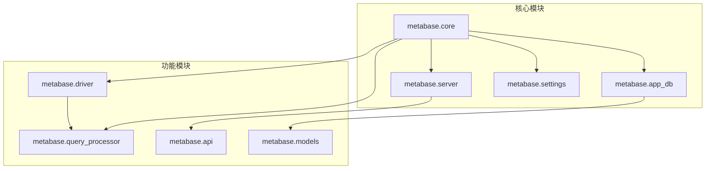
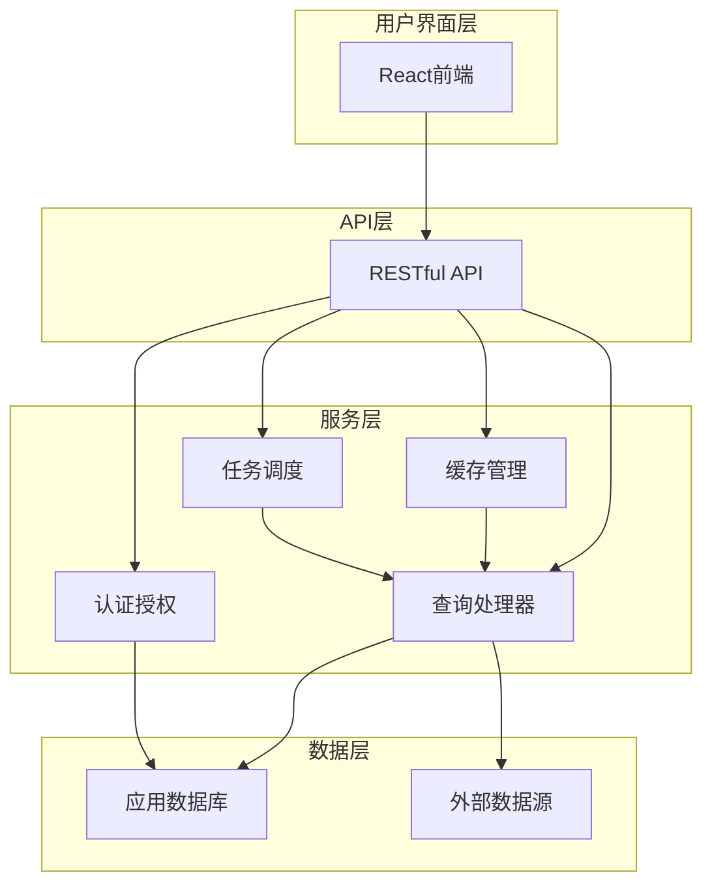
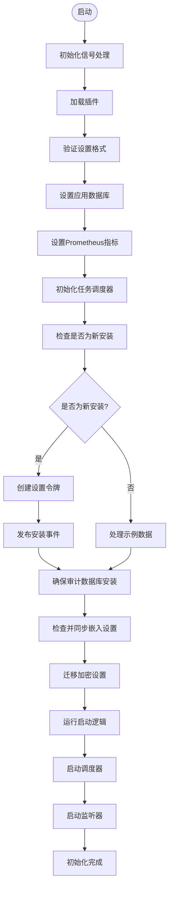
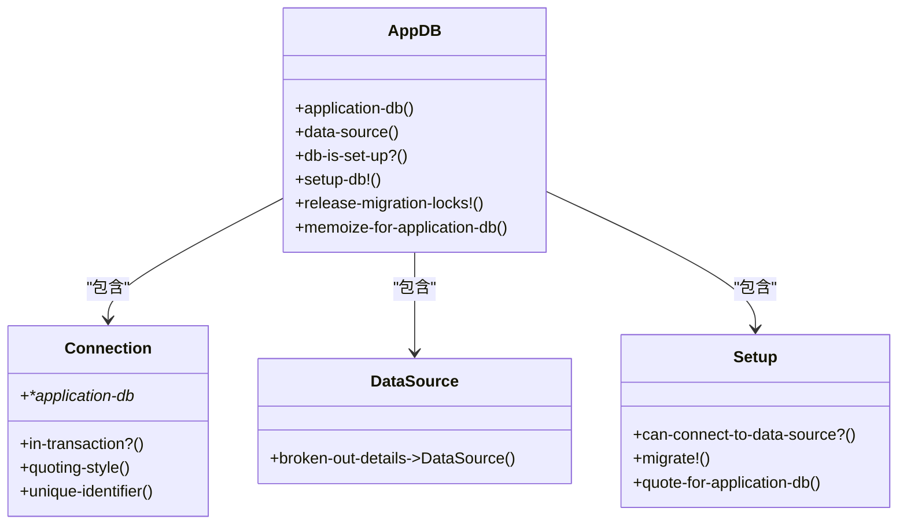
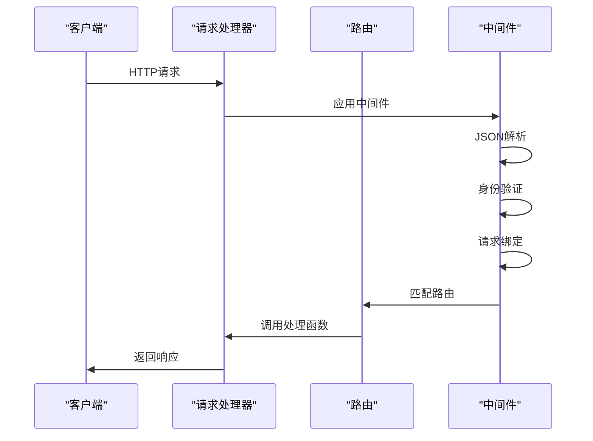
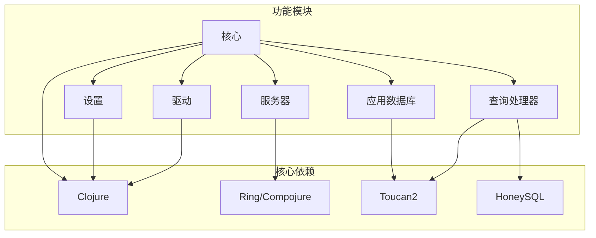

# 项目概述

<cite>
**本文档中引用的文件**  
- [README.md](file://README.md)
- [core.clj](file://src/metabase/core/core.clj)
- [init.clj](file://src/metabase/core/init.clj)
- [app_db/core.clj](file://src/metabase/app_db/core.clj)
- [server/core.clj](file://src/metabase/server/core.clj)
- [settings/core.clj](file://src/metabase/settings/core.clj)
- [driver/sql_jdbc/connection.clj](file://src/metabase/driver/sql_jdbc/connection.clj)
- [query_processor.clj](file://src/metabase/query_processor.clj)
</cite>

## 目录
1. [简介](#简介)
2. [项目结构](#项目结构)
3. [核心组件](#核心组件)
4. [架构概述](#架构概述)
5. [详细组件分析](#详细组件分析)
6. [依赖分析](#依赖分析)
7. [性能考虑](#性能考虑)
8. [故障排除指南](#故障排除指南)
9. [结论](#结论)

## 简介
Metabase是一个开源的数据分析和商业智能平台，旨在帮助用户轻松连接数据库、创建查询并生成可视化图表。该项目采用Clojure语言开发，利用Ring/Compojure Web框架处理HTTP请求，并使用Toucan2 ORM进行数据访问。Metabase的核心功能包括数据库连接管理、查询处理、结果可视化和用户权限控制。系统设计注重可扩展性和模块化，通过清晰的命名空间划分和初始化机制确保组件间的松耦合。

**Section sources**
- [README.md](file://README.md#L1-L3)

## 项目结构
Metabase项目的源代码组织在`src/metabase`目录下，按照功能模块划分为多个子目录。主要模块包括核心服务、API路由、应用数据库管理、服务器配置、设置管理、驱动程序、查询处理器等。每个模块都有独立的命名空间，遵循`metabase.<module-name>`的命名约定。项目采用Clojure的命名空间机制进行模块化组织，通过`require`和`import`语句管理依赖关系。核心入口点位于`metabase.core`命名空间，负责系统的初始化和启动流程。

**Diagram sources**
- [core.clj](file://src/metabase/core/core.clj#L1-L280)
- [app_db/core.clj](file://src/metabase/app_db/core.clj#L1-L164)

**Section sources**
- [core.clj](file://src/metabase/core/core.clj#L1-L280)

## 核心组件
Metabase的核心组件包括应用数据库管理、Web服务器、设置管理系统和驱动程序框架。应用数据库管理模块负责Metabase自身元数据的存储和访问，使用H2、MySQL或PostgreSQL等关系型数据库。Web服务器模块基于Ring/Compojure构建，处理HTTP请求和响应。设置管理系统提供了一套灵活的配置机制，支持环境变量、配置文件和管理界面三种配置方式。驱动程序框架支持多种数据库类型，通过统一的接口抽象不同数据库的连接和查询操作。

**Section sources**
- [core.clj](file://src/metabase/core/core.clj#L1-L280)
- [app_db/core.clj](file://src/metabase/app_db/core.clj#L1-L164)
- [server/core.clj](file://src/metabase/server/core.clj#L1-L33)

## 架构概述
Metabase采用分层架构设计，从下到上依次为数据层、服务层、API层和用户界面层。数据层由应用数据库和外部数据源组成，应用数据库存储Metabase的元数据，外部数据源是用户连接的各种数据库。服务层包含查询处理器、缓存管理、任务调度等核心服务。API层提供RESTful接口，供前端应用调用。用户界面层基于React构建，提供直观的可视化操作界面。各层之间通过明确定义的接口进行通信，确保系统的可维护性和可扩展性。

**Diagram sources**
- [core.clj](file://src/metabase/core/core.clj#L1-L280)
- [server/core.clj](file://src/metabase/server/core.clj#L1-L33)
- [query_processor.clj](file://src/metabase/query_processor.clj)

## 详细组件分析

### 核心初始化分析
Metabase的启动流程从`metabase.core/entrypoint`函数开始，该函数是应用程序的主要入口点。启动过程包括信号处理初始化、插件加载、数据库设置、任务调度器初始化等多个阶段。系统通过`init!`函数执行一次性初始化操作，包括设置进度、注册关闭钩子、加载类加载器、验证设置格式等。整个初始化过程是线程安全的，确保在多线程环境下正确执行。

**Diagram sources**
- [core.clj](file://src/metabase/core/core.clj#L1-L280)

**Section sources**
- [core.clj](file://src/metabase/core/core.clj#L1-L280)

### 应用数据库分析
应用数据库模块是Metabase的核心存储组件，负责管理系统的元数据。该模块提供了连接应用数据库的API，包括`app-db`、`data-source`等函数。`setup-db!`函数负责数据库的初始化和迁移，确保数据库模式与当前代码版本兼容。系统使用Liquibase进行数据库迁移管理，支持自动迁移和手动迁移两种模式。为了提高性能，应用数据库模块实现了智能缓存机制，对频繁访问的设置项进行缓存。

**Diagram sources**
- [app_db/core.clj](file://src/metabase/app_db/core.clj#L1-L164)

**Section sources**
- [app_db/core.clj](file://src/metabase/app_db/core.clj#L1-L164)

### Web服务器分析
Web服务器模块基于Ring/Compojure框架构建，负责处理HTTP请求和响应。`make-handler`函数创建主入口点，将路由与中间件组合成完整的请求处理链。系统支持开发模式下的热重载，当代码发生变化时自动重新编译和重新加载。中间件链包括JSON解析、身份验证、请求绑定等功能，确保每个请求都能得到正确处理。服务器支持多种部署模式，包括独立模式和嵌入式模式。

**Diagram sources**
- [server/core.clj](file://src/metabase/server/core.clj#L1-L33)
- [server/handler.clj](file://src/metabase/server/handler.clj)

**Section sources**
- [server/core.clj](file://src/metabase/server/core.clj#L1-L33)

## 依赖分析
Metabase项目依赖于多个第三方库和框架，包括Clojure标准库、Ring/Compojure Web框架、Toucan2 ORM、HoneySQL查询构建器等。这些依赖通过Leiningen进行管理，定义在`project.clj`文件中。系统采用模块化设计，各组件之间的依赖关系清晰，通过命名空间的`require`语句显式声明。核心组件如应用数据库、服务器、设置管理等被多个模块依赖，形成系统的基础设施层。

**Diagram sources**
- [core.clj](file://src/metabase/core/core.clj#L1-L280)
- [project.clj](file://project.clj)

**Section sources**
- [core.clj](file://src/metabase/core/core.clj#L1-L280)

## 性能考虑
Metabase在设计时充分考虑了性能因素，采用了多种优化策略。应用数据库模块实现了智能缓存机制，对频繁访问的设置项进行缓存，减少数据库查询次数。查询处理器支持结果缓存，对于相同的查询请求可以直接返回缓存结果。系统使用连接池管理数据库连接，避免频繁创建和销毁连接的开销。任务调度器采用Quartz框架，支持分布式部署和故障转移。此外，系统还集成了Prometheus监控，可以实时跟踪关键性能指标。

## 故障排除指南
当遇到Metabase运行问题时，首先检查日志文件，通常位于`logs/metabase.log`。常见的问题包括数据库连接失败、端口冲突、内存不足等。对于数据库连接问题，检查`MB_DB_TYPE`、`MB_DB_HOST`等环境变量是否正确设置。如果遇到性能问题，可以通过启用查询日志来分析慢查询。系统提供了丰富的监控指标，可以通过Prometheus和Grafana进行可视化监控。对于插件相关的问题，检查插件目录和权限设置。

**Section sources**
- [core.clj](file://src/metabase/core/core.clj#L1-L280)
- [app_db/core.clj](file://src/metabase/app_db/core.clj#L1-L164)

## 结论
Metabase作为一个功能强大的开源数据分析平台，通过精心设计的架构和模块化组织，实现了高度的可扩展性和可维护性。系统采用Clojure语言开发，充分利用了函数式编程的优势，代码简洁且易于测试。核心组件之间的职责划分清晰，通过明确定义的接口进行通信。初始化流程设计合理，确保系统在各种环境下都能正确启动。未来的发展方向可能包括进一步优化查询性能、增强可视化能力、支持更多数据源类型等。