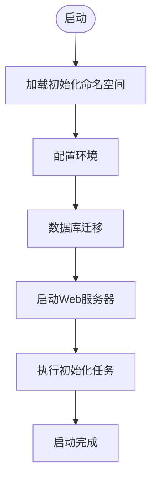

# 项目概述

<cite>
**本文档引用的文件**  
- [core.clj](file://src/metabase/core/core.clj)
- [init.clj](file://src/metabase/core/init.clj)
- [setup.clj](file://src/metabase/app_db/setup.clj)
- [liquibase.clj](file://src/metabase/app_db/liquibase.clj)
- [core.clj](file://src/metabase/server/core.clj)
- [handler.clj](file://src/metabase/server/handler.clj)
- [connection.clj](file://src/metabase/driver/sql_jdbc/connection.clj)
- [init.clj](file://src/metabase/query_processor/init.clj)
- [init.clj](file://src/metabase/driver/init.clj)
- [init.clj](file://src/metabase/api/init.clj)
</cite>

## 目录
1. [项目简介](#项目简介)
2. [核心功能](#核心功能)
3. [系统架构](#系统架构)
4. [核心组件分析](#核心组件分析)
5. [启动流程与初始化](#启动流程与初始化)
6. [技术背景](#技术背景)

## 项目简介

Metabase是一个开源的数据分析与商业智能平台，旨在为用户提供无需编写SQL即可查询数据库、创建可视化仪表板和设置自动化报表（Pulse）的能力。该项目基于Clojure语言开发，采用模块化设计，具有事件驱动架构和中间件模式。Metabase支持多种数据库连接，通过其直观的界面帮助用户探索数据、创建图表和共享洞察。

**Section sources**
- [core.clj](file://src/metabase/core/core.clj#L0-L280)

## 核心功能

Metabase提供了丰富的核心功能，使用户能够轻松地进行数据分析和可视化。主要功能包括：

- **无需编写SQL即可查询数据库**：用户可以通过图形化界面选择表和字段，构建查询，而无需手动编写SQL语句。
- **创建可视化仪表板**：用户可以将多个查询结果组合成一个仪表板，使用各种图表类型（如柱状图、折线图、饼图等）来展示数据。
- **设置自动化报表（Pulse）**：用户可以配置定期发送的报表，通过电子邮件或Slack等方式自动分享给团队成员。
- **数据探索与分析**：提供强大的数据探索工具，支持过滤、排序和聚合操作，帮助用户深入理解数据。
- **权限管理**：支持细粒度的权限控制，确保数据安全。

这些功能使得Metabase成为企业级数据分析的理想选择，无论是小型团队还是大型组织都能从中受益。

**Section sources**
- [core.clj](file://src/metabase/core/core.clj#L0-L280)

## 系统架构

Metabase采用基于Clojure的后端服务，整体架构分为多个层次，包括API层、查询处理器、驱动层等。系统采用模块化设计，各组件之间通过清晰的接口进行通信，确保了系统的可维护性和扩展性。

### 架构图

**Diagram sources**
- [core.clj](file://src/metabase/core/core.clj#L0-L280)
- [handler.clj](file://src/metabase/server/handler.clj#L0-L125)

## 核心组件分析

### API层

API层是Metabase的入口点，负责处理来自前端的HTTP请求。它使用Ring和Compojure框架构建，提供了RESTful API接口。API层通过中间件模式处理请求，确保了请求的统一处理和安全性。

#### 中间件模式

**Diagram sources**
- [handler.clj](file://src/metabase/server/handler.clj#L96-L125)
- [macros.clj](file://src/metabase/api/macros.clj#L597-L628)

### 查询处理器

查询处理器是Metabase的核心组件之一，负责解析和执行用户的查询请求。它接收来自API层的查询请求，将其转换为具体的SQL语句，并通过驱动层与数据库进行交互。

#### 查询处理流程

**Diagram sources**
- [init.clj](file://src/metabase/query_processor/init.clj#L0-L5)
- [connection.clj](file://src/metabase/driver/sql_jdbc/connection.clj#L0-L382)

### 驱动层

驱动层负责与不同的数据库进行通信。Metabase支持多种数据库，如H2、MySQL、PostgreSQL等。驱动层通过JDBC连接池管理数据库连接，确保高效和可靠的数据库访问。

#### 驱动层架构

**Diagram sources**
- [init.clj](file://src/metabase/driver/init.clj#L0-L16)
- [connection.clj](file://src/metabase/driver/sql_jdbc/connection.clj#L0-L382)

## 启动流程与初始化

Metabase的启动流程包括多个步骤，从加载必要的命名空间到启动Web服务器。以下是详细的启动流程：

1. **加载初始化命名空间**：通过`metabase.core.init`命名空间加载所有需要初始化的模块。
2. **配置环境**：读取环境变量和配置文件，设置系统参数。
3. **数据库迁移**：使用Liquibase进行数据库迁移，确保数据库结构与当前版本匹配。
4. **启动服务**：启动Web服务器，监听指定端口。
5. **初始化任务**：执行一系列初始化任务，如创建示例数据、设置定时任务等。

### 启动流程图

**Diagram sources**
- [init.clj](file://src/metabase/core/init.clj#L0-L76)
- [core.clj](file://src/metabase/core/core.clj#L0-L280)
- [setup.clj](file://src/metabase/app_db/setup.clj#L0-L290)
- [liquibase.clj](file://src/metabase/app_db/liquibase.clj#L0-L530)

## 技术背景

### Ring/Compojure框架

Metabase使用Ring和Compojure框架构建其Web服务。Ring是一个Clojure的Web应用库，提供了处理HTTP请求和响应的基本功能。Compojure则是一个基于Ring的路由库，简化了URL路由的定义。

### Liquibase数据库迁移

Liquibase是一个开源的数据库迁移工具，用于管理和跟踪数据库模式的变化。Metabase使用Liquibase进行数据库迁移，确保不同版本之间的数据库结构一致性。通过Liquibase，Metabase可以在启动时自动应用必要的数据库变更，避免手动干预。

**Section sources**
- [core.clj](file://src/metabase/core/core.clj#L0-L280)
- [setup.clj](file://src/metabase/app_db/setup.clj#L0-L290)
- [liquibase.clj](file://src/metabase/app_db/liquibase.clj#L0-L530)